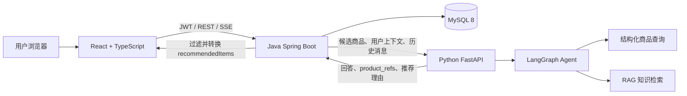

# 项目六阶段完成情况、测试复现、Demo 实现与面试架构说明

> 审查日期：2026-06-21  
> Java/React 项目：`IntelligentOutfitRecommendationSystem`  
> Python AI 项目：`../AI-Clothing-Shopping-Assistant-System`

快速入口：

- 想审查完成内容：看第 3、4 节。
- 想亲自测试：看第 5 节。
- 想从零复现：看第 6 节。
- 想自己写 Demo：看第 7 节。
- 想准备面试：看第 8 节。

## 1. 审查结论

本轮已经完成六个质量建设阶段，项目从“功能可以演示”提升为“有明确数据边界、有自动化回归、有可解释推荐、有安全错误处理，并且可以按文档复现”的工程化项目。

当前已经具备：

- Java 后端负责用户、商品、SKU、价格、库存、购物车、订单、支付和会话等业务事实。
- Python AI 服务负责意图识别、LangGraph 编排、RAG、推荐排序和推荐理由。
- React 前端只调用 Java，不绕过 Java 直接构造价格、库存、订单或支付状态。
- Java 与 Python 之间有明确的请求、响应和 SSE 数据结构。
- 推荐商品必须来自 Java 候选池，Python 返回的越界商品引用会被 Java 过滤。
- 推荐卡片可以显示推荐理由、排序分和本地商品图片。
- 加购物车、立即购买和支付仍经过用户确认以及 Java 业务校验。
- Java、Python、前端单测、构建、E2E 和真实 MySQL 迁移测试均已通过。

## 2. 当前总体架构



### 2.1 为什么这样分层

Java 是业务事实的单一真相源：

- 用户身份和权限。
- 商品 SPU、SKU、价格和图片。
- 实时库存。
- 购物车、订单、支付状态。
- 会话和消息持久化。

Python 是 AI 推理和编排层：

- 判断用户意图。
- 判断是否缺少商品、颜色、尺码或身体数据。
- 调用结构化商品查询或 RAG。
- 对 Java 候选商品排序。
- 生成可追溯的推荐理由和自然语言回答。

前端是交互层：

- 展示后端数据。
- 消费普通 HTTP 和 SSE。
- 管理页面交互状态。
- 在交易动作前要求用户确认。

核心原则是：**AI 可以建议，但不能成为交易事实的来源。**

## 3. 六个阶段完成了什么

### 3.1 第一阶段：AI 答案质量评测

解决的问题：

- 原测试主要验证 LangGraph 是否走了正确节点，但不能判断最终答案是否正确。
- 价格、库存、尺码、弱检索兜底和 debug 泄露缺少独立质量标准。

完成内容：

- 新增确定性的答案质量 Case。
- 新增答案评分器和报告生成器。
- 检查必须出现的事实、禁止出现的内容、事实来源、停止原因和答案长度。
- 覆盖库存有货、库存无货、缺颜色、缺尺码、价格、RAG、弱检索、历史追问和 debug 泄露。
- 评测不依赖真实外部大模型，结果可以稳定复现。

主要文件：

- Python `clothing_assistant/agent/answer_quality_cases.py`
- Python `clothing_assistant/agent/answer_quality_report.py`
- Python `tests/test_answer_quality_report.py`
- Python `docs/answer-quality-evaluation-plan.md`

带来的提升：

- 从“感觉回答还可以”变成“有可重复的质量报告”。
- 区分了“流程走对”和“答案说对”两个测试目标。
- 后续增加真实用户问题时，只需要增加 Case，不需要重写评测框架。

### 3.2 第二阶段：前端 E2E 质量门禁

解决的问题：

- 单元测试不能证明登录、AI 推荐、确认加购、结算和支付能够在浏览器中连续完成。

完成内容：

- 引入 Playwright。
- 新增浏览器主流程测试。
- 使用可控 API Mock，避免自动化测试依赖真实模型和本地数据库。
- 验证登录、SSE 推荐、推荐理由、图片加载、取消加购、确认加购、购物车结算和模拟支付。
- 验证前端提交的交易请求体不包含价格、金额、用户 ID 或支付状态。

主要文件：

- `frontend/playwright.config.ts`
- `frontend/e2e/ai-shopping.spec.ts`
- `frontend/e2e/fixtures/api.ts`
- `frontend/package.json`

带来的提升：

- 核心购物路径可以由浏览器自动回归。
- 能检查图片是否真正加载，而不只是检查 `img` 标签存在。
- 能检查确认弹窗是否阻止了未确认的交易动作。

当前边界：

- 这条 Playwright 测试使用 API Mock，是稳定的前端冒烟测试。
- 它不等同于 Java、Python、MySQL 全部真实启动后的联调测试。

### 3.3 第三阶段：Java/Python 契约回归

解决的问题：

- Java 和 Python 可以分别通过单测，但字段名、SSE 格式或商品引用仍可能在联调时失配。

完成内容：

- Java 测试同步 `/api/assistant/chat` 和流式 `/api/assistant/chat/stream`。
- Python 测试 `/chat/stream` 的 `token`、`done`、`error` 事件。
- SSE `data:` 保持单行 JSON。
- Python `done` 事件保留 `product_refs`，但不暴露 debug 和 trace。
- Java 使用本轮候选池过滤 Python 返回的 `spu_id` 和 `sku_id`。
- Python 跳过缺少 ID、重复 ID 和候选池外的商品引用。
- Python 流失败时，Java 不保存伪造的助手消息。

主要测试：

- Java `AssistantControllerTests`
- Java `AssistantServiceTests`
- Java `RestPythonAssistantClientTests`
- Java `PythonSseEventParserTests`
- Python `tests/test_chat_stream.py`
- Python `tests/test_recommendation_service.py`

带来的提升：

- 跨语言接口不再只靠人工记忆。
- AI 幻觉出的商品 ID 无法直接透传到前端。
- 流式接口的事件类型和 JSON 形状有回归保护。

### 3.4 第四阶段：推荐解释与商品图片修复

解决的问题：

- 推荐卡片只有商品，没有“为什么推荐”。
- 数据库图片 URL 指向不存在的 `.jpg`，导致页面图片区域不可见。

完成内容：

- Python 根据库存、尺码、风格、季节、场景、预算和颜色生成推荐理由。
- Python 返回 `reason` 和 `rank_score`。
- Java 新增 `recommendedItems`，同时保留旧的 `recommendedSpuIds` 兼容字段。
- Java 只转换通过候选池校验的推荐项。
- 前端显示推荐理由和排序分。
- 后端和前端增加同名本地 SVG 商品图片。
- Flyway V9 把种子数据中的旧 `.jpg` 路径迁移为 `.svg` 路径。
- E2E 检查图片 `naturalWidth > 0`。

主要文件：

- Java `AssistantRecommendationItem.java`
- Java `AssistantChatResponse.java`
- Java `AssistantStreamDoneEvent.java`
- Java `AssistantService.java`
- Java `V9__use_local_svg_product_images.sql`
- Java `backend/src/main/resources/static/images/products/*.svg`
- Python `clothing_assistant/application/recommendation_service.py`
- 前端 `ChatPanel.tsx`、`ProductCard.tsx`、`assistantStream.ts`
- 前端 `public/images/products/*.svg`

带来的提升：

- 推荐结果从黑盒变为可解释结果。
- 推荐理由可以追溯到已知候选数据，不能随意编造。
- 图片路径、数据库数据和静态资源保持一致。

### 3.5 第五阶段：前端状态边界整理

解决的问题：

- `App.tsx` 同时管理登录、购物车、聊天、推荐和待确认动作，继续增加功能会越来越难维护。

完成内容：

- 抽离登录状态 Hook。
- 抽离购物车状态 Hook。
- 使用 reducer 管理助手消息和推荐状态。
- 抽离交易确认状态 Hook。
- `App.tsx` 只负责编排页面和功能模块。
- 没有过早引入 Zustand 或 TanStack Query。

主要文件：

- `frontend/src/features/auth/useAuthSession.ts`
- `frontend/src/features/cart/useCartState.ts`
- `frontend/src/features/assistant/assistantState.ts`
- `frontend/src/features/assistant/assistantState.test.ts`
- `frontend/src/features/commerce-action/useCommerceAction.ts`
- `frontend/src/app/App.tsx`

带来的提升：

- 状态所有权更清楚。
- reducer 状态转换可以独立单测。
- 后续增加会话列表、分页商品或真实缓存时，更容易判断是否需要状态库。

### 3.6 第六阶段：生产安全默认值

解决的问题：

- 外部服务异常、未知异常和参数校验可能把内部错误、请求体或敏感字段返回给调用方。
- 本地 trace 如果开启，可能记录明显的 Token 或密码片段。

完成内容：

- Java 外部服务异常统一返回固定 `external_service_error` 文案。
- Java 未知异常统一返回固定 `internal_server_error` 文案。
- Java 日志只记录异常类型，不向客户端暴露堆栈、文件路径或 provider 原始错误。
- Python 422 校验错误移除 Pydantic 的原始 `input`、`ctx` 和 `url`。
- Python 422 只保留安全的错误位置、类型、说明和可用的 `request_id`。
- Python trace 文件默认关闭，只有 `AGENT_TRACE_TO_FILE=true` 时才写入。
- trace 写入前递归脱敏 Bearer Token、`api_key`、`token`、`password` 和 `secret`。

主要文件：

- Java `GlobalExceptionHandler.java`
- Java `GlobalExceptionHandlerTests.java`
- Python `clothing_assistant/api/app.py`
- Python `clothing_assistant/agent/tracing.py`
- Python `tests/test_api.py`
- Python `tests/test_agent_pipeline.py`

带来的提升：

- 错误可诊断，但不会把内部细节暴露给普通用户。
- 参数校验不再回显完整用户上下文、候选商品或提示词。
- 调试能力从默认开启改为显式开启，并增加基础脱敏。

## 4. 2026-06-21 实际验证结果

| 范围 | 命令 | 结果 |
| --- | --- | --- |
| Java 完整构建 | `bash ./mvnw verify` | 构建成功，115 项测试，0 失败，0 错误，1 项按环境变量默认跳过 |
| Java Checkstyle | 随 `verify` 执行 | 0 违规 |
| Java MySQL 迁移 | `RUN_MYSQL_TESTS=true bash ./mvnw test -Dtest=MySqlFlywayMigrationTests` | 1 项通过，MySQL 8 容器成功应用 V1-V9 |
| Python 全量测试 | `.venv/bin/python -m unittest discover -v` | 111 项通过 |
| Python 编译 | `.venv/bin/python -m compileall -q clothing_assistant tests` | 通过 |
| Python 答案质量报告 | `.venv/bin/python -m clothing_assistant.agent.answer_quality_report` | 10 个 Case，10 通过，0 失败 |
| 前端单测 | `npm test -- --run` | 4 个测试文件、10 项测试通过 |
| 前端生产构建 | `npm run build` | 通过，1593 个模块完成转换 |
| 前端 E2E | `npm run test:e2e` | Chromium 1 条主流程通过 |

Java 完整构建中默认跳过的测试是 `MySqlFlywayMigrationTests`，因为它要求：

```text
RUN_MYSQL_TESTS=true
```

本次已经单独打开该变量并使用 Testcontainers + MySQL 8 验证通过。

当前非阻塞警告：

- Python 测试提示 Starlette `TestClient` 后续需要从 `httpx` 迁移到 `httpx2`。
- Java Mockito 提示未来 JDK 将限制动态加载 Agent，需要后续按 Mockito 文档配置测试 Agent。
- 这些警告当前不影响测试结果，但应该进入后续依赖升级任务。

## 5. 你应该怎样测试

### 5.1 第一层：先跑自动化测试

#### Java

```bash
cd /Users/seekinward/Documents/推荐项目/IntelligentOutfitRecommendationSystem/backend
bash ./mvnw verify
```

有 Docker 时再跑真实 MySQL 迁移：

```bash
RUN_MYSQL_TESTS=true bash ./mvnw test -Dtest=MySqlFlywayMigrationTests
```

#### Python

```bash
cd /Users/seekinward/Documents/推荐项目/AI-Clothing-Shopping-Assistant-System
.venv/bin/python -m unittest discover -v
.venv/bin/python -m compileall -q clothing_assistant tests
.venv/bin/python -m clothing_assistant.agent.answer_quality_report
```

#### 前端

```bash
cd /Users/seekinward/Documents/推荐项目/IntelligentOutfitRecommendationSystem/frontend
npm test -- --run
npm run build
npm run test:e2e
```

判断标准：

- 所有命令退出码为 `0`。
- 答案质量报告是 `10 passed, 0 failed`。
- Playwright 是 `1 passed`。
- Java Checkstyle 是 `0 violations`。

### 5.2 第二层：启动真实本地环境

#### 步骤 1：启动 MySQL

```bash
cd /Users/seekinward/Documents/推荐项目/IntelligentOutfitRecommendationSystem
docker compose up -d mysql
docker compose ps
```

注意：

- Docker Compose 暴露的是宿主机 `3307`。
- Java `application.properties` 默认写的是 `3306`。
- 因此按当前代码复现时，必须使用下面的环境变量覆盖 Java 数据源地址。

#### 步骤 2：启动 Python

```bash
cd /Users/seekinward/Documents/推荐项目/AI-Clothing-Shopping-Assistant-System
python3 -m venv .venv
.venv/bin/python -m pip install -r requirements.txt
```

需要真实调用通义模型时设置：

```bash
export DASHSCOPE_API_KEY='你的本地密钥'
```

不要把真实密钥写进 Git、Markdown、Reqable 导出文件或截图。

启动：

```bash
.venv/bin/uvicorn clothing_assistant.api.app:app --reload --port 8000
```

检查：

```bash
curl http://127.0.0.1:8000/health
```

#### 步骤 3：启动 Java

```bash
cd /Users/seekinward/Documents/推荐项目/IntelligentOutfitRecommendationSystem/backend
SPRING_DATASOURCE_URL='jdbc:mysql://localhost:3307/intelligent_outfit?useUnicode=true&characterEncoding=utf8&serverTimezone=Asia/Shanghai&useSSL=false&allowPublicKeyRetrieval=true' \
SPRING_DATASOURCE_USERNAME='root' \
SPRING_DATASOURCE_PASSWORD='123456' \
bash ./mvnw spring-boot:run
```

检查商品接口和图片：

```bash
curl http://127.0.0.1:8080/api/products
curl -I http://127.0.0.1:8080/images/products/jacket-commute-main.svg
```

#### 步骤 4：启动前端

```bash
cd /Users/seekinward/Documents/推荐项目/IntelligentOutfitRecommendationSystem/frontend
npm install
npm run dev
```

浏览器打开：

```text
http://127.0.0.1:5173
```

Vite 默认把 `/api` 代理到 `http://localhost:8080`。

### 5.3 第三层：用 Reqable 测接口

在 Reqable 新建环境变量：

```text
java_base_url = http://127.0.0.1:8080
python_base_url = http://127.0.0.1:8000
access_token = 登录后填写
refresh_token = 登录后填写
thread_id = AI 接口返回后填写
order_no = 创建订单后填写
```

#### 用例 A：注册、登录和鉴权

注册：

```http
POST {{java_base_url}}/api/auth/register
Content-Type: application/json
```

```json
{
  "username": "review_user_001",
  "password": "StrongPassword123!",
  "email": "review_user_001@example.com"
}
```

登录：

```http
POST {{java_base_url}}/api/auth/login
Content-Type: application/json
```

```json
{
  "username": "review_user_001",
  "password": "StrongPassword123!"
}
```

把响应中的 `data.accessToken` 保存到 `access_token`。

验证：

```http
GET {{java_base_url}}/api/users/me
Authorization: Bearer {{access_token}}
```

期望：

- 不带 Token 返回 `401`。
- 带有效 Token 返回当前用户。

#### 用例 B：商品和图片

```http
GET {{java_base_url}}/api/products
```

检查 `mainImageUrl` 应类似：

```text
/images/products/jacket-commute-main.svg
```

再直接请求：

```http
GET {{java_base_url}}/images/products/jacket-commute-main.svg
```

期望：

- 状态码 `200`。
- `Content-Type` 是 SVG 图片类型。
- 不再请求旧的 `.jpg` 路径。

#### 用例 C：AI 同步推荐

```http
POST {{java_base_url}}/api/assistant/chat
Authorization: Bearer {{access_token}}
Content-Type: application/json
```

```json
{
  "threadId": null,
  "message": "我想买一件适合秋季通勤的外套，预算 800 以内",
  "category": "外套",
  "style": "commute",
  "season": "autumn",
  "fit": "regular",
  "budgetMax": 800
}
```

重点检查：

- 有 `data.threadId` 和 `data.answer`。
- `data.recommendedSpuIds` 仍存在。
- `data.recommendedItems[*]` 包含 `spuId`、`skuId`、`reason` 和 `rankScore`。
- 推荐 ID 必须能在 Java 候选商品中找到。
- 推荐理由不能编造折扣、物流、售后或不存在的库存。

#### 用例 D：AI 流式推荐

```http
POST {{java_base_url}}/api/assistant/chat/stream
Authorization: Bearer {{access_token}}
Content-Type: application/json
Accept: text/event-stream
```

请求体可以复用同步推荐请求。

重点检查：

- 响应类型是 `text/event-stream`。
- 可以看到 `meta`、`token`、`recommendation`、`done` 或受控的 `error`。
- 每一行 `data:` 后面是单行 JSON。
- `done` 中可以有推荐项，但不能有 `debug`、`trace_events` 或模型内部信息。

#### 用例 E：购物车、订单和支付

加入购物车：

```http
POST {{java_base_url}}/api/cart/items
Authorization: Bearer {{access_token}}
Content-Type: application/json
```

```json
{
  "skuId": 2001,
  "quantity": 1
}
```

从购物车创建订单：

```http
POST {{java_base_url}}/api/orders
Authorization: Bearer {{access_token}}
Content-Type: application/json
```

```json
{
  "source": "CART",
  "skuIds": [2001]
}
```

模拟支付：

```http
POST {{java_base_url}}/api/payments/mock-pay
Authorization: Bearer {{access_token}}
Content-Type: application/json
```

```json
{
  "orderNo": "{{order_no}}"
}
```

安全边界：

- 加购物车只提交 `skuId` 和 `quantity`。
- 下单不提交商品价格、总金额、用户 ID 或订单状态。
- 支付不提交支付成功状态。
- 金额和状态必须以 Java 响应为准。

#### 用例 F：安全错误测试

先停止 Python，再请求 Java AI 接口。

期望：

- Java 返回 `502`。
- `errorCode` 是 `external_service_error`。
- 响应不包含 Python 地址、连接堆栈、文件路径或 provider 原始错误。

直接向 Python 发送缺字段请求：

```http
POST {{python_base_url}}/chat
Content-Type: application/json
```

```json
{
  "request_id": "req-security-review",
  "query": "测试内容 token=test-secret-do-not-use",
  "user_context": {
    "password": "test-secret-do-not-use"
  }
}
```

期望：

- 返回 `422`。
- 可以指出缺少 `session_id`。
- 响应中不能回显 `test-secret-do-not-use`、完整请求体或 Pydantic `input`。

更完整的 Reqable 用例见 `docs/api-testing-with-reqable.md`。

### 5.4 第四层：用网页测完整业务

按以下顺序操作：

1. 打开 `http://127.0.0.1:5173`。
2. 注册或登录。
3. 进入 AI 推荐页。
4. 输入“通勤、预算 300、想要简洁一点”。
5. 检查聊天区是否出现回答。
6. 检查推荐卡片是否显示商品名、价格、库存、图片和推荐理由。
7. 点击加入购物车，先在确认弹窗中取消。
8. 确认购物车数量没有变化。
9. 再次点击加入购物车并确认。
10. 进入购物车，检查 SKU、数量和价格。
11. 点击结算，进入订单页。
12. 执行 Mock 支付，检查订单状态变为已支付。

浏览器 DevTools 的 Network 中应看到：

```text
POST /api/auth/register 或 /api/auth/login
GET  /api/users/me
POST /api/assistant/chat/stream
GET  /api/products/recommendation-candidates
GET  /images/products/*.svg
POST /api/cart/items
GET  /api/cart/items
POST /api/orders
POST /api/payments
```

重点审查请求体：

- 前端不能提交 `userId`。
- 前端不能提交价格和订单总金额。
- 前端不能提交库存状态。
- 前端不能提交订单状态或支付成功状态。
- 推荐理由来自后端 `recommendedItems`，不是前端自行拼接。

### 5.5 图片仍看不到时怎样定位

按以下顺序检查：

1. 调用 `GET /api/products`，确认 `mainImageUrl` 是 `.svg`。
2. 直接打开 `http://127.0.0.1:8080/images/products/jacket-commute-main.svg`。
3. 检查 Flyway 表是否已经到 V9。
4. 检查数据库 `product_spu.main_image_url` 和 `product_image.image_url`。
5. 检查后端 `src/main/resources/static/images/products/`。
6. 检查前端 `public/images/products/`。
7. 如果 Network 是 `200` 但页面不显示，再检查 CSS 是否把图片宽高压成 `0`。
8. 清理浏览器缓存，避免继续使用旧 `.jpg` 地址。

## 6. 如何从零复现项目

### 6.1 环境要求

- JDK 21。
- Maven Wrapper，无需单独安装 Maven。
- Python 3.11。
- Node.js 20 或兼容版本。
- Docker Desktop。
- MySQL 8，可使用项目 Docker Compose。
- 可选：Reqable。
- 可选：真实 AI 调用所需的 `DASHSCOPE_API_KEY`。

### 6.2 推荐复现顺序

1. 先分别跑 Java、Python、前端自动化测试。
2. 再启动 MySQL。
3. 启动 Python，检查 `/health`。
4. 启动 Java，检查 `/api/products` 和图片。
5. 启动前端。
6. 用 Reqable 走注册、登录、AI、购物车、订单和支付。
7. 最后用网页走完整用户路径。

这样排查更快：如果某层失败，可以在进入跨服务联调前定位。

### 6.3 不使用真实大模型能否复现

可以复现大部分工程能力：

- Java 全量测试不依赖真实模型。
- Python 单测和答案质量报告使用确定性数据，不依赖真实模型。
- Playwright 使用 API Mock，不依赖真实模型。
- 商品、购物车、订单和支付可以在 Python 不启动时独立验证。

只有真实 AI 对话和真实 RAG 生成需要模型密钥及网络。

## 7. 如果自己写一个最小 Demo

建议先写“规则排序版”，再替换为 LangGraph 或大模型。不要一开始同时实现完整商城、RAG、复杂 Agent 和支付。

### 7.1 Demo 最小目标

只实现：

- 3 个商品和 5 个 SKU。
- 用户输入场景、预算和颜色。
- Java 提供候选商品。
- Python 对候选商品打分并返回推荐理由。
- 前端展示推荐卡片。
- 用户确认后加入购物车。

暂时不实现：

- 真实支付。
- 复杂库存锁定。
- 多 Agent。
- 向量数据库。
- 微服务注册中心。

### 7.2 推荐目录

```text
outfit-demo/
├── contracts/
│   └── assistant-chat-v1.md
├── java-gateway/
│   └── Spring Boot
├── ai-service/
│   └── FastAPI
└── web/
    └── React + TypeScript
```

### 7.3 先定义跨服务契约

Java 发给 Python：

```json
{
  "request_id": "req-001",
  "session_id": "session-001",
  "query": "通勤外套，预算 500，喜欢黑色",
  "user_context": {
    "preferred_colors": ["黑色"],
    "budget_max": 500
  },
  "candidates": [
    {
      "spu_id": 1001,
      "sku_id": 2001,
      "name": "通勤轻薄外套",
      "sale_price": 299,
      "available_stock": 7,
      "color": "黑色",
      "season": ["autumn"],
      "style_tags": ["commute"]
    }
  ],
  "debug": false
}
```

Python 返回：

```json
{
  "request_id": "req-001",
  "answer": "优先推荐通勤轻薄外套。",
  "intent": "recommendation",
  "product_refs": [
    {
      "spu_id": 1001,
      "sku_id": 2001,
      "reason": "符合通勤场景、黑色偏好和预算要求",
      "rank_score": 0.9
    }
  ]
}
```

### 7.4 Python 先实现确定性排序

核心逻辑可以先写成：

```python
def score_candidate(candidate: dict, user_context: dict) -> tuple[float, list[str]]:
    score = 0.0
    reasons: list[str] = []
    sale_price = candidate.get("sale_price")
    budget_max = user_context.get("budget_max")

    if candidate.get("available_stock", 0) > 0:
        score += 0.3
        reasons.append("当前有库存")

    if sale_price is not None and budget_max is not None and sale_price <= budget_max:
        score += 0.3
        reasons.append("符合预算")

    if candidate.get("color") in user_context.get("preferred_colors", []):
        score += 0.2
        reasons.append("符合颜色偏好")

    if "commute" in candidate.get("style_tags", []):
        score += 0.2
        reasons.append("符合通勤场景")

    return score, reasons
```

然后：

1. 遍历 Java 传入的 `candidates`。
2. 计算分数。
3. 按分数倒序。
4. 只返回原候选中的 `spu_id` 和 `sku_id`。
5. 把命中的规则组合成 `reason`。

规则版稳定后，再把“意图识别、缺信息追问、RAG”逐步迁移到 LangGraph。

### 7.5 Java 实现业务事实和过滤

Java 核心流程：

```text
用户请求
-> 鉴权获取当前 userId
-> 查询用户偏好
-> 从 MySQL 查询上架且有库存的候选 SKU
-> 组装 PythonChatRequest
-> 调用 Python
-> 用原候选池过滤 product_refs
-> 保存用户消息和助手消息
-> 返回商品事实与推荐理由给前端
```

过滤逻辑必须使用 `(spuId, skuId)` 组合，而不是只相信 Python：

```java
Set<String> allowedKeys = candidates.stream()
        .map(item -> item.getSpuId() + ":" + item.getSkuId())
        .collect(Collectors.toSet());

List<ProductRef> safeRefs = pythonResponse.getProductRefs().stream()
        .filter(ref -> allowedKeys.contains(ref.getSpuId() + ":" + ref.getSkuId()))
        .toList();
```

正式 Demo 还要在加购物车和下单时重新查询价格与库存，不能复用 AI 返回值。

### 7.6 React 只负责展示和确认

交互原则：

```text
推荐卡片点击“加入购物车”
-> 设置 pendingAction
-> 显示确认弹窗
-> 用户确认
-> POST /api/cart/items
-> 重新读取后端购物车
```

前端请求体只发送：

```json
{
  "skuId": 2001,
  "quantity": 1
}
```

不要发送：

```text
userId
salePrice
availableStock
orderStatus
paymentStatus
```

### 7.7 Demo 应补的最小测试

Python：

- 有库存、预算内、颜色匹配时分数更高。
- 候选池外商品不能出现在结果中。
- 缺少预算时不会报错。

Java：

- Python 返回候选池外 ID 时被过滤。
- Python 不可用时返回固定安全错误。
- 下单金额来自数据库，不来自请求体。

前端：

- 取消确认时不发加购物车请求。
- 确认后只发送 `skuId` 和 `quantity`。
- 推荐理由和图片正常显示。

E2E：

- 登录。
- 请求推荐。
- 取消一次加购。
- 确认加购。
- 创建订单。
- 模拟支付。

## 8. 面试时怎样介绍架构

### 8.1 30 秒版本

> 这是一个 AI 服装导购电商项目。我把系统分成 React 前端、Java Spring Boot 业务后端和 Python FastAPI AI 服务。Java 是用户、商品、价格、库存、订单和支付的单一真相源，Python 用 LangGraph 做意图识别、RAG、候选排序和推荐解释。Java 只把筛选后的候选商品交给 Python，并再次过滤 Python 返回的商品引用，所以 AI 不能编造商品或直接修改交易状态。项目使用 Flyway、MyBatis、JWT、SSE、Vitest、Playwright、Python unittest 和 Testcontainers 做回归。

### 8.2 2 分钟版本

> 我没有让前端直接调用 AI 服务，而是让所有请求先进入 Java。因为用户身份、商品价格、库存和订单状态都属于强一致业务事实，必须由 Java 鉴权和数据库控制。Java 根据当前用户、预算和商品状态生成候选 SKU，再把候选、用户上下文和历史消息传给 Python。
>
> Python 使用 LangGraph 把流程拆成意图路由、上下文解析、缺信息判断、结构化查询、RAG、证据评分、答案生成和答案校验。对于价格和库存这类精确事实，走结构化数据；对于搭配、材质养护等解释性问题，才使用 RAG。Python 返回自然语言回答和结构化 `product_refs`，其中包括推荐理由和排序分。
>
> Java 收到结果后，会用本轮候选池再次过滤 `(spuId, skuId)`，然后保存会话并返回前端。前端展示推荐卡片，但加购物车、下单和支付必须由用户确认，并重新调用 Java 校验。
>
> 在质量方面，我补了答案质量评测、Java/Python 契约回归、SSE 单行 JSON 测试、浏览器 E2E、真实 MySQL Flyway 测试和安全错误测试。这样既能验证业务流程，也能验证 AI 没有越过数据边界。

### 8.3 面试官追问：为什么使用 Java + Python

回答重点：

- Java 擅长稳定业务建模、事务、鉴权、订单和库存。
- Python 的 LangGraph、RAG 和模型生态更成熟。
- 两者通过明确契约解耦，而不是共享数据库。
- 代价是跨服务调用和契约维护更复杂，所以需要契约测试、超时和降级。

不要只回答“Java 性能好，Python 适合 AI”。更好的回答是：**按业务事实与推理能力划分所有权。**

### 8.4 面试官追问：为什么不让前端直接调用 Python

回答：

- 前端不可信，不能自己构造用户画像、候选商品、价格和库存。
- Python 不负责用户鉴权和交易数据。
- 前端直连 Python 会绕过 Java 的权限和候选池过滤。
- 所以前端只调用 Java，Java 作为 AI 网关组装可信上下文。

### 8.5 面试官追问：怎样防止 AI 幻觉商品和价格

回答：

1. Java 先从数据库生成候选商品。
2. Python 只能从请求候选中产生 `product_refs`。
3. Python 的结构化查询和 RAG 职责分离，价格库存不走 RAG。
4. Java 再次过滤 Python 返回的 `(spuId, skuId)`。
5. 前端展示和下单时仍以 Java 最新价格库存为准。
6. 契约测试专门构造越界商品 ID，验证不会透出。

### 8.6 面试官追问：为什么使用 SSE

回答：

- AI 文本生成耗时较长，SSE 可以降低用户首字等待时间。
- 当前场景主要是服务端向客户端单向推送，不需要 WebSocket 的双向长连接复杂度。
- 事件拆成 `meta`、`token`、`recommendation`、`done` 和 `error`。
- `done` 提供最终结构化结果，不能只依赖零散 token。
- SSE `data:` 使用单行 JSON，减少跨语言解析歧义。

### 8.7 面试官追问：Python 服务挂了怎么办

回答：

- 商品浏览、购物车、订单和支付不依赖 Python，仍然可用。
- Java 对 Python 设置连接、读取和流式超时。
- 同步请求返回固定 `external_service_error`。
- 流式请求返回受控 `error` 事件。
- 不向用户暴露连接地址、堆栈或模型 provider 错误。
- 后续可以增加熔断、指标告警和非 AI 推荐兜底。

### 8.8 面试官追问：为什么先做模块化单体而不是微服务

回答：

- 当前团队和业务规模没有必要承担服务发现、分布式事务、链路治理和多仓部署成本。
- Java 内部已经按用户、商品、库存、购物车、订单、支付、会话和 assistant 划分模块。
- 模块边界稳定后，可以优先拆分变化频率和资源特征不同的 assistant、product 或 order。
- Python AI 已经因为技术栈和伸缩特征不同而独立部署。

### 8.9 面试官追问：前端为什么没有直接上状态库

回答：

- 当前复杂度可以用 focused hooks 和 reducer 清楚表达。
- 先拆状态所有权，再决定是否引入状态库。
- 如果后续出现大量服务端缓存、分页、失效和并发请求，可以引入 TanStack Query。
- 如果跨页面客户端状态继续增多，再评估 Zustand。
- 避免为了技术栈展示而增加依赖和维护成本。

### 8.10 面试官追问：测试体系怎么设计

回答可以按测试金字塔展开：

- Python 单测：节点路由、结构化查询、RAG 兜底、推荐排序和答案质量。
- Java 单测/集成测试：Controller、Service、Mapper、鉴权、订单、支付和异常处理。
- 契约测试：Java/Python 请求响应、SSE 事件、候选商品过滤。
- 数据库测试：H2 快速回归 + Testcontainers MySQL Flyway 迁移。
- 前端单测：API Client、SSE Parser、Reducer 和交易动作。
- Playwright：浏览器核心购物路径。
- Reqable 和网页：真实三服务人工验收。

### 8.11 面试官追问：你解决过什么具体问题

可以用图片问题作为 STAR 示例：

> 页面商品图片不显示时，我先通过 Network 确认请求是 404，然后对比数据库 URL 与静态资源目录，发现种子数据仍指向 `.jpg`，但项目里没有对应文件。我没有只在前端写 fallback，而是补了后端和前端同名 SVG 静态资源，并通过 Flyway V9 修正数据库路径，最后在 Playwright 中增加 `naturalWidth > 0` 断言。这样修复了当前问题，也防止以后只有标签存在但图片实际加载失败。

也可以用越界商品过滤作为 STAR 示例：

> Java/Python 联调中最大的风险是模型返回候选池外商品。我把 Java 候选池设为可信边界，Python 只从候选生成引用，Java 收到响应后再按 `(spuId, skuId)` 过滤，并分别在同步和 SSE 路径增加回归测试。结果是即使 Python 返回幻觉 ID，前端也看不到。

## 9. 这个项目可以学习什么

### 9.1 架构学习

- 按“事实所有权”和“推理所有权”拆分系统。
- 模块化单体与独立 AI 服务的组合。
- 跨语言服务不能只靠文档，还需要契约回归测试。
- AI 服务不应该拥有订单和支付写权限。

### 9.2 AI 工程学习

- LangGraph 节点应该按可测试的业务职责拆分。
- 精确事实查询与 RAG 解释性知识要分开。
- AI 质量不只是模型效果，还包括缺信息追问、证据约束、兜底和泄露防护。
- 推荐结果应该同时返回文本和结构化引用。

### 9.3 后端学习

- SPU 与 SKU 的业务区别。
- Flyway 管理数据库演进。
- JWT、统一异常、MDC requestId 和 internal token 边界。
- 下单时由服务端重算金额并校验库存。
- H2 快速测试与 MySQL Testcontainers 测试的互补关系。

### 9.4 前端学习

- SSE 流解析。
- reducer 管理复杂状态转换。
- 交易动作确认。
- 前端不能成为业务事实来源。
- E2E 要验证真实可见结果，例如图片是否加载，而不只验证 DOM 是否存在。

### 9.5 测试学习

- 单元测试、契约测试、集成测试和 E2E 的职责不同。
- Mock E2E 保证稳定，真实联调保证环境和服务集成，两者都需要。
- AI 评测应该区分路由正确性与最终答案质量。
- 安全需求要落成回归测试，不能只写在规范里。

## 10. 当前已知限制和下一步

1. 共享目录 `outfit-project-contract` 当前不存在。
   两个仓库暂时使用各自的本地契约文档，后续应建立真正共享、版本化的契约源。

2. Playwright 当前使用 API Mock。
   下一步应增加一条真实 Java + MySQL 的浏览器测试，AI 部分可以继续使用确定性 Python 测试模式。

3. Docker MySQL 是 `3307`，Java 默认配置是 `3306`。
   当前复现需要环境变量覆盖；后续应统一 Compose 与本地默认配置。

4. `application.properties` 中仍有开发用 JWT Secret、数据库密码和 internal token。
   部署前必须改为环境变量或 Secret Manager，并区分 dev/test/prod 配置。

5. 当前 trace 脱敏是基础正则规则。
   后续可增加结构化敏感字段白名单、日志采样和集中式审计。

6. Python 测试存在 Starlette `TestClient` 依赖迁移警告。
   后续依赖升级时应迁移到推荐客户端并补回归。

7. Mockito 存在未来 JDK 动态 Agent 警告。
   后续应按 Mockito 官方建议配置测试 Agent。

8. 当前答案质量 Case 为 10 个确定性样例。
   后续应加入匿名化真实用户问题、失败样本和版本间对比报告。

## 11. 建议审查顺序

第一次审查建议按以下顺序：

1. 阅读本文第 2、3、4 节，确认架构边界和完成内容。
2. 跑第 5.1 节自动化命令。
3. 按第 5.2 节启动完整环境。
4. 用 Reqable 测第 5.3 节的 A-F。
5. 用网页走第 5.4 节完整业务。
6. 按第 8 节尝试不看文档讲一遍架构。
7. 按第 7 节重新写一个缩小版 Demo，验证自己是否真正理解。

审查通过的判断标准：

- 能解释为什么 Java 是事实源、Python 是推理层。
- 能独立启动三个服务并定位端口问题。
- 能用 Reqable 验证鉴权、推荐、图片、购物车、订单和安全错误。
- 能说明 Mock E2E 与真实联调的区别。
- 能自己写出候选排序、候选过滤和确认加购的最小实现。
- 面试时能讲清设计取舍、失败处理、测试体系和下一步演进。
