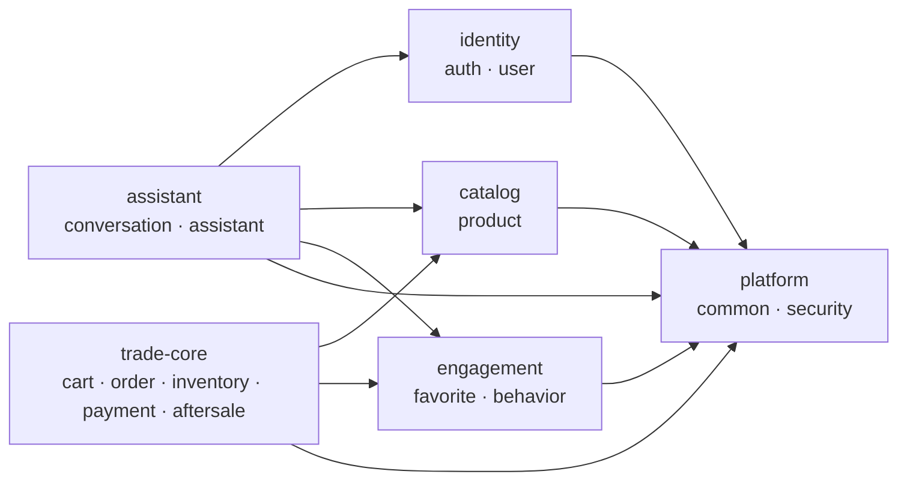

# Java 模块边界与表所有权

## 1. 目的

本项目继续使用单个 Spring Boot/Maven 制品，但把顶层业务包视为模块。模块边界由
ArchUnit 在 `mvn verify` 中验证，不依赖开发者记忆，也不通过拆成多个空壳 Maven 模块制造复杂度。

## 2. 逻辑模块地图

| 逻辑组 | Java 包 | 责任 |
| --- | --- | --- |
| identity | `auth`、`user` | 登录身份、Refresh Token、用户画像 |
| catalog | `product` | 商品目录、推荐候选静态信息和实时事实组装 |
| trade-core | `cart`、`order`、`inventory`、`payment`、`aftersale` | 购物车、订单、库存状态转换、支付和售后 |
| engagement | `favorite`、`behavior` | 收藏与用户行为事件 |
| assistant | `conversation`、`assistant` | 会话、Java/Python 编排和 AI 输出适配 |
| platform | `common`、`security` | 通用错误、缓存、日志、内部鉴权和 JWT 基础设施 |
| bootstrap | 根包应用类、`demo` | Spring Boot 启动与演示数据初始化 |

## 3. 模块公开边界

- `api` 只负责 HTTP 适配，不得访问任何 Mapper。
- `mapper` 是模块私有的数据访问实现，其他模块只能调用公开 Service/Application Service。
- `common` 是底层平台模块，不得反向依赖业务模块。
- Python Client 只属于 `assistant` 模块，由 Assistant Service 编排。
- Mapper 返回的内部 Model 不应被新调用方当作跨模块 API；新增边界优先使用语义明确的 DTO 或应用服务方法。

当前已建立的高价值公开边界：

| 边界 | 对调用方暴露的语义 | 隐藏的实现 |
| --- | --- | --- |
| `InventoryApplicationService` | `lock`、`confirm`、`release` | `InventoryMapper`、条件更新和失败行数解释 |
| `RecommendationCandidateQueryService` | `findCandidates` | 静态快照缓存、实时价格/库存补齐、可售过滤和确定性排序 |
| `ConversationApplicationService` | 创建/校验会话、受限历史、追加消息 | `ChatSession`、`ChatMessage` 和 `ConversationMapper` |
| `OrderApplicationService` | 锁定订单、读取支付所需明细、确认订单已支付 | `SalesOrder`、`OrderItem`、`OrderMapper` 和条件更新失败解释 |

当前没有跨模块 Mapper 例外。Payment 和 AfterSale 通过 `OrderApplicationService`
参与同一个外层事务，但不会获得 `SalesOrder`、`OrderItem` 持久化对象。

## 4. 表所有权

| 模块 | 所有表 |
| --- | --- |
| auth | `user_account`、`role`、`user_role`、`refresh_token`、`login_log` |
| user | `user_profile`、`user_body_data`、`user_preferences` |
| product | `category`、`color`、`size_option`、`fit_type`、`season`、`style_tag`、`material`、`size_rule`、`product_spu`、`product_sku`、`product_image`、`product_material`、`product_season`、`product_style_tag`、`product_attribute` |
| inventory | `inventory` |
| cart | `cart_item` |
| order | `sales_order`、`order_item`、`order_idempotency` |
| payment | `payment`、`payment_callback_log` |
| aftersale | `after_sale_request` |
| conversation | `chat_session`、`chat_message` |
| favorite | `user_favorite` |
| behavior | `behavior_event` |

表所有权表示：只有所属模块的 Mapper 可以直接读写该表。跨模块事务通过公开应用服务协作；
Redis 仍只是缓存和保护层，不拥有库存、订单、支付等最终业务状态。

## 5. 自动化门禁

`ModuleArchitectureTests` 当前验证：

1. 顶层模块依赖无环；
2. Controller 不依赖 Mapper；
3. `common` 不反向依赖业务模块；
4. Mapper 只能被所属模块直接访问，不再保留临时白名单；
5. Assistant 不得依赖旧的商品目录综合服务、旧会话服务或会话 Mapper/Model。

新增跨模块协作应建立语义明确的应用服务，不得扩大 ArchUnit 规则来绕过表所有权。
