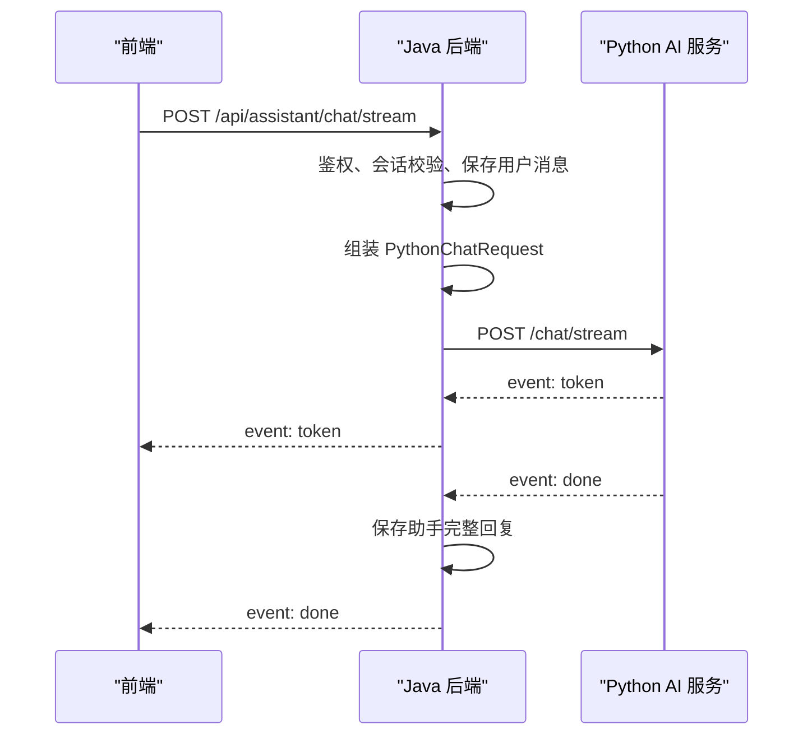

# Java 智能穿搭助手 SSE 流式对话实现计划

> **给自动化开发 Agent 的要求：** 按任务逐项执行。实现阶段建议使用 `subagent-driven-development` 或 `executing-plans`，并按本文件的复选框跟踪进度。当前文件只是实现计划，用户确认后再改 Java 代码。

## 目标

在 Java 后端新增：

```http
POST /api/assistant/chat/stream
Accept: text/event-stream
```

让前端可以收到 `meta`、`token`、`done`、`error` 四类 SSE 事件，同时保持 Java 继续负责：

- 用户鉴权
- 会话校验
- 用户消息落库
- 用户上下文装配
- 候选商品装配
- 调用 Python AI 服务
- Python 完成后保存助手完整回复

旧接口 `POST /api/assistant/chat` 不删除、不替换，作为同步接口继续保留。

## 架构说明

整体链路：



Java 不直接生成 AI 内容，只负责代理、校验、上下文与业务数据边界。

## 技术栈

- Spring MVC `SseEmitter`
- JDK `java.net.http.HttpClient`
- Jackson
- JUnit 5
- Mockito
- MockMvc
- 共享契约文档：
  - `D:\git\outfit-project-contract\contracts\assistant-streaming-chat\v1.md`

## 范围边界

本计划只实现 Java 层。

本阶段不做：

- 不修改 Python 代码
- 不修改前端代码
- 不删除 Java 同步 `/api/assistant/chat`
- 不删除 Python 同步 `/chat`
- 不在 Java 里伪造价格、库存、订单、支付状态
- 不保存未完成的半截助手回复
- 不把共享契约目录改成 Git submodule

实现前必须先看 `git status --short`。当前 Java 仓库已有订单、BuyNow 相关未提交改动，实现 SSE 时不要误碰这些无关文件。

## 共享契约必须满足

- 前端只调用 Java，不直接调用 Python。
- 前端请求体仍使用 Java 的 `AssistantChatRequest`。
- Java 调 Python 时转换为 `PythonChatRequest`。
- Python 返回 `token`、`done`、`error`。
- Java 返回前端 `meta`、`token`、`done`、`error`。
- SSE 的 `data` 必须是 JSON。
- Java 在调用 Python 前保存用户消息。
- Java 只在 Python `done` 后保存助手完整回复。
- Python `error` 要转发给前端，并关闭 SSE。
- 前端主动断开属于正常业务行为，Java 不应打印 Error 级别日志。

## 事件设计

### Java 返回前端

#### meta

Java 先发 `meta`，让前端知道本次消息和会话已经在 Java 侧建立。

```text
event: meta
data: {"conversationId":1,"userMessageId":10}
```

建议字段：

- `conversationId`
- `userMessageId`
- `requestId`

#### token

Python 每产生一段内容，Java 原样转成前端 `token`。

```text
event: token
data: {"content":"我建议"}
```

#### done

Python 完成后，Java 保存助手完整消息，然后返回 `done`。

```text
event: done
data: {"assistantMessageId":11,"answer":"我建议您穿 L 码。","intent":"size_recommendation","productRefs":[],"suggestedActions":[]}
```

#### error

Python 或 Java 流程失败时返回 `error`，随后关闭连接。

```text
event: error
data: {"code":"python_stream_error","message":"大模型生成异常"}
```

错误信息要适合前端展示，不要把内部堆栈直接暴露给前端。

## 计划新增或修改的文件

### Client 层

- 新增 `assistant/client/PythonAssistantStreamClient.java`
  - 定义 Java 调 Python `/chat/stream` 的流式客户端边界。

- 新增 `assistant/client/PythonAssistantStreamHandler.java`
  - 定义 Python SSE 事件回调：`onToken`、`onDone`、`onError`。

- 新增 `assistant/client/PythonSseEvent.java`
  - 表示从 Python 解析出来的一帧 SSE 事件。

- 新增 `assistant/client/PythonSseEventParser.java`
  - 负责把 `event:`、`data:` 行解析成结构化事件。

- 修改 `assistant/client/RestPythonAssistantClient.java`
  - 保留同步调用能力。
  - 新增流式调用 Python `/chat/stream` 的能力。

### DTO 层

- 新增 `assistant/dto/AssistantStreamMetaEvent.java`
- 新增 `assistant/dto/AssistantStreamTokenEvent.java`
- 新增 `assistant/dto/AssistantStreamDoneEvent.java`
- 新增 `assistant/dto/AssistantStreamErrorEvent.java`

这些 DTO 是 Java 返回给前端的 SSE `data` 结构，不直接复用 Python 内部结构。

### Service 层

- 修改 `assistant/service/AssistantService.java`
  - 新增流式编排方法。
  - 复用现有同步接口的请求校验、上下文装配、候选商品装配能力。
  - 保证消息落库顺序正确。

### Controller 层

- 修改 `assistant/api/AssistantController.java`
  - 新增 `POST /api/assistant/chat/stream`。
  - 返回 `SseEmitter`。
  - 设置 `produces = MediaType.TEXT_EVENT_STREAM_VALUE`。

### 配置

- 新增 `assistant/config/AssistantStreamingConfig.java`
  - 提供有界线程池，避免每个 SSE 请求无限创建线程。

- 修改 `src/main/resources/application.properties`
  - 新增 SSE 超时、Python 流式路径等配置。

### 测试

- 新增 `PythonSseEventParserTests.java`
- 修改 `RestPythonAssistantClientTests.java`
- 修改 `AssistantServiceTests.java`
- 修改 `AssistantControllerTests.java`

### 文档

- 修改 `docs/backend-feature-mapping.md`
- 修改 `docs/api-testing-with-reqable.md`

## 实现任务

### 任务 1：先写 Python SSE 解析器测试

目标：先固定 Java 如何理解 Python 的 SSE 格式。

测试覆盖：

- 单个 `token` 事件
- `done` 事件
- `error` 事件
- 多行 `data:` 合并
- 空行表示一帧事件结束
- 忽略注释行 `: ping`
- 缺少 `event:` 时不产生业务事件

执行命令：

```powershell
.\mvnw.cmd -Dtest=PythonSseEventParserTests test
```

预期：测试先失败，因为实现类还不存在。

### 任务 2：实现 Python SSE 解析器

目标：新增 `PythonSseEvent` 和 `PythonSseEventParser`。

解析规则：

- `event: token` 解析事件类型。
- `data: {...}` 解析数据字符串。
- 空行触发当前事件完成。
- 多个 `data:` 行用换行拼接。
- 只负责解析 SSE 帧，不负责 JSON 反序列化。

验收：

```powershell
.\mvnw.cmd -Dtest=PythonSseEventParserTests test
```

必须通过。

### 任务 3：定义 Python 流式 Client 边界

目标：让 Service 层不用关心 HTTP 细节。

建议接口形状：

```java
public interface PythonAssistantStreamClient {
    void streamChat(PythonChatRequest request, PythonAssistantStreamHandler handler);
}
```

建议回调形状：

```java
public interface PythonAssistantStreamHandler {
    void onToken(String content);
    void onDone(PythonChatResponse response);
    void onError(String code, String message);
}
```

注意：

- 接口和实现都要按 `docs/commenting-guidelines.md` 写 Javadoc。
- 注释解释边界，不要重复类名。

### 任务 4：实现 RestPythonAssistantClient 的流式调用

目标：Java 使用 JDK `HttpClient` 调 Python：

```http
POST /chat/stream
Accept: text/event-stream
Content-Type: application/json
```

实现要求：

- 使用现有 Python base URL 配置。
- 新增 Python stream path 配置，默认 `/chat/stream`。
- 请求体继续使用 `PythonChatRequest`。
- 响应使用 `BodyHandlers.ofLines()` 或等价的逐行读取方式。
- 每解析出一帧事件：
  - `token`：读取 JSON 中的 `content`，调用 `handler.onToken`
  - `done`：反序列化为 `PythonChatResponse`，调用 `handler.onDone`
  - `error`：读取 `code`、`message`，调用 `handler.onError`
- Python 返回非 2xx 时，转为 `handler.onError`
- JSON 解析失败时，转为内部错误

测试重点：

- 能正确发送 `Accept: text/event-stream`
- 能把 Python `token` 转成 handler 回调
- 能把 Python `done` 转成 `PythonChatResponse`
- Python `error` 能被转发
- 非 2xx 能变成错误事件

### 任务 5：新增前端 SSE DTO

目标：Java 返回前端的 `data` 使用清晰 DTO。

建议 DTO：

- `AssistantStreamMetaEvent`
- `AssistantStreamTokenEvent`
- `AssistantStreamDoneEvent`
- `AssistantStreamErrorEvent`

注意：

- 不要把 Python DTO 直接暴露给前端。
- `done` 可以承载 `answer`、`intent`、`productRefs`、`suggestedActions`、`assistantMessageId`。
- 字段命名要和现有 Java API 风格一致。

### 任务 6：写 AssistantService 流式测试

目标：先证明 Service 编排边界正确。

测试覆盖：

- 先保存用户消息，再调用 Python 流。
- Python `token` 能通过 `SseEmitter` 发给前端。
- Python `done` 后保存助手完整消息。
- Python `error` 时发送前端 `error`，不保存助手消息。
- 前端断开导致 `IOException` 时，正常结束，不抛出业务异常。

### 任务 7：实现 AssistantService 流式编排

目标：在 Service 层新增流式方法，例如：

```java
public SseEmitter streamChat(Long userId, AssistantChatRequest request)
```

实现顺序：

1. 校验请求。
2. 查找或创建会话。
3. 保存用户消息。
4. 发送前端 `meta`。
5. 复用现有逻辑组装 `PythonChatRequest`。
6. 异步调用 `PythonAssistantStreamClient.streamChat`。
7. 收到 Python `token` 时转发前端。
8. 收到 Python `done` 时保存助手消息，再发送前端 `done`。
9. 收到 Python `error` 时发送前端 `error` 并关闭连接。
10. 前端断开时停止继续写入。

重要边界：

- 不能在收到 `token` 时保存助手消息。
- 不能因为前端断开就打印 Error 级别日志。
- 不能绕过 Java 的候选商品和用户上下文装配。

### 任务 8：写 Controller 流式接口测试

目标：固定前端入口契约。

测试覆盖：

- 未登录请求被拒绝。
- 已登录请求返回 `text/event-stream`。
- 路径为 `/api/assistant/chat/stream`。
- 请求体沿用现有 `AssistantChatRequest`。
- Controller 调用 Service 的流式方法。

### 任务 9：实现 Controller 接口

目标：在 `AssistantController` 新增端点：

```java
@PostMapping(value = "/chat/stream", produces = MediaType.TEXT_EVENT_STREAM_VALUE)
public SseEmitter streamChat(...)
```

注意：

- 不影响原有 `/chat`。
- 继续使用现有鉴权方式获取用户身份。
- Controller 只负责 HTTP 边界，不写流式业务细节。

### 任务 10：更新 Java 项目文档

实现完成后更新：

- `docs/backend-feature-mapping.md`
- `docs/api-testing-with-reqable.md`

Reqable 示例建议：

````markdown
### AI 流式对话

```http
POST http://localhost:8080/api/assistant/chat/stream
Authorization: Bearer <accessToken>
Content-Type: application/json
Accept: text/event-stream
```

请求体沿用同步接口：

```json
{
  "message": "我身高175体重70kg，适合穿什么码？",
  "category": "outerwear",
  "style": "commute",
  "season": "autumn",
  "fit": "regular",
  "budgetMax": 800
}
```

预期事件顺序：

1. `meta`
2. 若干 `token`
3. 最终 `done`

Python 失败时返回 `error`。
````

### 任务 11：最终验证

至少执行：

```powershell
.\mvnw.cmd -Dtest=PythonSseEventParserTests test
.\mvnw.cmd -Dtest=RestPythonAssistantClientTests test
.\mvnw.cmd -Dtest=AssistantServiceTests test
.\mvnw.cmd -Dtest=AssistantControllerTests test
.\mvnw.cmd verify
```

如果某个测试因本地环境缺少依赖失败，要记录失败原因和已验证范围。

## 开发顺序建议

建议严格按这个顺序：

1. 解析器测试
2. 解析器实现
3. Python 流式 Client 接口
4. Python 流式 Client 实现
5. 前端 SSE DTO
6. Service 测试
7. Service 实现
8. Controller 测试
9. Controller 实现
10. 文档更新
11. Maven 验证

这个顺序的好处是：先把最小、最稳定的 SSE 解析边界固定住，再接 HTTP，再接业务编排，最后暴露前端接口。

## 断连与异常处理策略

### 前端主动断开

这是正常业务行为。

Java 写 `SseEmitter` 时如果遇到 `IOException`、`ClientAbortException` 或等价异常：

- 不打印 Error 级别日志。
- 停止继续向前端发送。
- 尽量停止 Python 流式调用。
- 不保存未完成的助手消息。

### Python 返回 error

Java 应：

- 转发前端 `event: error`
- 关闭 SSE
- 不保存助手消息
- 记录适度日志，便于排查 Python 失败原因

### Python 连接失败

Java 应：

- 返回前端 `event: error`
- `code` 建议为 `python_stream_unavailable`
- `message` 使用用户可理解的短文本
- 不暴露内部 URL、堆栈、密钥或配置

## 验收标准

实现完成后必须满足：

- `POST /api/assistant/chat/stream` 可用。
- `Content-Type` 为 `text/event-stream`。
- Java 能把 Python `/chat/stream` 的 `token` 实时转发给前端。
- Java 能在 `done` 后保存助手完整回复。
- Python `error` 能传给前端。
- 前端断开不会污染错误日志。
- 原同步接口继续可用。
- Maven `verify` 通过，或明确说明失败原因。

## 不要做的事

- 不要把 Python 的 `/chat/stream` 直接暴露给前端。
- 不要让前端自己拼 `user_context` 和 `candidates`。
- 不要在 Java 里模拟 AI token。
- 不要在 `token` 阶段落库助手消息。
- 不要改订单、库存、价格、支付相关文件。
- 不要为了 SSE 重构整个 assistant 模块。

## 实现状态

Java 侧已按本计划完成第一版 SSE 流式对话实现，并通过 `mvnw.cmd verify`。
