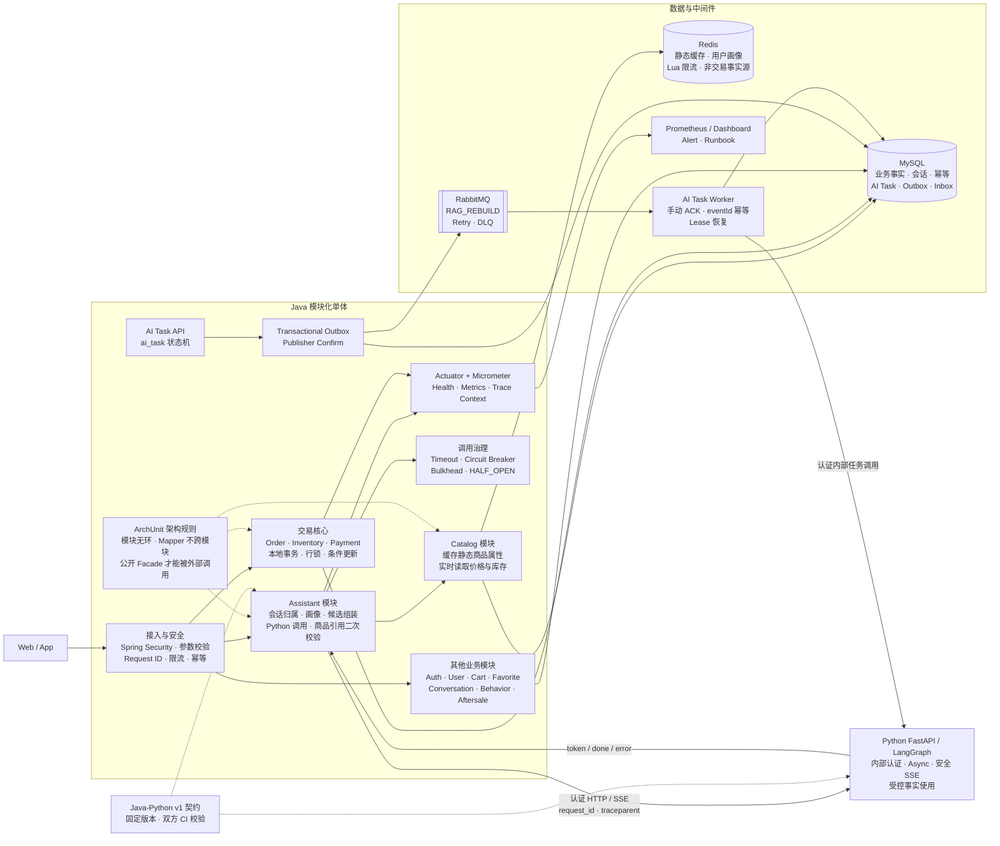
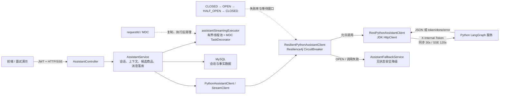
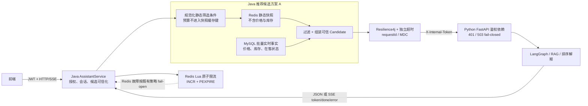

# Java 成熟工程架构润色设计

> **状态：** 设计方向已确认；Java AI 调用治理、Python 内部鉴权与 Redis 方案 A 已实现，后续阶段待推进`r`n> **日期：** 2026-07-14  
> **目标：** 在不盲目拆微服务的前提下，用四周左右的有效开发时间，把当前 Java 后端提升为边界清晰、正确性可证明、故障可恢复、运行可观察、异步任务可靠的模块化单体。  
> **协作约束：** LangGraph 主体仍由另一台电脑并行推进；本机只补齐了 Python HTTP 边界的内部鉴权，并继续以 Java 后端工程化为主。

## 1. 为什么现在做 Java 工程架构润色

当前项目已经具备真实的电商业务主线：

```text
用户与认证
-> 商品与 SKU
-> AI 导购与推荐候选
-> 收藏 / 购物车
-> 订单与库存
-> 支付与回调
-> 行为反馈
```

它也已经具备若干成熟设计基础：

- Java 是用户、会话、商品、价格、库存、订单和支付的事实源；
- Python 负责 LangGraph、RAG、排序解释和自然语言生成；
- Java 会过滤 Python 返回的商品引用，避免模型推荐候选集合外的商品；
- 库存使用条件更新而不是“先查后扣”；
- 订单、库存和支付依赖 MySQL 本地事务；
- 支付回调已有验签和重复成功判断；
- Redis 已用于商品、画像、候选缓存和 AI 限流；
- 项目已有 Flyway、单元测试和 MySQL Testcontainers。

当前的主要问题不是缺少业务功能，而是以下工程能力还没有闭环：

1. 模块虽然按业务分包，但跨模块依赖没有自动约束；
2. AI 熔断、超时和服务身份认证不完整；
3. Redis 候选缓存可能携带过期库存；
4. Redis 限流命令不是原子操作；
5. 下单入口缺少明确的请求幂等模型；
6. 可观测性主要依赖日志，缺少指标和健康状态；
7. 推荐曝光与用户行为没有稳定的归因标识；
8. 还没有一条真实、可靠、可故障验证的 MQ 垂直链路；
9. 学习 Demo 混入生产源码会污染质量门和架构表达。

因此，本轮润色不追求“技术栈更多”，而追求：

> 每一个架构能力都有真实业务场景、清晰接口、自动测试、故障语义和可观察证据。

## 2. 总体决策

| 主题 | 决策 |
| --- | --- |
| Java 形态 | 保持模块化单体，不立即拆微服务 |
| 模块约束 | 第一版优先使用 ArchUnit 固化依赖规则；不为展示框架强行引入 Spring Modulith |
| 交易核心 | `order + inventory + payment` 保持本地事务协作，暂不跨进程拆分 |
| 跨模块调用 | 通过公开的 Application Service / Facade 形成 seam，禁止直接访问其他模块 Mapper |
| Java-Python | Java 保持授权、会话、候选和事实控制；调用增加服务认证、超时、熔断、指标和 Trace 传播 |
| Redis | 只作缓存和保护层；实时库存、订单、支付和幂等结果以 MySQL 为准 |
| 可观测性 | 第一版使用 Actuator + Micrometer + Prometheus；Trace 后端按部署条件接入 |
| MQ | 第一条链路固定为 `RAG_REBUILD` 异步任务，使用 RabbitMQ |
| 消息可靠性 | Transactional Outbox + Publisher Confirm + 手动 ACK + MySQL 幂等 + 有限重试 + DLQ |
| 微服务 | 只有出现独立团队、扩容、发布、SLA 或数据所有权需求后再拆 |

## 3. 目标架构图



## 4. 设计原则

### 4.1 模块要深，不要只增加接口数量

本方案中的模块应当通过较小的 Interface 隐藏较多实现细节。调用方只需要知道：

- 能调用什么；
- 输入输出是什么；
- 必须满足哪些不变量；
- 失败时会返回什么；
- 是否参与事务；
- 是否可能进行网络或慢查询。

不为每个 Service 机械创建一个同名 Java Interface。只有以下场景才形成独立 seam：

1. 跨业务模块调用；
2. Java 调 Python、Redis、RabbitMQ 或支付平台等基础设施；
3. 测试需要替换真实外部依赖；
4. 已经存在两个真实 Adapter；
5. 某种复杂策略需要对调用方隐藏。

### 4.2 先修正确性，再谈性能和分布式

优先级固定为：

```text
事实正确性
-> 请求幂等与事务正确性
-> 模块依赖正确性
-> 故障恢复
-> 可观测性
-> 异步解耦
-> 微服务拆分
```

### 4.3 事实源不能模糊

- MySQL：库存、订单、支付、任务和幂等事实；
- Redis：缓存、限流和短期保护；
- RabbitMQ：任务传输和重投，不保存最终业务事实；
- Java：用户授权、会话归属、候选商品和交易事实；
- Python：推理、RAG、排序解释和自然语言生成。

## 5. 四周实施路线

## 5.1 第一周：可信基线

### 目标

先消除会直接破坏工程可信度的正确性、质量门和故障恢复问题。

### 工作项一：隔离学习 Demo

当前 `com.recommendation.learning` 下的学习代码不应继续作为生产制品的一部分。

目标目录策略：

```text
backend/src/main/java/...                  生产代码
backend/src/test/java/...                  可自动验证的学习/实验测试
learning_demos/ 或独立 examples 模块       不进入生产制品的教学代码
```

要求：

- 不删除用户正在学习的并发锁 Demo；
- 将其移动到不会污染生产 Checkstyle 和制品的位置；
- 每个重要 Demo 保留最小可运行验证；
- `mvnw.cmd verify` 必须全绿。

### 工作项二：修复 AI 熔断生命周期

当前计数型旁路在达到失败阈值后可能无法自动恢复。目标状态机：

```text
CLOSED
-> 连续失败达到阈值
-> OPEN
-> 等待 openDuration
-> HALF_OPEN 单次/少量探测
-> 成功回到 CLOSED
-> 失败重新 OPEN
```

第一版采用 Resilience4j，不继续扩展自制熔断状态机。

验收：

- Python 连续失败后 Java 自动降级；
- 等待时间结束后会进行有限探测；
- Python 恢复后无需重启 Java；
- 熔断状态、失败原因和恢复次数可观测；
- 不对已经开始输出 SSE 的请求做整体盲目重试。

### 工作项三：分离同步与 SSE 超时

普通 `/chat` 与 `/chat/stream` 使用不同超时：

- connect timeout；
- 普通响应总超时；
- SSE 建连和读取超时；
- Java `SseEmitter` 超时；
- Python 端总 deadline。

Java Client 的 Interface 必须明确：普通请求失败、流式请求建立失败、流中断和用户断连是不同错误。

### 工作项四：Java-Python 内部认证

第一版固定使用环境变量注入的内部 Token：

```text
X-Internal-Token: <secret>
```

Java 责任：

- `RestPythonAssistantClient` 自动添加 Header；
- 生产配置没有 Token 时启动失败；
- 日志不得打印 Token；
- 健康检查与业务请求分开处理；
- 携带 `request_id` 和 `traceparent`。

Python 的校验实现由另一台电脑完成，双方通过契约测试确认未认证请求被拒绝。

### 工作项五：修复 Redis 候选库存一致性

当前推荐候选缓存可能包含实时库存。目标流程：

```text
缓存静态商品属性或匹配商品 ID
-> 每次推荐前批量读取实时价格和库存
-> 过滤不可售 SKU
-> 组装可信 candidates
-> 调用 Python
```

第一版如果无法低风险拆分静态与动态查询，就先取消候选库存缓存，优先保证正确性。

验收：

- 下单锁库存后，下一次候选查询不会返回旧库存；
- Redis 不可用时回源 MySQL；
- Python 收到的库存来自本次实时组装；
- Redis 中不存在订单、支付和库存的唯一事实。

### 工作项六：Redis Lua 原子限流

将：

```text
INCR
-> 首次计数时 EXPIRE
```

改为一个 Lua 脚本原子执行。

验收：

- 并发请求下计数正确；
- 不会产生没有 TTL 的限流 Key；
- Redis Testcontainers 验证 TTL 和脚本返回值；
- Redis 故障时按照配置降级，并记录 error/fail-open 指标。

### 工作项七：下单幂等

客户端通过 `Idempotency-Key` 提交创建订单请求。

数据库约束：

```text
UNIQUE(user_id, idempotency_key)
```

同时保存请求体 Hash，避免同一个 Key 被用于不同请求。

处理规则：

- 首次请求创建订单并保存结果；
- 完全相同的重复请求返回第一次结果；
- 同 Key 不同请求体返回冲突；
- 并发重复请求只允许一个成功锁库存；
- 幂等实现以 MySQL 为准，不只使用 Redis 锁。

### 第一周完成标准

- `mvnw.cmd verify` 全绿；
- Python 故障后熔断能自动恢复；
- 同步和 SSE 超时测试通过；
- 未携带内部 Token 的 Python 业务调用被拒绝；
- AI 候选不再携带长时间过期库存；
- Redis Lua 集成测试通过；
- 并发重复下单只产生一个业务结果。

## 5.2 第二周：把模块化单体做实

### 目标

让模块关系从“开发者自觉”升级为“构建时自动验证”。

### 第一步：建立模块依赖地图

模块初始划分：

```text
identity
  auth
  user

catalog
  product

trade-core
  cart
  order
  inventory
  payment
  aftersale

engagement
  favorite
  behavior

assistant
  conversation
  assistant

platform
  common
  security
```

这只是依赖视图，不要求立即移动所有包或创建 Maven 多模块。

### 第二步：ArchUnit 规则

第一版至少验证：

1. 业务模块之间不存在循环依赖；
2. 任何模块不得直接访问其他模块的 `mapper` 包；
3. Controller 不能直接访问 Mapper；
4. 交易模块以外不得直接修改库存；
5. Python Client 只能由 Assistant Application 层调用；
6. `common` 不得反向依赖业务模块；
7. 模块外只能使用被标记为公开的 Facade/Application Service/DTO。

### 第三步：优先建立三个高价值 seam

#### Catalog Candidate Query

调用方只需要：

```text
根据可信用户需求返回本次可推荐候选
```

其内部隐藏：

- 静态缓存；
- MySQL 查询；
- 实时库存 Hydration；
- 可售过滤；
- 候选数量限制；
- 缓存降级。

#### Inventory Application Service

调用方只需要：

```text
lock
confirm
release
```

Interface 必须明确数量必须为正、失败返回方式、事务要求和幂等语义。Order/Payment 不再直接跨模块操作 InventoryMapper。

#### Conversation Application Service

调用方只需要：

```text
验证会话归属
读取受限历史
追加消息
```

Assistant 不直接依赖 Conversation 内部 Mapper 或 Model。

### 第四步：控制大 Service 的职责

不按方法数量机械拆类。只在出现独立职责和独立不变量时拆分：

- Assistant：上下文组装、Python 调用、结果校验；
- Order：订单创建、取消/关闭、查询；
- Payment：支付发起、回调确认、补偿查询。

每次拆分必须减少调用方需要理解的 Interface，而不是把一个大类变成多个浅包装类。

### 第二周完成标准

- ArchUnit 在 Maven Verify 中执行；
- 新增跨 Mapper 依赖会导致测试失败；
- 关键模块依赖无环；
- Order/Payment 不再直接访问 InventoryMapper；
- Assistant 通过公开查询 Interface 获取候选与会话；
- 没有批量创建一实现一接口的无用抽象；
- 架构依赖图和表所有权文档与代码一致。

## 5.3 第三周：可靠性、可观测性与反馈闭环

### 目标

让系统发生故障时能够回答：

```text
哪里慢？
哪里错？
影响多少请求？
是否正在降级？
是否已经恢复？
一次推荐最终有没有转化？
```

### Actuator 与健康检查

增加：

- liveness；
- readiness；
- MySQL、Redis、Python AI 依赖状态；
- 版本、构建 Commit 和运行环境信息；
- 生产环境只暴露必要端点。

Readiness 不应因为非关键缓存短暂失败就让商城整体下线，但必须反映关键事实库和交易入口是否可用。

### Micrometer 指标

Java 指标至少覆盖：

#### AI 调用

- 请求数、成功数、失败数；
- 普通请求和 SSE 耗时；
- Python timeout、5xx、解析失败；
- 熔断器状态和旁路次数；
- Fallback 次数；
- Java 组装的候选数量；
- Python 返回引用被 Java 丢弃的数量。

#### Redis

- hit、miss、error；
- 回源 MySQL 次数；
- Lua 限流拒绝和 fail-open；
- 命令耗时。

#### 交易

- 创建订单成功/失败；
- 幂等命中；
- 库存不足；
- 支付回调验签失败；
- 重复支付回调；
- 超时关单数量。

### Trace 与日志关联

- Java 接收或生成 `request_id`；
- 验证外部 request ID 的长度和字符集；
- Java 调 Python 时传播 `traceparent` 和 request ID；
- SSE 线程池通过 TaskDecorator 传播 MDC/Observation Context；
- 日志不记录内部 Token、JWT、支付签名、完整画像和完整 Prompt；
- 支付回调 Header 采用白名单持久化。

### 推荐曝光与转化归因

新增：

```text
assistant_recommendation
assistant_recommendation_item
recommendation_id
```

记录：

- request ID / run ID；
- 候选集与最终推荐 SKU；
- 规则分数和规则版本；
- 模型、Prompt 和 RAG 索引版本；
- 点击、收藏、加购、下单和支付事件。

推荐排序当前应表述为规则 Reranker Baseline，而不是训练完成的推荐模型。

### Dashboard 与 Runbook

至少准备两个 Dashboard：

1. Java 商城核心：请求、错误、DB、订单、库存、支付；
2. AI 导购：Python 延迟、SSE、熔断、Fallback、候选过滤、Redis 和推荐转化。

每个核心告警对应最小 Runbook：

- 告警含义；
- 第一检查项；
- 降级和恢复方式；
- 是否影响交易事实；
- 何时需要人工介入。

### 第三周完成标准

- Actuator 健康端点可用于部署探针；
- Prometheus 能采集核心指标；
- Java→Python 请求能通过 request ID/traceparent 关联；
- SSE 异步日志不丢失 Trace Context；
- 能观察熔断状态和自动恢复；
- 推荐结果具有稳定 `recommendation_id`；
- 点击、加购和支付可以归因到一次推荐；
- 至少完成一个 AI 故障 Runbook。

## 5.4 第四周：RabbitMQ 可靠异步垂直切片

### 目标

用一条真实的 `RAG_REBUILD` 长任务证明消息可靠性，不修改同步聊天和交易主链路。

### 任务状态

```text
PENDING
-> PROCESSING
-> SUCCESS

PENDING
-> PROCESSING
-> FAILED

PROCESSING lease 过期
-> 可重新 claim
```

`ai_task` 建议字段：

```text
task_id             unique
task_type
created_by
status
input_ref
result_ref
attempt_count
worker_id
lease_until
version
failure_code
created_at
started_at
finished_at
updated_at
```

### Transactional Outbox

创建任务时在一个 MySQL 事务中：

```text
INSERT ai_task(PENDING)
INSERT outbox_event(NEW)
COMMIT
```

Outbox Relay：

```text
批量 claim NEW 事件
-> 发布 RabbitMQ
-> 等待 Publisher Confirm
-> 标记 PUBLISHED
```

即使 Publisher Confirm 后更新 Outbox 前进程崩溃，重复发布也由消费端幂等处理。

### 消息结构

```json
{
  "eventId": "uuid",
  "eventType": "ai.task.requested",
  "schemaVersion": 1,
  "taskId": "task_xxx",
  "taskType": "RAG_REBUILD",
  "occurredAt": "2026-07-14T12:00:00+08:00",
  "correlationId": "request-id",
  "traceparent": "..."
}
```

消息中不放完整知识文件、用户画像、Prompt、密钥或交易数据。

### Worker 部署形态

第一版 Worker 仍位于同一 Java 仓库，但使用独立 Spring Profile/进程运行：

```text
web profile       接收 API、创建 task/outbox
worker profile    消费 RabbitMQ、调用 Python、保存结果
```

这能够形成独立扩容和故障隔离，同时暂时不支付拆仓库、拆数据库和服务治理成本。

### 消费幂等

数据库表：

```text
consumer_inbox
- consumer_name
- event_id
- processed_at

UNIQUE(consumer_name, event_id)
```

消费规则：

- task 已 SUCCESS：直接 ACK；
- event ID 已处理：直接 ACK；
- task 可 claim：进入 PROCESSING；
- task 被其他有效 lease 持有：延迟重试；
- lease 过期：允许重新 claim；
- Python 成功且 Java 保存结果后 ACK；
- Java 保存失败不得 ACK。

### Retry 与 DLQ

```text
main queue
-> retry 10s
-> retry 60s
-> retry 5m
-> final DLQ
```

分类：

- JSON/Schema 错误：直接 DLQ；
- 内部认证失败：失败并告警，不无限重试；
- Python 429/timeout/5xx：有限重试；
- Java/MySQL 暂时不可用：有限重试；
- 超过上限：task FAILED + DLQ。

DLQ 必须提供：

- 队列深度和最老消息时间；
- 告警；
- 查看失败原因；
- 人工 Redrive；
- Redrive 审计；
- Redrive 后仍保持幂等。

### 故障测试

至少自动验证：

1. MySQL 成功、RabbitMQ 暂时不可用时，Outbox 不丢；
2. Broker 收到消息、Outbox 尚未更新时进程崩溃，重复发布不会重复完成任务；
3. Worker 保存成功、ACK 丢失后重新投递，任务不会重复生效；
4. Python timeout 进入有限重试；
5. 非法消息进入 DLQ；
6. Worker 处理期间崩溃，lease 到期后可以恢复；
7. 关闭 MQ Publisher Feature Flag 后，同步聊天和交易不受影响。

### 第四周完成标准

- `POST /api/ai/tasks` 返回 `202 + taskId`；
- 可查询 PENDING/PROCESSING/SUCCESS/FAILED；
- 任务和 Outbox 同事务提交；
- Publisher Confirm 和手动 ACK 生效；
- 重复消息不会重复完成任务；
- Retry、DLQ 和 Redrive 可验证；
- 有队列积压、失败和 DLQ 告警；
- 普通聊天、订单和支付不依赖 RabbitMQ 可用性。

## 6. 微服务决策门

完成四周润色后仍不默认拆微服务。只有满足以下条件之一，才为对应模块单独写拆分设计：

1. 存在独立负责该模块的团队；
2. 该模块需要持续独立扩容；
3. 发布频率和其他模块明显不同；
4. 故障必须与交易核心隔离；
5. 单体构建、测试或发布已经成为可量化瓶颈；
6. 模块已经拥有稳定 Interface 和独立数据所有权；
7. 团队具备分布式追踪、幂等、补偿和运维能力。

如果未来拆分，建议顺序：

```text
AI Task Worker
-> Catalog 只读能力
-> Identity
-> 最后才考虑 Order / Inventory / Payment
```

## 7. 质量门

### Java CI

```text
compile
-> Checkstyle
-> unit tests
-> ArchUnit
-> MySQL integration tests
-> Redis integration tests
-> RabbitMQ integration tests
-> package
```

### 跨服务 CI

```text
固定版本 Contract
-> Java DTO / Python Schema 校验
-> Java-Python HTTP smoke
-> SSE token/done/error smoke
-> 内部认证失败测试
```

### 安全门

- 生产默认 Secret 未覆盖时启动失败；
- 日志 Secret 扫描；
- 依赖漏洞扫描；
- 支付回调 Header 白名单；
- 前端用户不能直接伪造 Java-Python 内部请求；
- Actuator 生产暴露面受限。

## 8. 预计涉及的 Java 代码区域

### 第一周

```text
backend/pom.xml
backend/src/main/resources/application.properties
backend/src/main/java/.../assistant/client/RestPythonAssistantClient.java
backend/src/main/java/.../assistant/service/AssistantFallbackService.java
backend/src/main/java/.../common/cache/RedisCacheService.java
backend/src/main/java/.../product/service/ProductCatalogService.java
backend/src/main/java/.../order/api/OrderController.java
backend/src/main/java/.../order/service/OrderService.java
backend/src/main/resources/db/migration/
backend/src/test/java/
```

### 第二周

```text
backend/src/test/java/.../architecture/
backend/src/main/java/.../product/
backend/src/main/java/.../inventory/
backend/src/main/java/.../conversation/
backend/src/main/java/.../assistant/
backend/src/main/java/.../order/
backend/src/main/java/.../payment/
```

### 第三周

```text
backend/pom.xml
backend/src/main/resources/application.properties
backend/src/main/java/.../common/logging/
backend/src/main/java/.../assistant/config/
backend/src/main/java/.../assistant/service/
backend/src/main/java/.../behavior/
backend/src/main/resources/db/migration/
```

### 第四周

```text
docker-compose.yml
backend/pom.xml
backend/src/main/java/.../aitask/
backend/src/main/java/.../messaging/
backend/src/main/resources/db/migration/
backend/src/test/java/.../aitask/
backend/src/test/java/.../messaging/
```

具体文件名和类名在实施计划阶段根据现有调用链确定。本设计不预先创建没有真实调用方的 Interface、Factory 或 Adapter。

## 9. 风险与回滚

| 风险 | 控制方式 | 回滚方式 |
| --- | --- | --- |
| 候选缓存调整导致查询变慢 | 先记录 SQL 与缓存基线，批量 Hydration | Feature Flag 关闭新缓存策略，但不能恢复错误库存事实 |
| Resilience4j 参数过于激进 | 从现有超时和真实失败数据设置初值 | 配置回滚，不回到永久熔断实现 |
| ArchUnit 一次暴露过多违规 | 按高风险规则分批收紧 | 暂时记录已知违规清单，不删除核心规则 |
| 指标标签基数爆炸 | 禁止 userId、requestId、SKU 作为 Metrics Label | 删除高基数 Label，Trace 中保留关联信息 |
| Outbox 重复发布 | Consumer 数据库幂等 | 关闭 Publisher，保留 Outbox 待恢复 |
| MQ 不可用 | 同步交易不依赖 MQ | 关闭 AI Task Feature Flag |
| Python 长任务失败 | 有限重试、任务状态、DLQ | 人工 Redrive 或重新创建任务 |

## 10. 面试验收问题

完成后应能直接回答：

1. 为什么现在不拆微服务？
2. 如何证明模块之间没有循环依赖？
3. 为什么禁止跨模块访问 Mapper？
4. 库存为什么不能直接相信 Redis？
5. 为什么 `INCR + EXPIRE` 必须使用 Lua？
6. 重复下单如何做到幂等？
7. AI 熔断打开后如何自动恢复？
8. 为什么同步聊天不走 MQ？
9. 为什么第一条 MQ 链路选择 RAG 重建？
10. DB 成功但 MQ 发布失败怎么办？
11. Consumer 保存成功但 ACK 丢失怎么办？
12. 为什么不宣称 exactly-once？
13. 毒消息为什么不会无限重试？
14. DLQ 如何告警和重放？
15. 如何观察 Java→Python 延迟和 Fallback？
16. Redis 故障时哪些功能仍可用？
17. Python 故障时商城哪些功能仍可用？
18. 一次推荐如何归因到加购、下单和支付？
19. 什么指标会触发真正的微服务拆分？
20. 新机器如何验证整个系统可以运行？

## 11. 最终完成定义

四周工程架构润色完成的最低标准：

- Java Verify 全绿；
- 学习 Demo 不进入生产制品；
- ArchUnit 自动验证核心模块规则；
- 订单创建具备数据库幂等；
- AI 熔断可以自动 HALF_OPEN 和恢复；
- Java-Python 有服务身份、独立超时和 Trace 传播；
- Redis 不向 AI 返回长时间过期库存；
- Lua 限流有真实 Redis 集成测试；
- Actuator、Prometheus 和核心 Dashboard 可用；
- 推荐曝光和转化可以通过 `recommendation_id` 关联；
- `RAG_REBUILD` 具备 Task、Outbox、Confirm、ACK、Retry、DLQ 和幂等；
- 关键故障有自动测试和 Runbook；
- 项目可以被准确描述为“模块化单体 + 独立 AI 服务 + 可靠异步任务”，而不是伪装成完整微服务平台。

## 12. 推荐的统一表述

> Java 后端采用模块化单体而不是过早拆微服务。通过 ArchUnit 固化模块依赖，跨模块只能经过公开的 Application Service 或 Facade；订单、库存和支付继续使用本地事务保证交易正确性。Redis 只缓存静态商品和画像，并通过 Lua 实现原子限流，实时库存仍由 MySQL 校验。Java 调 Python 时使用内部服务身份、独立超时、Resilience4j 熔断和 Trace 传播。对于真正可异步的 RAG 重建任务，系统使用 RabbitMQ、Transactional Outbox、Publisher Confirm、手动 ACK、数据库幂等、有限重试和 DLQ，保证 at-least-once 下的业务幂等。只有出现独立团队、扩容、发布或数据所有权需求后，才会从现有稳定模块 Interface 拆出微服务。

## 13. Java AI Client Reliability 实施状态（2026-07-14）

### 13.1 本轮已经完成

- Java 同步 `/chat` 和 SSE `/chat/stream` 请求均发送 `X-Internal-Token`；
- 内部 Token 支持独立环境变量 `APP_AI_PYTHON_INTERNAL_TOKEN`，并兼容复用 `APP_INTERNAL_API_TOKEN`；
- 同步请求和 SSE 请求使用独立读取超时，避免长连接被同步接口的短超时误杀；
- 使用 Resilience4j Core 2.4.0 装饰原始 HTTP Adapter，同步与 SSE 共用一个 Python 依赖熔断器；
- CircuitBreaker 已覆盖 `CLOSED → OPEN → HALF_OPEN → CLOSED` 自动恢复测试；
- SSE 的 done、error、异常结束都会向 CircuitBreaker 记录唯一终态；
- `AssistantFallbackService` 已改为无状态安全响应构造器，不再自己维护失败次数；
- CircuitBreaker OPEN 时，同步请求和 SSE 请求都会快速进入已有的安全降级路径；
- SSE 有界线程池通过 TaskDecorator 传播并清理 MDC，避免 requestId 丢失或串线；
- 熔断功能支持 `app.ai.circuit-breaker.enabled` 开关，便于测试替身和紧急配置回滚。

### 13.2 当前框架图



### 13.3 本轮对应的工程知识

| 改进 | 对应知识点 | 面试可说明的价值 |
| --- | --- | --- |
| HTTP Adapter 与熔断 Decorator 分离 | 端口适配器、装饰器模式、依赖倒置 | 业务层不感知 HTTP 和熔断库，策略可替换、可单测 |
| 同步/SSE 独立超时 | 超时预算、长短请求隔离 | 避免一个全局 timeout 同时伤害普通请求和长连接 |
| `X-Internal-Token` | 服务间认证、Secret 外置 | 防止前端绕过 Java 直接伪造 Python 内部调用 |
| Resilience4j 状态机 | 熔断、快速失败、半开探测、自愈 | Python 故障不会持续拖垮 Java，也不会永久旁路 Python |
| 无状态 Fallback | 单一职责、线程安全 | 降级文案与故障状态解耦，不再存在 JVM 全局计数竞态 |
| SSE 终态记录 | 流式协议生命周期、exactly-once terminal bookkeeping | done/error/异常结束只记录一次，熔断统计不会重复 |
| MDC TaskDecorator | ThreadLocal、线程池上下文传播与清理 | 异步日志仍能关联 requestId，同时防止线程复用造成串线 |
| 核心依赖而非 Boot Starter | 兼容性控制、最小依赖原则 | Spring Boot 4 基线下只引入已验证能力，避免 Starter 自动配置风险 |
| 测试先行 | RED-GREEN-REFACTOR、故障路径测试 | 不只测试成功路径，还证明 OPEN、HALF_OPEN、超时与安全降级行为 |

### 13.4 验证结果与剩余门禁

- AI 聚焦测试：15 个测试全部通过；
- Java 全量测试：198 个测试通过，0 失败，0 错误，2 个跳过；
- Assistant 生产代码 Checkstyle：0 违规；
- 依赖树仅新增 `resilience4j-circuitbreaker` 与其 `resilience4j-core`；
- 全量 `mvnw.cmd verify` 尚未全绿：测试和打包通过，但被既有学习 Demo 的 18 个 Checkstyle 违规阻断；涉及 `CacheBreakdownDemo.java`、`CachePenetrationDemo.java`、`MQOutfitDemo.java`、`MQProductionDemo.java`。本轮未擅自修改学习代码；
- Python 端现已强制校验 `X-Internal-Token`，Java 发送与 Python 拒绝/接受两侧均有自动测试；尚未启动两个真实进程执行跨服务 Smoke Test，因此不把“双方单测通过”等同于完整端到端验收；
- Redis 方案 A 已在下一阶段落地；订单幂等、ArchUnit、Actuator、RabbitMQ/Outbox 仍按前文章节继续推进。

## 14. Python 内部鉴权与 Redis 方案 A 实施状态（2026-07-14）

### 14.1 Python 服务边界鉴权

- `/chat`、`/chat/stream`、`/chat/pipeline`、`/chat/langgraph`、`/chat/feedback` 统一校验 `X-Internal-Token`；
- Secret 优先读取 `APP_AI_PYTHON_INTERNAL_TOKEN`，兼容 `APP_INTERNAL_API_TOKEN`，不写死在代码和配置样例中；
- 使用常量时间比较，避免普通字符串比较带来的时序侧信道；
- Token 未配置时 fail-closed 返回 503，缺失或错误时返回 401；
- 健康检查保持公开，便于容器编排探活；
- 日志与错误响应不回显 Secret。

### 14.2 Redis 方案 A：静态快照缓存，动态事实回源

推荐候选不再把价格和库存作为 Redis 中可长期复用的事实。新的读路径为：

```text
规范化推荐条件
-> Redis 获取静态 RecommendationCandidateSnapshot
-> miss 时从 MySQL 查询并写入静态快照
-> 按 skuId 一次批量查询 MySQL 实时价格/库存/在售状态
-> 过滤下架、无库存、价格缺失、超预算 SKU
-> 组装完整 RecommendationCandidate
-> 交给 Python 排序和解释
```

实现要点：

- 静态快照只包含商品、类目、图片、颜色、尺码、材质、季节、风格和属性标签；
- 实时事实模型只包含当前售价、SPU 价格区间、SKU 库存和 SPU 总库存；
- 相同静态筛选条件的不同预算共用一个缓存键，预算在实时组装阶段过滤，避免缓存碎片；
- Redis miss 或 Redis 故障仍可查询 MySQL，Redis 不成为交易事实源；
- 缓存命中也必须查询实时事实，避免把过期库存或价格暴露给 AI。

### 14.3 Redis Lua 原子限流

原来的 `INCR` 与 `EXPIRE` 两条命令存在进程在两步之间退出时留下永久 key 的窗口。现在通过单段 Lua 脚本完成：

```lua
local count = redis.call('INCR', KEYS[1])
if count == 1 then
    redis.call('PEXPIRE', KEYS[1], ARGV[1])
end
return count
```

该语义保证首次计数和 TTL 设置在 Redis 内原子完成；Java 侧继续保留 Redis 异常时的既有 fail-open 行为，防止缓存故障直接中断 AI 导购主链路。真实 Redis Testcontainers 测试已覆盖顺序计数、并发唯一计数和 TTL，但本机 Docker 未启动时会按测试配置跳过，不能把“测试代码存在”表述为“容器集成测试已实际执行”。

### 14.4 当前已完成框架图



### 14.5 本阶段对应知识点

| 已完成能力 | 工程知识 | 面试表达 |
| --- | --- | --- |
| Python 统一鉴权依赖 | 服务间身份认证、Secret 外置、fail-closed | Python 不是可由浏览器直接调用的公开后端 |
| 常量时间 Token 比较 | 安全编码、时序攻击基础防护 | 不用普通字符串比较认证 Secret |
| 静态/动态候选拆分 | Cache-Aside、事实源、缓存一致性 | Redis 提速但不决定库存和价格真相 |
| 批量实时补齐 | 避免 N+1、读模型组装 | 一次 SQL 补齐所有 SKU 交易事实 |
| 预算不进入快照键 | 缓存键设计、低基数复用 | 动态条件后过滤，减少无意义缓存分片 |
| Lua 限流 | Redis 原子性、固定窗口限流 | 消除 INCR 成功但 EXPIRE 丢失的永久 key 窗口 |
| Testcontainers 测试 | 基础设施语义验证 | Mock 验证调用形状，真实 Redis 验证 TTL/并发语义 |

## 15. 下一阶段：订单创建幂等

订单幂等方案已经确认，详细设计见：

```text
docs/superpowers/specs/2026-07-14-order-idempotency-design.md
```

本阶段采用 MySQL 独立 `order_idempotency` 表，通过 `(user_id, operation, idempotency_key)` 唯一约束保护购物车结算和立即购买。幂等占位、库存锁定、订单创建、购物车清理、行为事件和 `order_id` 关联处于同一个本地事务；相同 Key 的重复请求返回同一订单，相同 Key 换参数返回 HTTP 409。该能力为后续 MQ `eventId + Inbox` 消费幂等建立模型，但不提前引入 RabbitMQ。
