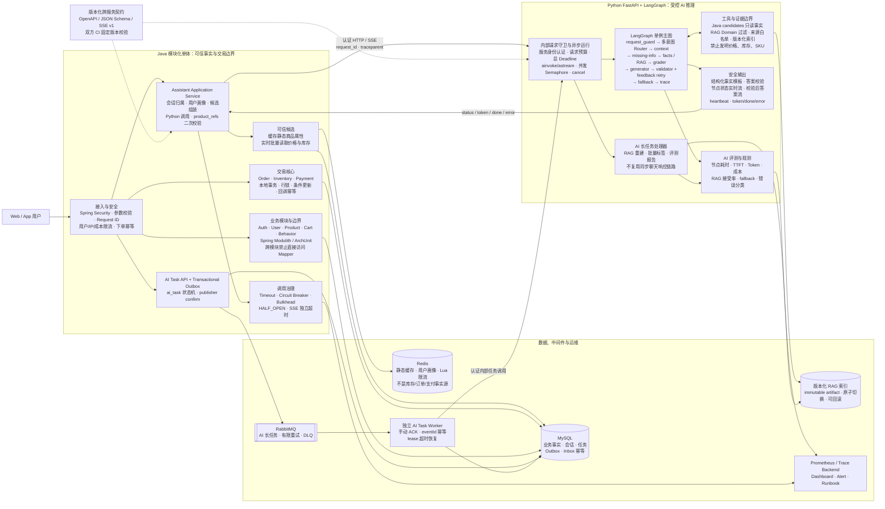

# Java + LangGraph 现代化改进设计

> **状态：** 已讨论确认，作为后续开发与面试讲解的统一设计基线  
> **日期：** 2026-07-14  
> **覆盖范围：** Java 模块化单体、Python FastAPI/LangGraph、Redis、RabbitMQ 演进、跨服务契约、可观测性与评测  
> **非目标：** 本设计不要求立即拆 Java 微服务，不把同步聊天、订单、库存或支付主事务迁移到 MQ，也不为展示技术栈引入多 Agent、Kafka、Redis Cluster 或新的向量数据库。

## 1. 文档目的

当前项目已经形成了“Java 电商事实层 + Python AI 推理层”的合理边界，但生产可靠性仍存在缺口。本设计把 2026-07-13 的代码审计和架构讨论整理为可执行的开发基线，重点回答以下问题：

1. 现有 LangGraph 是否符合现代 Agent 工程标准，应从哪里优化；
2. Java 单 Maven 模块是否需要立即拆微服务；
3. Redis 还缺哪些正确性和运维能力；
4. RabbitMQ 应以什么场景和可靠性模型无缝接入；
5. 怎样把项目提升为经得起 Java + AI Agent 面试追问的工程项目。

本设计中的“现代化”不等于堆叠组件，而是同时满足：

- 商业事实不越权；
- 业务工作流可解释、可测试；
- 同步与异步边界明确；
- 超时、熔断、重试和取消可预测；
- 契约、测试、评测和部署可复现；
- 系统能够观察延迟、错误、Token、成本和业务效果。

## 2. 总体决策

### 2.1 架构定位

当前项目应定义为：

> Java 模块化单体承载用户、商品、价格、库存、订单、支付、会话和任务状态等业务事实；Python 独立服务承载 LangGraph、RAG、候选排序解释和自然语言生成；Java 与 Python 通过版本化内部契约通信。

### 2.2 核心决策

| 主题 | 决策 |
| --- | --- |
| LangGraph | 保留单图、显式节点和确定性路由，不改成开放式万能 ReAct 或多 Agent |
| 会话状态 | Java 继续持久化会话历史；短同步图启动时编译为单例，默认不使用请求级 `InMemorySaver` |
| 持久化 Checkpoint | 只有出现中断恢复、人工审批、长任务续跑等需求时才引入持久化 Checkpointer |
| SSE | 先实现节点状态实时流，答案通过校验后再输出；高风险事实不直接裸流模型 Token |
| Java 架构 | 保持单部署模块，先用 Spring Modulith/ArchUnit 固化模块边界 |
| Redis | 只作加速和保护层；实时库存、订单、支付和任务最终状态仍以 MySQL 为准 |
| MQ | 首选 RabbitMQ，第一条链路为 RAG 重建、批量标签或评测报告等 AI 长任务 |
| 事务 | 订单创建、锁库存、支付确认等强一致流程继续使用 MySQL 本地事务 |
| 消息语义 | 采用 at-least-once + Outbox + 幂等消费，不宣称 exactly-once |
| 微服务 | 只有出现独立团队、发布、扩容、SLA 或数据所有权需求后再拆 |

## 3. 当前基线

### 3.1 已有优势

1. Java 是用户、会话、商品、SKU、价格、库存、订单和支付的事实源；
2. Python 只消费 Java 组装的 `user_context` 和 `candidates`；
3. Python 返回的 `product_refs` 会由 Java 再次校验；
4. LangGraph 已包含意图识别、缺信息门、结构化事实查询、RAG、检索评分、答案校验、有限重试和兜底；
5. 库存使用带条件的原子更新，支付回调具备验签和重复回调判断；
6. Redis 已覆盖商品、画像、推荐候选和 AI 限流的第一版能力；
7. 项目已有 Java/Python 测试、Flyway、MySQL Testcontainers 和 RAG 评测基线。

### 3.2 已验证的主要缺口

1. Python 会把只有 `in_stock` 状态、没有精确数量的候选解释成“库存 1 件”；
2. 候选中缺少某颜色/尺码时，当前逻辑可能错误地解释成库存为零；
3. 同一 SPU 多个 SKU 价格不同时，价格查询可能取第一条候选；
4. Java 传入的身高体重没有完整进入尺码缺信息判断；
5. Validator 的失败反馈没有进入默认 LLM Prompt，重试可能重复相同错误；
6. `/chat/stream` 先完成整张图，再把最终答案固定长度切片，不是真实流式；
7. FastAPI `async` 路由中执行同步图和同步 Provider 调用；
8. 每次请求重新构建图并创建短生命周期 `InMemorySaver`，不能实现恢复；
9. Java 调 Python 缺少服务身份认证；
10. Java/Python 共享契约存在字段漂移，且 CI 无法可靠获取仓库外的 sibling contract；
11. 推荐候选缓存包含实时库存，库存变化后没有对应失效；
12. Redis 限流的 `INCR` 和 `EXPIRE` 不是原子操作；
13. Java 自制 AI 熔断达到阈值后可能永久旁路 Python；
14. Java `verify` 的测试执行通过，但 Checkstyle 被学习 Demo 阻断；
15. 当前没有生产 RabbitMQ，现有 MQ learning Demo 不能作为可靠消息实现。

## 4. 目标框架图



### 4.1 图中最重要的边界

- **Java 决定事实：** 用户身份、会话归属、候选商品、价格、库存、订单和支付状态；
- **LangGraph 决定流程：** 意图、缺信息判断、事实工具/RAG 路由、答案生成、校验、兜底；
- **Redis 决定速度，不决定最终事实；**
- **RabbitMQ 决定异步任务何时执行，不决定交易是否成功；**
- **MySQL 是业务状态、消息幂等和任务状态的最终事实源；**
- **跨服务契约必须进入版本控制和双方 CI。**

## 5. LangGraph 改进设计

### 5.1 P0：先修商业事实语义

#### 库存状态与库存数量分离

目标模型：

```text
in_stock: bool | null
stock_count: int | null
stock_evidence: exact | status_only | unknown
```

规则：

- 只有 `available_stock` 有值时才能输出精确数量；
- 只有 `stock_status=in_stock` 时只能输出“候选数据显示有货”；
- 候选缺失只能解释为“当前候选集合无法核实”；
- Python 不得把缺失候选解释成数据库库存为零。

#### SKU 与价格语义

- 明确 SKU 时返回该 SKU 的价格；
- 只明确 SPU 且所有 SKU 同价时返回单价；
- 不同价时返回区间或追问规格；
- 禁止依赖候选数组第一条的顺序决定答案。

#### 尺码信息优先级

```text
当前用户输入的新值
> Java user_context 结构化画像
> 最近一轮有效历史
```

尺码工具应接收结构化 `height_cm`、`weight_kg` 和 `preferred_fit`，不再只靠自由文本正则解析。

### 5.2 图编译与 Checkpoint

当前同步聊天由 Java 提供完整会话历史，LangGraph 执行时间较短，因此目标为：

1. FastAPI 启动时编译单例 Graph；
2. 请求通过 `ainvoke` 或 `astream` 执行；
3. `thread_id` 先用于 trace 关联，不宣传跨请求恢复；
4. 删除生产请求级短生命周期 `InMemorySaver`；
5. 只有出现人工审批、中断恢复或长任务续跑时，再设计持久化 Checkpointer、TTL、数据清理和线程所有权。

### 5.3 安全流式

第一阶段不直接裸流未经校验的模型 Token，而是发送：

```text
status: intent_recognized
status: checking_candidates
status: retrieving
status: validating
token: 已通过安全边界的答案块
done
```

验收要求：

- 第一条状态事件在整张图完成前到达；
- 客户端断开后取消下游 Provider 调用；
- `done.answer` 与用户收到的答案一致；
- Validator 拒绝的价格、库存、SKU 事实不得先行泄漏；
- SSE `data` 保持单行 JSON；
- 支持 heartbeat、event ID、`done` 和安全的 `error`。

### 5.4 异步与依赖治理

- 使用 `graph.ainvoke` / `graph.astream`；
- LLM 使用异步调用；
- embedding 使用可复用的 `httpx.AsyncClient`；
- 分别配置 connect/read/write/pool timeout；
- 设置模型并发上限和每请求总 deadline；
- 只对尚未产生外部副作用的 Provider 调用做有限指数退避；
- 将异常分类为 timeout、rate limited、unavailable、invalid response 和 index not ready；
- trace 持久化必须 best-effort，不能让日志写失败破坏正常回答。

内部认证第一版固定使用环境变量注入的 `X-Internal-Token`，由 Java Client 自动发送、Python 使用常量时间比较统一校验，并通过部署网络限制 Python 端口只允许 Java/Worker 访问。后续需要跨集群或凭证轮换时再升级为短期服务 JWT 或 mTLS。

### 5.5 Router 与 State

状态从单一 `intent` 演进为：

```text
primary_intent
requested_capabilities[]
slots{}
confidence
```

示例：

```json
{
  "primary_intent": "recommendation",
  "requested_capabilities": [
    "price_filter",
    "inventory_check",
    "size_filter",
    "occasion_filter"
  ],
  "slots": {
    "budget_max": 300,
    "color": "black",
    "size": "L",
    "occasion": "commute"
  }
}
```

Java 已提供的 `demand_intent` 优先于 Python 的重复关键词推断；规则低置信或多意图冲突时，再调用 structured-output LLM Router。

### 5.6 RAG 与答案校验

- 在向量检索前按 query type 过滤业务 Domain；
- 政策类知识使用独立权威来源、有效期和版本，不与普通穿搭知识混用；
- 知识 Chunk 和用户输入都视为不可信数据，不执行其中的指令；
- LLM 输出引用 ID，程序校验 ID 必须属于本次 accepted chunks；
- 商业事实尽量使用确定性模板，LLM 主要负责解释性文本；
- Validator 的枚举化反馈必须进入下一次生成 Prompt；
- 不优先增加在线 LLM Judge，避免增加成本和不确定性。

当前数据量下保留本地 JSON 向量索引即可。只有出现数万级 Chunk、多实例共享检索、明显延迟或复杂 metadata/hybrid search 需求时，再评估 Qdrant、Elasticsearch 或其他向量服务。

### 5.7 评测与观测

新增指标：

- 请求总耗时和各节点耗时；
- 首状态事件、首安全 Token 和总响应时延；
- LLM/embedding 429、5xx、timeout；
- 输入/输出 Token 和单请求成本；
- RAG 接受率、拒答率和错误 Domain 率；
- Validator 重试次数；
- fallback 率；
- 商品引用合法率；
- 价格、库存事实一致率；
- 客户端断连和取消成功率。

评测集需要覆盖：

- 多意图；
- 身高体重画像；
- 多轮纠错；
- 候选缺失；
- RAG 无关问题；
- 用户和知识库 Prompt Injection；
- 模型 429/5xx/timeout；
- 索引损坏；
- SSE 断连；
- 真实模型回答与成本。

## 6. Java 后端改进设计

### 6.1 保持模块化单体

当前不拆微服务的理由：

1. 订单、库存和支付仍依赖本地事务；
2. 当前没有独立团队和独立发布需求；
3. 没有某个 Java 模块需要持续独立扩容的证据；
4. Java 与 Python 已经形成一个合理的跨进程边界；
5. 直接拆交易服务会引入 Saga、补偿、分布式幂等和复杂部署，收益小于成本。

拆分前先完成：

- Spring Modulith 或 ArchUnit 模块验证；
- 禁止跨模块直接访问 Mapper；
- 跨模块只依赖公开 application service、Facade 或领域事件；
- 为每个模块记录表所有权；
- 将 order、inventory、payment 先视为交易核心边界；
- 记录真实扩容、发布和故障数据，再决定是否拆分。

### 6.2 Java-Python 调用治理

- Java 自动携带服务身份、request ID 和 `traceparent`；
- Python 除健康检查外拒绝匿名内部调用；
- 使用 Resilience4j 管理 Timeout、Circuit Breaker 和 Bulkhead；
- 熔断状态必须支持 `CLOSED -> OPEN -> HALF_OPEN -> CLOSED`；
- 普通调用和 SSE 使用独立超时；
- 不对已开始向用户输出的生成请求盲目重试；
- Java 继续执行最终 `product_refs` 校验。

### 6.3 交易可靠性

- 下单接口增加 `Idempotency-Key`；
- 建立 `(user_id, idempotency_key)` 唯一约束和请求体 Hash；
- 重复请求返回第一次处理结果；
- 真实支付平台调用移出长数据库事务，回调在短事务中确认；
- Refresh Token 使用行锁或条件更新避免并发重复刷新；
- 多实例定时关单使用数据库 claim、`SKIP LOCKED` 或调度租约；
- 延迟消息只能作为优化，数据库补偿扫描仍需保留。

### 6.4 推荐反馈闭环

新增结构化推荐记录：

```text
assistant_recommendation
assistant_recommendation_item
recommendation_id
```

记录：

- 候选集版本；
- 最终推荐 SKU；
- 排名分数与规则版本；
- 模型、Prompt 和 RAG 索引版本；
- 推荐理由；
- request ID / run ID；
- 点击、收藏、加购、下单和支付归因。

手工加权排序必须诚实描述为规则 Reranker Baseline；得分要么称为 `raw_score`，要么稳定归一化到 `[0,1]`。

## 7. Redis 改进设计

### 7.1 事实边界

Redis 可以缓存：

- 静态商品属性；
- 商品详情；
- 用户画像；
- 搜索结果；
- 不含实时库存的推荐匹配结果；
- AI 限流计数和短期保护状态。

Redis 不能成为唯一事实源：

- 实时库存；
- 订单状态；
- 支付状态；
- 用户所有权；
- MQ 消费幂等结果；
- AI 任务最终状态。

### 7.2 候选缓存调整

目标流程：

```text
缓存命中静态商品/匹配 ID
-> 批量读取 MySQL 实时价格与库存
-> 过滤不可售 SKU
-> 组装 Java candidates
-> 调用 Python
```

在完成静态数据和动态库存拆分前，可以暂时取消候选缓存，优先保证正确性。

### 7.3 限流与一致性

- 使用 Lua 原子执行 `INCR + EXPIRE`；
- 后续根据真实流量再升级 token bucket/sliding window；
- 同时考虑用户、IP、全局并发和模型成本预算；
- 用户画像和其他 Cache Aside 删除在数据库提交后执行；
- Key 增加应用、环境和 Schema 版本前缀；
- 不存在商品可使用短 TTL 空值缓存；
- Redis 故障降级必须产生指标和采样日志。

### 7.4 Redis 验收

- Redis Testcontainers 验证真实序列化、TTL 和 Lua；
- 并发请求不会产生无 TTL 限流 Key；
- 锁库存后下一次 AI 候选读取不到旧库存；
- 用户画像事务提交后缓存才失效；
- Redis 故障不会阻断商城主流程，但能触发指标和告警。

## 8. RabbitMQ AI 长任务设计

### 8.1 第一条业务链路

第一条实现固定为 **RAG 索引重建任务**，任务类型使用 `RAG_REBUILD`，消息事件使用 `ai.task.requested.v1`。批量商品标签和推荐评测报告作为后续复用同一任务框架的候选，不进入第一版范围。

普通 `/chat` 和 `/chat/stream` 继续使用 HTTP/SSE。订单锁库存、支付确认和交易事实不迁移到 MQ。

### 8.2 可靠消息链路

```text
POST /api/ai/tasks
-> MySQL 同事务写 ai_task(PENDING) + outbox_event
-> 返回 202 + taskId
-> Outbox Relay 发布 ai.task.requested.v1
-> Publisher Confirm 后更新 outbox
-> Worker 消费并原子 claim task
-> 调用 Python 长任务
-> Java 短事务保存 SUCCESS/FAILED
-> 提交成功后 ACK
```

### 8.3 幂等与重试

- `event_id` 全局唯一；
- `consumer_inbox` 建立 `(consumer_name, event_id)` 唯一约束；
- 任务状态使用 CAS/version/lease 防止重复执行；
- Consumer 保存成功但 ACK 丢失时，重复消息识别 SUCCESS 后直接 ACK；
- JSON/Schema 错误直接进入 DLQ；
- 429、timeout、5xx 进入 10 秒、60 秒、5 分钟有限重试；
- 超过上限后任务标记 FAILED，并进入最终 DLQ；
- DLQ 必须有指标、告警、查询、人工重放和审计。

### 8.4 顺序与并发

MQ 不保证所有任务全局串行完成。默认策略：

- 根据模型配额设置有限 consumer concurrency；
- 使用较小 prefetch，防止单个 Worker 持有过多任务；
- 任务互相独立时允许并行；
- 同一用户或同一聚合必须有序时，使用固定路由分片和 sequence/version；
- 不为了“一个一个执行”把整个系统锁成单消费者。

### 8.5 灰度与回滚

1. 先发布 additive 数据库迁移；
2. 部署队列、Retry、DLQ 和 Consumer，但暂不生产消息；
3. 部署任务 API 和 Outbox Relay；
4. Feature Flag 开启小流量任务；
5. 观察 backlog、oldest message age、重试、DLQ 和端到端耗时；
6. 出现问题时关闭 Publisher，Outbox 保留，恢复后继续发布；
7. 同步聊天和交易主链路不受影响。

## 9. 跨服务契约与质量门

共享契约第一版固定采用 **独立 contract Git 仓库**，将现有 `outfit-project-contract` 纳入版本控制，由 Java/Python CI checkout 固定 SHA。后续可以发布版本化 Schema Artifact，但不再依赖开发机上未版本化的 sibling 目录，也不在本阶段迁移为 Monorepo。

契约测试不能只比较字段名，还应覆盖：

- 类型；
- 必填与可空；
- Enum；
- 未知字段策略；
- Schema version；
- SSE `token/done/error` 事件；
- 同步响应与 `done` 响应语义一致性。

质量门顺序：

```text
Contract Schema
-> Java unit/integration/checkstyle
-> Python compile/lint/unit/eval
-> Frontend test/build
-> Java-Python HTTP/SSE smoke
-> Docker build
```

学习 Demo 不放在生产 `src/main/java`，避免污染 Checkstyle、制品和面试边界。

## 10. 实施优先级

### Phase 0：可信基线

1. 修复库存、候选缺失、SKU 价格和尺码画像语义；
2. 让 `validation_feedback` 进入 Prompt；
3. 修复共享契约并纳入可复现 CI；
4. Java/Python 增加服务身份认证；
5. 修复永久熔断；
6. 移走生产源码中的 learning Demo；
7. 保证 Java/Python/Frontend 质量门绿色。

### Phase 1：运行时可靠性

1. 单例 Graph；
2. 全链路 async；
3. 安全状态流与答案流；
4. 超时、取消、并发舱壁；
5. OTel、Metrics 和错误分类。

### Phase 2：数据正确性与反馈闭环

1. Redis 静态缓存与实时库存分离；
2. Lua 限流和 Redis Testcontainers；
3. 下单幂等、Refresh Token 并发修复；
4. 推荐曝光与转化归因；
5. 真实模型评测和索引版本发布。

### Phase 3：模块边界

1. Spring Modulith/ArchUnit；
2. 跨模块 Facade/Application Service；
3. 表所有权和模块事件；
4. 根据真实数据决定是否拆服务。

### Phase 4：RabbitMQ 垂直切片

1. `ai_task`、Outbox、Inbox；
2. RabbitMQ 主队列、Retry、DLQ；
3. Publisher Confirm、手动 ACK、幂等；
4. 一条真实 AI 长任务；
5. 故障测试、Dashboard、告警和 Runbook。

## 11. 完成标准

以下条件全部满足后，项目才可以称为具备生产级演进基础：

- 价格、库存、SKU 和商品引用边界测试 100% 通过；
- Java/Python 共享契约在干净 CI 环境可复现；
- 首个 SSE 状态事件在图完成前到达，断连后能取消下游执行；
- Redis 不再向 AI 提供长时间过期库存；
- 熔断能够自动进入 HALF_OPEN 并恢复；
- Java `verify`、Python 测试和前端测试/构建全部通过；
- 能查询 AI 时延、TTFT、Token、成本、fallback 和依赖错误指标；
- 推荐结果能通过 `recommendation_id` 归因到点击、加购和支付；
- RabbitMQ 垂直切片通过重复投递、Consumer 崩溃、Broker 不可用、Retry 和 DLQ 测试；
- 新机器可按文档启动 MySQL、Redis、Java、Python、Frontend，并执行跨服务 smoke test。

## 12. 面试统一表述

> 项目没有把所有决策交给大模型。Java 模块化单体负责身份、会话、商品、价格、库存、订单和支付等可信事实，Python LangGraph 负责意图、流程编排、RAG、候选排序解释和自然语言生成。图中使用缺信息门、结构化事实查询、Retrieval Grader、Answer Validator、有限重试和保守兜底。Java 会对 Python 返回的商品引用进行二次校验。Redis 只用于缓存和限流，不是交易事实源；RabbitMQ 只承接 RAG 重建和评测等可异步长任务，通过 Outbox、Publisher Confirm、手动 ACK 和数据库幂等实现 at-least-once。Java 当前不拆微服务，而是先用 Modulith/ArchUnit 固化模块边界，等出现独立团队、扩容、发布和数据所有权需求后再拆。

## 13. 关键代码入口

### Python / LangGraph

- 图组装：`D:\git\推荐系统\AI Clothing Shopping Assistant System\clothing_assistant\agent\langgraph_executor.py`
- 图状态：`D:\git\推荐系统\AI Clothing Shopping Assistant System\clothing_assistant\agent\state.py`
- 核心节点：`D:\git\推荐系统\AI Clothing Shopping Assistant System\clothing_assistant\agent\nodes.py`
- Router：`D:\git\推荐系统\AI Clothing Shopping Assistant System\clothing_assistant\agent\router.py`
- Prompt/答案生成：`D:\git\推荐系统\AI Clothing Shopping Assistant System\clothing_assistant\application\answer_service.py`
- FastAPI：`D:\git\推荐系统\AI Clothing Shopping Assistant System\clothing_assistant\api\app.py`
- SSE：`D:\git\推荐系统\AI Clothing Shopping Assistant System\clothing_assistant\api\streaming.py`
- LLM Client：`D:\git\推荐系统\AI Clothing Shopping Assistant System\clothing_assistant\infrastructure\llm_client.py`
- 向量索引：`D:\git\推荐系统\AI Clothing Shopping Assistant System\clothing_assistant\infrastructure\vector_store.py`

### Java

- Assistant 编排：`D:\git\推荐系统\Intelligent Outfit Recommendation System\backend\src\main\java\com\recommendation\intelligentoutfitrecommendationsystem\assistant\service\AssistantService.java`
- Python Client：`D:\git\推荐系统\Intelligent Outfit Recommendation System\backend\src\main\java\com\recommendation\intelligentoutfitrecommendationsystem\assistant\client\RestPythonAssistantClient.java`
- AI 降级/熔断：`D:\git\推荐系统\Intelligent Outfit Recommendation System\backend\src\main\java\com\recommendation\intelligentoutfitrecommendationsystem\assistant\service\AssistantFallbackService.java`
- Redis 封装：`D:\git\推荐系统\Intelligent Outfit Recommendation System\backend\src\main\java\com\recommendation\intelligentoutfitrecommendationsystem\common\cache\RedisCacheService.java`
- 商品候选缓存：`D:\git\推荐系统\Intelligent Outfit Recommendation System\backend\src\main\java\com\recommendation\intelligentoutfitrecommendationsystem\product\service\ProductCatalogService.java`
- 订单：`D:\git\推荐系统\Intelligent Outfit Recommendation System\backend\src\main\java\com\recommendation\intelligentoutfitrecommendationsystem\order\service\OrderService.java`
- 支付：`D:\git\推荐系统\Intelligent Outfit Recommendation System\backend\src\main\java\com\recommendation\intelligentoutfitrecommendationsystem\payment\service\PaymentService.java`
- 库存 SQL：`D:\git\推荐系统\Intelligent Outfit Recommendation System\backend\src\main\resources\mapper\inventory\InventoryMapper.xml`

## 14. 参考资料

- [LangGraph Overview](https://docs.langchain.com/oss/python/langgraph/overview)
- [LangGraph Streaming](https://docs.langchain.com/oss/python/langgraph/streaming)
- [LangGraph Persistence](https://docs.langchain.com/oss/python/langgraph/persistence)
- [Spring Modulith Verification](https://docs.spring.io/spring-modulith/reference/verification.html)
- [Redis Cache-Aside](https://redis.io/docs/latest/develop/use-cases/cache-aside/)
- [RabbitMQ Reliability Guide](https://www.rabbitmq.com/docs/reliability)
- [RabbitMQ Consumer Acknowledgements and Publisher Confirms](https://www.rabbitmq.com/docs/confirms)
