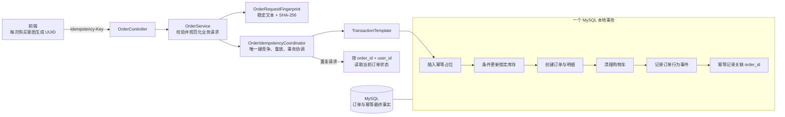
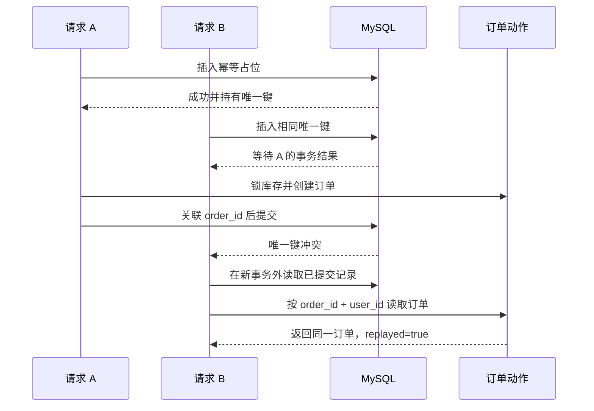

# 订单创建幂等设计

> **状态：** 已实现；真实 MySQL 并发用例待 Docker 环境验收
> **日期：** 2026-07-14  
> **范围：** `POST /api/orders` 与 `POST /api/orders/buy-now`  
> **核心决策：** 使用 MySQL 独立幂等表和唯一约束保证最终正确性，不以 Redis 锁作为交易防线。

## 1. 背景与目标

当前购物车结算和立即购买接口每次调用都会执行库存锁定和订单创建。用户重复点击、客户端超时重试、网关重试或并发提交可能生成多个订单并重复锁定库存。

本阶段为每一次真实购买意图引入 UUID 格式的 `Idempotency-Key`，实现以下语义：

- 相同用户、相同操作、相同 Key、相同请求参数在 24 小时内只创建一个订单；
- 重复请求返回第一次创建的同一个订单，不再次扣库存、清理购物车或记录行为事件；
- 相同 Key 被用于不同请求参数时返回 HTTP 409；
- 下单事务失败时幂等记录、订单和库存一起回滚，原 Key 可以安全重试；
- Redis 故障不影响订单幂等正确性；
- 建立可迁移到 MQ `eventId + inbox` 的数据库幂等模型。

## 2. 非目标

本阶段不处理：

- 支付回调幂等重构；
- 取消订单、超时关单的幂等协议变更；
- RabbitMQ、Transactional Outbox 或 Inbox 的实现；
- 使用 Redis 缓存幂等结果；
- 把幂等能力抽象成覆盖所有 Controller 的通用 AOP 框架；
- 拆分订单微服务。

## 3. 方案选择

### 3.1 放弃只使用 Redis `SETNX`

Redis 可以快速阻挡热点重复请求，但无法与 MySQL 订单事务原子提交。Redis 成功而下单失败、Redis 数据丢失或主从切换都可能破坏交易语义，因此不能作为最终防线。

### 3.2 放弃只在 `sales_order` 增加幂等字段

直接扩展订单表虽然简单，但会把 HTTP 幂等协议与订单实体耦合，过期记录清理也会影响永久订单历史，并且不利于迁移到支付命令或 MQ Inbox。

### 3.3 采用 MySQL 独立幂等表

新增 `order_idempotency`，使用 `(user_id, operation, idempotency_key)` 唯一约束处理并发竞争。幂等占位、库存锁定、订单创建、购物车清理和结果关联处于同一个本地事务。

## 4. 组件与职责



### 4.1 `OrderController`

- 从 JWT 获取 `userId`；
- 读取 `Idempotency-Key`；
- 调用订单应用服务；
- 将 `replayed` 转换为 `Idempotency-Replayed` 响应头；
- 不直接访问幂等 Mapper、库存或事务 API。

### 4.2 `OrderRequestFingerprint`

- 购物车结算使用 `CART_CHECKOUT|source=CART|skuIds=<去重排序后的列表>`；
- 立即购买使用 `BUY_NOW|skuId=<id>|quantity=<quantity>`；
- 使用 UTF-8 和 SHA-256 生成 64 位十六进制摘要；
- operation 必须进入摘要，防止不同命令碰撞；
- 不把数据库读取到的价格、库存和购物车数量放入请求摘要。

### 4.3 `OrderIdempotencyCoordinator`

- 校验并规范化 UUID Key；
- 计算 24 小时过期时间；
- 使用 `TransactionTemplate` 显式包围幂等占位和订单动作；
- 在事务外捕获唯一键冲突，避免在已标记回滚的事务中继续查询；
- 校验已有记录的请求摘要；
- 重放时按 `orderId + userId` 读取同一个订单；
- 唯一键冲突只允许一次有界解析，不进行无限重试。

### 4.4 `OrderService`

继续负责可信价格读取、SKU 可售校验、条件更新库存、订单快照、购物车清理和行为事件。幂等协调器只控制订单动作是否执行，不接管订单领域规则。

## 5. 数据模型

新增 Flyway 迁移：

```sql
CREATE TABLE order_idempotency (
    id BIGINT PRIMARY KEY AUTO_INCREMENT,
    user_id BIGINT NOT NULL,
    operation VARCHAR(32) NOT NULL,
    idempotency_key CHAR(36) NOT NULL,
    request_fingerprint CHAR(64) NOT NULL,
    order_id BIGINT NULL,
    expires_at DATETIME(6) NOT NULL,
    created_at DATETIME(6) NOT NULL DEFAULT CURRENT_TIMESTAMP(6),
    updated_at DATETIME(6) NOT NULL DEFAULT CURRENT_TIMESTAMP(6),
    CONSTRAINT uk_order_idempotency
        UNIQUE (user_id, operation, idempotency_key),
    CONSTRAINT fk_order_idempotency_user
        FOREIGN KEY (user_id) REFERENCES user_account(id),
    CONSTRAINT fk_order_idempotency_order
        FOREIGN KEY (order_id) REFERENCES sales_order(id),
    INDEX idx_order_idempotency_expires (expires_at)
);
```

`order_id` 在事务开始时允许为空，但事务提交前必须由协调器更新为新订单 ID。业务异常会回滚占位，因此数据库中不保留永久的 `PROCESSING` 或 `FAILED` 状态。

operation 仅允许：

- `CART_CHECKOUT`；
- `BUY_NOW`。

## 6. HTTP 契约

两个接口必须携带：

```http
Idempotency-Key: 2d36f872-e8d1-4e4f-b12e-a9702c88e890
```

Key 经 trim 后必须能解析为 UUID，并规范化为小写 36 字符格式。缺失或非法时返回：

```http
HTTP/1.1 400 Bad Request
```

```json
{
  "success": false,
  "errorCode": "bad_request",
  "message": "Idempotency-Key must be a valid UUID"
}
```

第一次成功：

```http
HTTP/1.1 200 OK
Idempotency-Replayed: false
```

相同请求重放：

```http
HTTP/1.1 200 OK
Idempotency-Replayed: true
```

相同 Key、不同摘要：

```http
HTTP/1.1 409 Conflict
```

```json
{
  "success": false,
  "errorCode": "idempotency_key_reused",
  "message": "Idempotency-Key was already used with different request parameters"
}
```

应用层返回：

```java
public record IdempotentOrderResult(OrderResponse order, boolean replayed) {
}
```

重复请求返回同一个订单身份和数据库中的当前订单状态。如果订单已经支付，则返回同一个 `orderNo` 的 `PAID` 状态，而不是保存过期的 `UNPAID` JSON。

## 7. 首次执行与重放流程

### 7.1 首次请求

```text
校验 JWT、Key 和业务参数
-> 生成 request_fingerprint
-> 直接尝试插入幂等占位
-> 仅在唯一键冲突且旧记录已过期时，于独立事务删除旧记录并限次重试
-> 读取可信商品/购物车事实
-> 条件更新库存
-> 创建订单和明细
-> 清理购物车并记录行为事件
-> 幂等记录关联 order_id
-> 提交
-> 返回 Idempotency-Replayed: false
```

### 7.2 并发重复请求



MySQL 唯一索引保证第二个请求不会进入库存和订单动作。若 A 回滚，A 的幂等占位消失，B 可以成功占位并执行。

## 8. 24 小时有效期与清理

配置：

```yaml
app:
  order:
    idempotency:
      retention: PT24H
      cleanup-delay: PT1H
      cleanup-batch-size: 500
```

采用两层机制：

1. 请求路径先尝试 `INSERT`，避免首次请求执行预删除产生 MySQL gap lock；仅当唯一键冲突且查到旧记录已过期时，才在独立事务中删除该逻辑 Key 并限次重试；
2. 后台任务每小时按 `expires_at` 和主键顺序批量删除最多 500 条，限制单次事务规模并防止表无限增长。

清理只删除 `order_idempotency`，不会删除订单、订单明细或行为事件。超过 24 小时后使用原 Key属于新的购买意图。

## 9. 故障语义

| 故障 | 结果 |
| --- | --- |
| Key 或请求参数非法 | 不开启订单事务，不写幂等记录 |
| 商品不存在、下架或库存不足 | 幂等占位、库存和订单一起回滚，Key 可重试 |
| 订单或订单明细写入失败 | 库存与幂等占位一起回滚 |
| 购物车清理或行为事件失败 | 整个本地事务回滚 |
| 第一个并发请求成功 | 后续请求读取同一个订单 |
| 第一个并发请求失败 | 后续请求可以重新占位并执行 |
| 相同 Key 换参数 | HTTP 409，不执行订单动作 |
| Redis 不可用 | 不影响订单幂等 |
| MQ 不可用 | 本阶段没有 MQ 依赖，不影响同步下单 |

## 10. 安全与日志

日志允许记录：

- operation；
- userId；
- replayed；
- orderNo；
- requestId；
- Idempotency-Key 的不可逆短摘要。

日志禁止记录完整 Key、JWT、完整请求体或用户隐私字段。数据库查询重放订单时必须同时使用 `order_id` 和 `user_id`，避免通过幂等记录绕过订单归属边界。

## 11. 测试策略

### 11.1 摘要单元测试

- 购物车 SKU 顺序不同但集合相同，摘要相同；
- 重复 SKU 规范化后摘要相同；
- BUY_NOW 数量不同，摘要不同；
- operation 不同，摘要不同。

### 11.2 协调器测试

- 首次请求只执行一次订单动作；
- 相同 Key 和摘要重放原订单；
- 相同 Key 与不同摘要抛出幂等冲突；
- 订单动作异常时幂等占位回滚；
- 过期记录允许重新占位；
- 非法 Key 在访问数据库前失败。

### 11.3 Mapper 与 Flyway 集成测试

- 唯一约束阻止同一用户、operation 和 Key 重复；
- 不同用户可使用相同 Key；
- 不同 operation 可使用相同 Key；
- `order_id` 外键有效；
- 过期记录可以按批次删除。

### 11.4 HTTP 验收测试

购物车结算和立即购买都验证：

- 缺少 Key 返回 400；
- 非法 UUID 返回 400；
- 首次请求响应头为 `false`；
- 重放响应头为 `true` 且 `orderNo` 相同；
- 库存只变化一次、订单只增加一条；
- 相同 Key 换参数返回 409。

### 11.5 并发集成测试

MySQL Testcontainers 使用两个并发事务提交相同请求，断言两个响应引用同一个订单、库存只锁定一次、幂等表只有一条记录。Docker 不可用时明确跳过，并在交付报告中说明真实 MySQL 并发语义尚未在本机执行。

## 12. 与 MQ 的关系

本阶段不添加 MQ，但建立与可靠消费相同的核心不变量：

```text
HTTP Idempotency-Key
-> 数据库唯一约束
-> 重复命令只产生一个业务结果

MQ eventId
-> Inbox 唯一约束
-> 重复消息只产生一个业务结果
```

后续 RabbitMQ 阶段仍需独立实现 Transactional Outbox、Publisher Confirm、手动 ACK、Inbox/业务唯一约束、有限重试和 DLQ。HTTP 幂等不能替代 MQ 消费幂等，但可以复用设计经验和测试方法。

## 13. 完成标准

- 两个订单创建入口强制要求 UUID 幂等键；
- 重复请求不重复扣库存、创建订单、清理购物车或记录事件；
- 同 Key 换参数返回 HTTP 409；
- 失败事务不留下幂等脏记录；
- 24 小时过期和批量清理有自动测试；
- Redis 不参与最终正确性；
- 新增 Java 类符合项目 Javadoc 与 Checkstyle 规则；
- 聚焦单元测试、接口测试和 Mapper 测试通过；
- 全量 `mvnw.cmd verify` 的结果和既有门禁阻塞如实记录。

## 14. 实施结果与验证证据

### 14.1 已落地能力

- 新增 Flyway V16、`order_idempotency` 表、MyBatis Mapper 和 24 小时配置；
- 购物车结算与立即购买强制 UUID `Idempotency-Key`；
- 首次成功返回 `Idempotency-Replayed: false`，同请求重放返回 `true`；
- 同 Key 换参数返回 HTTP 409 / `idempotency_key_reused`；
- 幂等占位、库存变更、订单/明细、购物车清理、行为事件、结果关联处于同一事务；
- 重放通过 `order_id + user_id` 查询，未绕过数据归属边界；
- 增加过期记录限量清理调度器；
- 支付与售后端到端测试夹具已补齐新的幂等请求头。

### 14.2 并发实现修正

初版设计中的“首次请求先删除过期 Key”会让 MySQL 在不存在记录时获取范围锁，两个首次并发请求可能形成不必要的 gap-lock 竞争。因此实际实现采用：

```text
先 INSERT
-> 成功：执行订单事务
-> 唯一键冲突：事务外读取已提交记录
   -> 未过期且摘要相同：重放
   -> 未过期且摘要不同：409
   -> 已过期：独立事务删除，最多重试一次
```

数据库唯一约束仍是最终正确性边界，Redis 不参与交易幂等。

### 14.3 自动验证

- 全量单元/集成测试：`224` 个，`0` 失败，`0` 错误，`5` 跳过；
- 订单相关聚焦测试：`47` 个，`0` 失败，`0` 错误，`1` 跳过；
- 支付与售后回归测试：`11` 个，全部通过；
- 新增代码聚焦 Checkstyle：`0` 违规；
- 全量 Checkstyle 仍被既有学习 Demo 的 `18` 个违规阻断，涉及 `CacheBreakdownDemo.java`、`CachePenetrationDemo.java`、`MQOutfitDemo.java`、`MQProductionDemo.java`，本阶段未修改这些学习文件。

### 14.4 尚未通过的环境门禁

`OrderIdempotencyMySqlConcurrencyTests` 与 `MySqlFlywayMigrationTests` 已具备真实 MySQL Testcontainers 用例，但本机没有可用 Docker daemon。设置 `RUN_MYSQL_TESTS=true` 后启动失败于 `Could not find a valid Docker environment`，因此不能宣称真实 MySQL 并发语义已经在本机通过。Docker 可用后执行：

```powershell
$env:RUN_MYSQL_TESTS='true'
.\mvnw.cmd "-Dtest=OrderIdempotencyMySqlConcurrencyTests,MySqlFlywayMigrationTests" test
```
