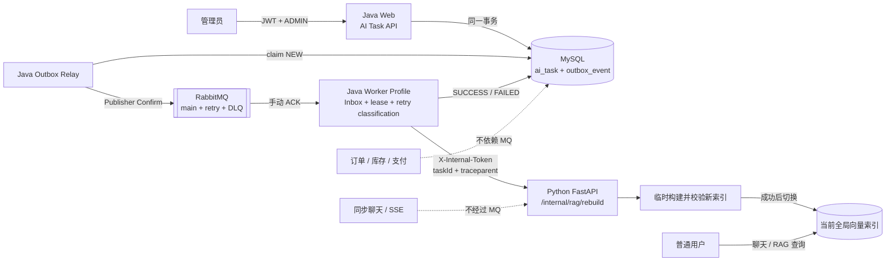
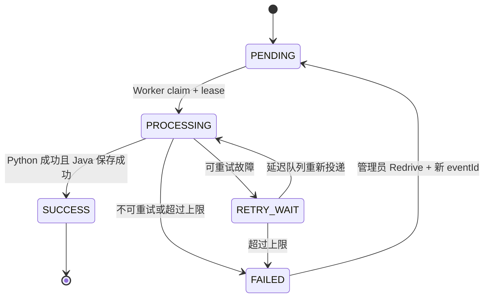
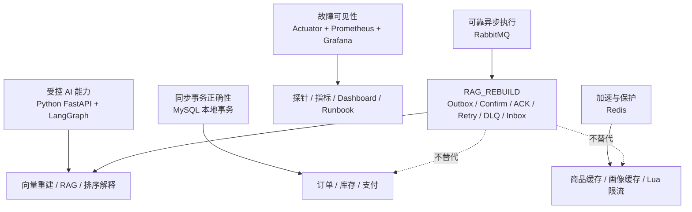

# RabbitMQ 全局 RAG 索引重建 MVP 设计

## 1. 结论

第四周只交付一条真实的 RabbitMQ 垂直链路：管理员创建 `RAG_REBUILD` 任务，Java 在同一 MySQL 事务中保存任务和 Outbox 事件，Outbox Relay 经 Publisher Confirm 发布到 RabbitMQ，独立 Java Worker 手动 ACK 消费，再通过受保护的内部 HTTP 接口调用 Python 重建全局本地知识库索引。Python 只有在新索引完整构建并校验成功后才切换当前索引；失败时旧索引继续服务普通用户。

RabbitMQ 只负责可靠安排异步执行，不保存最终业务事实。MySQL 保存任务、Outbox、消费幂等和人工重放审计；Python 负责向量索引构建与安全切换。普通聊天、订单、库存和支付主链路不经过 RabbitMQ。

## 2. 已确认决策

| 决策 | 选择 |
| --- | --- |
| 第一条 MQ 链路 | 全局本地知识库 `RAG_REBUILD` |
| Broker | RabbitMQ |
| 触发权限 | 仅管理员 |
| 普通用户能力 | 可以读取并使用当前 RAG 索引，不能触发全局重建或 Redrive |
| 消费方 | Java Worker 消费 RabbitMQ，再调用 Python 内部接口 |
| Python 职责 | 执行真实向量索引重建和安全切换，不直接连接 RabbitMQ |
| 并发规则 | 同时最多一个活动的全局重建任务；重复请求返回当前 `taskId` |
| 索引可用性 | 重建期间继续读取旧索引；成功后切换，失败时保留旧索引 |
| 交付语义 | at-least-once + 业务幂等，不宣称 exactly-once |
| 本轮范围 | 只开发全局索引重建；其他 MQ 场景只登记待开发 |

## 3. 目标与非目标

### 3.1 目标

- 管理员通过异步任务 API 发起全局 RAG 索引重建，并立即获得可查询的 `taskId`。
- 任务事实和待发布事件在同一 MySQL 事务中提交，消除“数据库成功但消息丢失”。
- Broker、Worker 或 Python 暂时故障时可以有限重试，超过上限后进入 DLQ。
- 重复发布、重复投递、ACK 丢失和 Worker 崩溃不会让同一任务重复产生业务效果。
- 重建失败不破坏已有向量索引，不影响普通用户继续使用当前 RAG。
- 提供管理员 Redrive、审计、指标、告警和真实进程级闭环验证。

### 3.2 非目标

- 不实现知识文件上传、多知识库、租户索引或用户私有索引。
- 不把普通聊天、SSE、订单、库存或支付改为 MQ 链路。
- 不让 Python 直接消费 RabbitMQ。
- 不把完整知识文件、Prompt、密钥、用户画像或交易数据放入消息。
- 不实现 Kafka、RocketMQ、Redis Streams、服务注册中心或微服务拆分。
- 不同时开发推荐评测、商品标签、图片处理、行为计算、支付副作用或通知任务。

## 4. RabbitMQ 在项目中的位置



RabbitMQ 位于 **Java 任务创建端与 Java 异步 Worker 之间**。它产生以下效果：

1. 管理员 HTTP 请求不等待长时间向量重建，API 返回 `202 + taskId`。
2. Web 进程和 Worker 解耦，Worker 可以独立 profile、独立进程和独立扩容。
3. Python、网络或数据库暂时故障时，任务可以有限重试而不是丢失。
4. 最终失败消息进入 DLQ，保留人工调查和 Redrive 入口。
5. Outbox 和 Publisher Confirm 为“任务已保存但消息未可靠发布”提供恢复路径。

RabbitMQ 不承担以下职责：

- 不保存最终任务状态；MySQL 才是事实源。
- 不保证 exactly-once；重复交付由 Inbox、任务状态和 Python `taskId` 幂等共同处理。
- 不决定订单、库存或支付是否成功。
- 不替代同步聊天和 SSE 实时输出。

## 5. 组件边界

### 5.1 Java Web Profile

负责：

- 校验管理员权限；
- 创建或复用当前活动的全局重建任务；
- 在一个事务中写入 `ai_task(PENDING)` 和 `outbox_event(NEW)`；
- 提供任务查询和管理员 Redrive API；
- 不直接调用 Python 重建接口。

### 5.2 Java Outbox Relay

负责：

- 小批量 claim `NEW` 或发布 lease 已过期的 Outbox；
- 发布消息并等待 RabbitMQ Publisher Confirm；
- Confirm 成功后标记 `PUBLISHED`；
- Broker 不可用或 Confirm 失败时保留 Outbox，等待下一次调度；
- 支持 Feature Flag，关闭后仅停止发布，不影响任务事实、聊天和交易。

Relay 使用有界批量和发布 lease，避免多实例重复 claim。即使 Confirm 已成功但更新 Outbox 前进程崩溃，后续重复发布也由消费端幂等处理。

### 5.3 RabbitMQ

固定使用一个任务 Exchange 和一组 RAG 重建队列：

| 类型 | 建议名称 | 用途 |
| --- | --- | --- |
| Exchange | `ai.task.exchange.v1` | AI 长任务交换机 |
| Routing Key | `ai.task.rag-rebuild.v1` | 全局 RAG 重建 |
| Main Queue | `ai.task.rag-rebuild.v1` | 正常消费 |
| Retry Queue | `ai.task.rag-rebuild.retry-10s.v1` | 第一次延迟重试 |
| Retry Queue | `ai.task.rag-rebuild.retry-60s.v1` | 第二次延迟重试 |
| Retry Queue | `ai.task.rag-rebuild.retry-300s.v1` | 第三次延迟重试 |
| DLQ | `ai.task.rag-rebuild.dlq.v1` | 最终失败和不可重试消息 |

Retry Queue 通过 TTL 和 dead-letter routing 返回 Main Queue。拓扑必须以代码声明并进行真实 RabbitMQ 集成测试。

### 5.4 Java Worker Profile

负责：

- 校验消息结构和 `schemaVersion`；
- 根据 `eventId`、Inbox 和任务状态判断重复消息；
- claim 任务并设置 `workerId`、`leaseUntil` 和 `PROCESSING`；
- 调用 Python 内部重建接口；
- 在数据库事务中保存最终状态和消费成功 Inbox；
- 只有保存成功后才手动 ACK；
- 对异常分类并进入对应 Retry Queue 或 DLQ。

Web 与 Worker 第一版仍在同一 Java 仓库，但通过 Spring Profile 和独立进程隔离。Worker 不承接 Web 请求。

### 5.5 Python FastAPI

新增只允许 Java 内部身份调用的重建接口。Python 不持有 RabbitMQ、Outbox 或 Java 任务状态，只接收 `taskId` 和关联上下文，执行以下步骤：

1. 如果当前索引元数据已经记录同一 `taskId`，直接返回原成功结果，避免 ACK 丢失后的重复重建。
2. 读取现有全局本地知识文件。
3. 在临时版本位置生成向量索引和元数据。
4. 校验文件可读取、chunk 数量、Embedding 维度和元数据一致性。
5. 成功后切换当前版本指针；失败时删除临时产物并保留旧索引。

普通 RAG 查询始终读取当前版本。第一版不支持上传文件或指定知识库。

## 6. API 设计

### 6.1 创建或复用重建任务

```http
POST /api/ai/tasks
Authorization: Bearer <admin-jwt>
Content-Type: application/json

{
  "taskType": "RAG_REBUILD"
}
```

首次创建返回：

```json
{
  "code": "success",
  "data": {
    "taskId": "task_01...",
    "taskType": "RAG_REBUILD",
    "status": "PENDING",
    "replayed": false
  }
}
```

如果已存在 `PENDING`、`PROCESSING` 或 `RETRY_WAIT` 的全局重建任务，返回同一个 `taskId`，`replayed=true`，不创建第二条任务或 Outbox。普通用户返回 `403`。

### 6.2 查询任务

```http
GET /api/ai/tasks/{taskId}
Authorization: Bearer <admin-jwt>
```

返回状态、尝试次数、创建/开始/结束时间、结果索引版本、失败码和可安全展示的失败摘要，不返回 Secret、Prompt 或完整异常栈。

### 6.3 人工 Redrive

```http
POST /api/ai/tasks/{taskId}/redrive
Authorization: Bearer <admin-jwt>
Content-Type: application/json

{
  "reason": "dependency recovered"
}
```

只允许 `FAILED` 任务。Redrive 在同一事务中把任务恢复为 `PENDING`、创建新的 `eventId`/Outbox，并写入独立审计记录。新 `eventId` 避免被旧 Inbox 直接判重；同一 `taskId` 让 Python 仍可识别已经成功切换过的操作。

### 6.4 Python 内部接口

```http
POST /internal/rag/rebuild
X-Internal-Token: <service-secret>
X-Request-Id: <request-id>
traceparent: <w3c-traceparent>
Content-Type: application/json

{
  "taskId": "task_01...",
  "source": "LOCAL_GLOBAL_KNOWLEDGE"
}
```

成功返回索引版本、chunk 数量、知识文件数量、内容摘要和是否幂等复用。接口使用独立的长任务超时，不复用普通同步聊天超时。

## 7. 数据模型

### 7.1 `ai_task`

核心字段：

```text
task_id, task_type, created_by, status, active_slot, input_ref, result_ref,
attempt_count, worker_id, lease_until, version, failure_code,
failure_summary, created_at, started_at, finished_at, updated_at
```

- `task_type` 第一版只允许 `RAG_REBUILD`。
- `input_ref` 固定表达全局本地知识库，不保存完整文件内容。
- 乐观版本号和条件更新防止两个 Worker 同时获得有效 lease。
- `PENDING/PROCESSING/RETRY_WAIT` 使用固定 `active_slot=GLOBAL_RAG_REBUILD`，终态将其置空；唯一索引从数据库层保证同时只有一个活动任务。并发创建撞到唯一约束后回查并返回已有任务。

### 7.2 `outbox_event`

核心字段：

```text
event_id, aggregate_type, aggregate_id, event_type, schema_version,
payload_json, status, attempt_count, publisher_id, lease_until,
published_at, last_error, created_at, updated_at
```

状态为 `NEW / PUBLISHING / PUBLISHED`。`payload_json` 只保存小型事件信封。

### 7.3 `consumer_inbox`

核心字段：

```text
consumer_name, event_id, task_id, processed_at
UNIQUE(consumer_name, event_id)
```

Inbox 成功记录与任务 `SUCCESS` 更新处于同一数据库事务。不能在调用 Python 前就把消息标记为已处理。

### 7.4 `ai_task_redrive_audit`

核心字段：

```text
id, task_id, previous_event_id, new_event_id,
operator_id, reason, created_at
```

该表只记录管理员人工 Redrive，自动 Retry 由任务尝试次数和消息 Header 记录。

## 8. 消息契约

```json
{
  "eventId": "uuid",
  "eventType": "ai.task.requested",
  "schemaVersion": 1,
  "taskId": "task_01...",
  "taskType": "RAG_REBUILD",
  "occurredAt": "2026-07-15T17:00:00+08:00",
  "correlationId": "request-id",
  "traceparent": "00-...-...-01"
}
```

消息不包含完整知识文件、Embedding、Prompt、密钥、用户画像或交易数据。Worker 根据 `taskId` 回查 MySQL 事实。

## 9. 状态、幂等和并发



幂等分三层：

1. **API 层**：活动任务存在时返回原 `taskId`。
2. **Java 消费层**：`consumer_name + event_id` 唯一约束、任务终态和 lease 防止重复完成。
3. **Python 副作用层**：当前索引元数据记录 `taskId`；同一任务重复调用直接返回已有结果。

如果 Python 已切换索引，但 Java 保存成功状态前崩溃，消息会重新投递。Python 看到同一 `taskId` 后返回已完成结果，Java 再完成任务和 Inbox 事务，然后 ACK。

## 10. Retry、DLQ 与错误分类

| 错误 | 行为 |
| --- | --- |
| 非法 JSON、字段缺失、未知 schemaVersion | 直接 DLQ；只有能安全解析并匹配现有任务时才标记该任务 `FAILED` |
| Python 内部鉴权失败 | 直接失败并告警，不无限重试 |
| Python 429、timeout、5xx | 10 秒、60 秒、300 秒有限重试 |
| Java/MySQL 临时故障 | 不 ACK 或进入有限重试 |
| Worker lease 被其他实例持有 | 延迟重试，不并发执行 |
| 重试耗尽 | `FAILED` + final DLQ |
| 重复 eventId 或任务已 SUCCESS | 直接 ACK |

DLQ 必须暴露队列深度、最老消息年龄和告警。管理员从任务失败详情定位问题，通过 Redrive API 创建新事件；不提供任意修改原始消息后重新投递的入口。

## 11. 安全边界

- Java 创建、查询失败详情和 Redrive API 仅允许 `ADMIN`。
- Python `/internal/rag/rebuild` 复用现有内部服务 Token 校验并 fail-closed。
- 日志、响应和 Outbox 错误摘要不得包含 Token、API Key、完整知识内容或异常栈。
- `taskId`、`eventId`、`requestId` 和 `traceparent` 用于关联日志，但不作为 Prometheus 高基数标签。
- 普通用户只能通过既有聊天/RAG 路径读取当前索引。

## 12. 可观测性

低基数指标至少包括：

- 任务创建、成功、失败和耗时，按固定 `taskType/status`；
- Outbox NEW 数量、发布成功/失败和最老事件年龄；
- RabbitMQ main/retry/DLQ 队列深度和最老消息年龄；
- Worker 消费成功、重试、重复、DLQ 和处理耗时；
- Python 重建成功/失败、文件数、chunk 数和耗时；
- lease 恢复和管理员 Redrive 次数。

请求 ID 和 traceparent 从管理员 API 写入事件并传播到 Worker 和 Python，用于跨进程日志关联。

## 13. 验证与验收

必须自动或真实环境验证：

1. 普通用户创建任务返回 `403`。
2. 管理员创建任务返回 `202 + taskId`。
3. 已有活动任务时返回原 `taskId`，不重复写任务和 Outbox。
4. `ai_task` 与 `outbox_event` 同事务提交、同事务回滚。
5. RabbitMQ 不可用时 Outbox 保留。
6. Publisher Confirm 后才标记 `PUBLISHED`。
7. 重复发布和重复投递不会重复完成任务。
8. Worker 保存成功但 ACK 丢失时，重新投递可安全 ACK。
9. Worker 崩溃后 lease 过期可以恢复。
10. Python timeout、429、5xx进入有限重试。
11. 非法消息直接进入 DLQ。
12. Redrive 有管理员权限、审计和新 `eventId`，且保持任务幂等。
13. Python 重建成功才切换索引，失败保留旧索引。
14. RabbitMQ Publisher Feature Flag 关闭时，聊天、订单和支付仍然正常。
15. 使用真实 MySQL、RabbitMQ、Java Web、Java Worker 和 Python 服务完成进程级闭环验证。

## 14. 交付和回滚

推荐按以下顺序启用：

1. 部署数据库表、任务 API 和查询能力，但关闭 Publisher。
2. 部署 RabbitMQ 拓扑、Worker、Retry 和 DLQ，仍不生产消息。
3. 部署 Python 内部重建接口和安全索引切换。
4. 打开 Worker，再打开 Outbox Publisher。
5. 管理员创建一次真实重建任务，验证任务、日志、指标、索引版本和普通查询。

出现问题时关闭 Outbox Publisher Feature Flag；未发布事件继续保留在 MySQL。RabbitMQ 不可用不影响同步聊天、订单和支付。已成功切换的索引不回滚为未校验产物。

## 15. 后续 MQ 待开发清单

以下六类场景适合后续复用同一可靠任务框架，但不进入第四周 MVP：

1. **推荐评测报告**：批量执行评测集，生成准确率、召回率和失败样例报告。
2. **批量商品 AI 标签**：异步生成颜色、风格、季节和场景标签，Java 校验后保存。
3. **商品图片处理**：压缩、裁剪、缩略图生成和视觉属性识别。
4. **行为事件后续计算**：从已持久化行为事实更新用户画像、热门商品和推荐特征。
5. **支付成功后的非核心副作用**：通知、普通积分、报表和外部物流通知；支付记录、订单状态和库存确认仍在核心事务中完成。
6. **通知任务**：邮件、短信和站内消息的异步发送、有限重试和失败审计。

这些场景必须分别明确事实源、幂等键、重试分类和失败影响后，才能创建独立实施计划。

## 16. 项目知识定位



面试和项目表述应为：

> Java 模块化单体保存身份、任务和交易事实；Redis 负责缓存与限流；RabbitMQ 只承接可延期、可重试的 AI 长任务；Java Worker 通过 Outbox、Confirm、手动 ACK、Inbox、lease、有限重试和 DLQ 实现 at-least-once 下的业务幂等；Python 负责真实索引重建并在校验成功后切换索引。普通聊天、订单、库存和支付不依赖 RabbitMQ 可用性。

## 17. 仓库边界

本设计会涉及两个仓库：

- `D:\git\推荐系统\Intelligent Outfit Recommendation System`：Java API、MySQL 表、Outbox Relay、RabbitMQ 拓扑、Worker、监控和 Docker Compose。
- `D:\git\推荐系统\AI Clothing Shopping Assistant System`：Python 内部重建接口、`taskId` 幂等和安全索引切换。

Python 仓库当前已有未提交的学习文件和文档。后续实现必须保留这些修改，不得通过 reset、checkout、stash 或切换分支规避脏工作区；开始修改前应再次列出将触碰的 Python 文件并确认不会覆盖现有内容。
