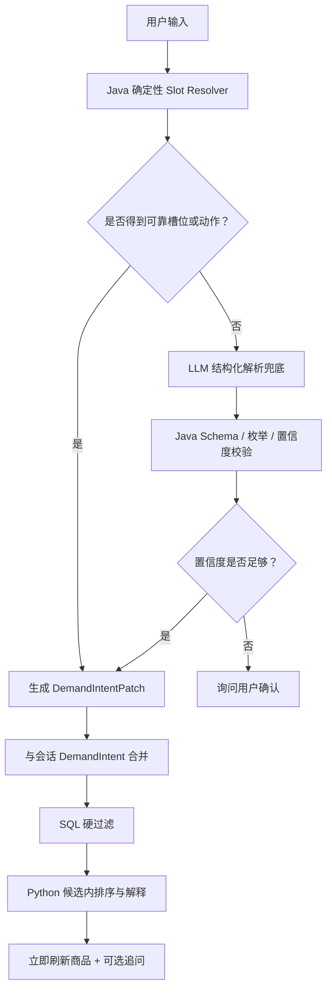

# 模糊短输入与混合需求解析设计

**日期：** 2026-07-16
**状态：** 第一阶段已实施（确定性规则、持久状态、Python 消费与安全降级）
**范围：** AI 导购对话中的短输入、条件补充、性别过滤与 LLM 兜底解析

## 1. 背景

当前系统已经具备性别感知推荐能力：Java 可以把男性、女性需求解析为 `targetGender`，商品候选 SQL 可以按 `male/female/unisex` 强过滤，Python 可以在 Java 候选范围内排序和解释。

现有问题是 Java 与 Python 对原始文本各自做一轮意图判断。用户只输入“男性”时，Java 能识别 `targetGender=male`，但 Python Router 会把它判断为 `unknown`；输入“男性穿搭”后 Python 才能命中推荐意图。类似问题还会出现在“女性”“黑色”“通勤”“500 以内”“宽松”等短输入上。

本设计采用已确认的 **方案 B + 方案 C**：

1. Java 使用确定性规则解析明确槽位，并维护权威的结构化 `DemandIntent`；
2. 当前输入如果只是条件补充，则与已有需求状态合并；
3. Java 无法可靠解析的复杂语义才交给 LLM 输出结构化补丁；
4. SQL 始终负责性别、分类、预算、季节等商品事实的硬过滤；
5. Python 只在 Java 候选池内排序、解释和生成自然追问。

## 2. 目标

- 第一次只输入“男性”或“女性”，也能立即展示对应商品候选；
- 单个短词可以作为新需求的起点，也可以作为上一轮需求的条件补丁；
- 男性与女性使用完全对称的解析、过滤和交互规则；
- 明确硬条件不依赖 LLM，保证稳定、低延迟、可测试；
- 模糊语义通过 LLM 补充解析，但 LLM 不能越过 Java/SQL 的商品事实边界；
- 信息不足时先展示已有条件下的候选，再自然追问，不阻塞浏览。

## 3. 非目标

- 不让 LLM 直接查询数据库或自行编造商品属性；
- 不根据商品模特图片推断商品适用性别；
- 不在本阶段构建通用自然语言理解平台；
- 不允许 Python 绕过 Java 候选池推荐被硬条件排除的商品；
- 不在本阶段处理“便宜一点”这类相对数值计算，除非上一轮存在可安全计算的明确预算。

## 4. 核心原则

### 4.1 结构化需求是权威事实

Java 产出的 `DemandIntent` 是本轮导购筛选的权威输入。Python 可以读取它，但不能从原始消息重新生成一套相互冲突的性别、分类或预算事实。

### 4.2 硬条件与软偏好分离

硬条件由 Java 归一化并由 SQL 执行：

- `targetGender`；
- `category`；
- `budgetMax`；
- `season`；
- 明确颜色或尺码（后续具备对应查询能力时）。

软偏好由 Python 在候选池内排序：

- 通勤、约会、校园等场景倾向；
- 成熟、休闲、硬朗、简约等风格；
- 显瘦、遮肉、显高、保暖等视觉或功能目标；
- 推荐理由与自然语言追问。

### 4.3 先确定性规则，后 LLM 兜底

明确表达不调用 LLM：

- 男性、男士、男款、男生；
- 女性、女士、女款、女生；
- 500 以内；
- 外套、衬衫、短裤、半裙；
- 夏季、冬季；
- 黑色、白色；
- 通勤、面试、约会。

只有规则无法可靠解释的表达才调用 LLM，例如：

- 给对象买；
- 偏硬朗一点；
- 想穿得成熟一些；
- 给家里长辈买；
- 不想太女性化；
- 类似韩剧男主穿的那种。

## 5. 第一轮短输入行为

第一次只输入“男性”时，不需要大模型判断性别。Java 直接建立新的需求状态：

```json
{
  "intent": "recommendation",
  "targetGender": "male",
  "category": null,
  "scene": [],
  "style": [],
  "hardFilters": ["targetGender"],
  "confidence": 1.0
}
```

随后 SQL 只允许 `male/unisex` 商品进入候选池。前端立即展示可售候选，同时助手回复：

> 已为你筛选男款和中性款商品。你想优先看上衣、外套、裤装，还是通勤、运动等场景？

第一次只输入“女性”时使用完全相同的流程，唯一差异是：

```json
{
  "targetGender": "female"
}
```

SQL 只允许 `female/unisex` 商品进入候选池，并立即展示候选后追问分类、场景或预算。

## 6. 后续短输入作为条件补丁

每轮输入先解析为 `DemandIntentPatch`，再与当前会话的权威需求状态合并。

示例：

```text
用户：推荐通勤外套
系统状态：scene=commute, category=外套

用户：男性
解析补丁：targetGender=male
合并状态：scene=commute, category=外套, targetGender=male

用户：黑色
解析补丁：preferredColors=[black]
合并状态：scene=commute, category=外套, targetGender=male, preferredColors=[black]

用户：500 以内
解析补丁：budgetMax=500
最终重新筛选并推荐
```

### 6.1 合并规则

- 新的单值硬条件覆盖旧值，例如 `male -> female`；
- 明确否定可以清除对应条件，例如“男女都可以”清除 `targetGender`；
- 多值偏好默认去重合并；
- 新分类覆盖旧分类，避免同时保留“外套”和“短裤”造成冲突；
- 用户明确说“重新推荐”“重新开始”时清空旧状态后建立新需求；
- 不明确的新输入不得静默删除已有硬条件。

### 6.2 历史记录与当前有效状态分离

系统不能把聊天记录中的所有历史条件同时拿来执行当前查询。需要明确分为三层：

1. **原始聊天记录**：不可变地保存用户和助手每轮说过的内容，用于页面展示、审计、指代理解和问题排查；
2. **每轮条件补丁**：记录该轮新增、覆盖或清除了哪些槽位；
3. **当前有效快照**：由上一轮有效快照和本轮补丁合并得到，是当前 SQL 和 Python 推荐的唯一结构化依据。

示例：

```json
{
  "turnId": 2,
  "message": "那女性呢？",
  "patch": {
    "targetGender": "female"
  },
  "effectiveIntent": {
    "targetGender": "female",
    "category": "外套",
    "scene": ["commute"],
    "preferredColors": ["black"],
    "budgetMax": 500
  }
}
```

历史中的 `male` 继续保留，但不再参与本轮 SQL。Python 可以读取聊天历史理解“那”“还是之前的”等指代，却必须以 `effectiveIntent` 为当前事实，不能因为历史中同时出现 `male/female` 就自行判定冲突。

现有 `chat_message` 已经保存原始聊天内容，但这不等于已经可靠保存“当前有效筛选状态”。Python LangGraph Checkpointer 保存的是工作流执行状态，也不应成为 Java 商品硬过滤的事实源。本功能需要在 Java/MySQL 侧增加独立的需求状态持久化：

- `chat_demand_state`：每个会话一行，保存最新 `effective_intent_json`、状态版本和最近更新请求；
- `chat_demand_transition`：每轮一行，保存 `message_id/request_id`、`patch_json`、合并后的 `effective_intent_json` 和动作类型；
- `chat_message`：继续只负责原始对话，不重复承担筛选状态职责；
- Redis：只能缓存当前快照，不能成为状态切换的唯一事实源。

建议的最小字段如下：

```text
chat_demand_state
- session_id (PK/FK)
- state_version
- effective_intent_json
- last_request_id
- updated_at

chat_demand_transition
- id
- session_id
- message_id
- request_id
- action (initialize/merge/switch/clear/compare/restore)
- patch_json
- effective_intent_json
- created_at
```

合并和版本更新必须处于同一个 MySQL 本地事务，并通过 `state_version` 做乐观并发控制，防止较早请求晚完成后覆盖用户更新的性别。重复 `request_id` 必须返回同一合并结果，避免前端重试重复应用补丁。

### 6.3 “那女性呢？”采用正式切换

已确认的默认交互语义是：

> 用户在男性需求之后说“那女性呢？”，系统正式把当前 `targetGender` 切换为 `female`，保留其他仍然有效的分类、场景、颜色和预算条件，并立即重新查询 `female/unisex` 候选。

切换前：

```json
{
  "targetGender": "male",
  "category": "外套",
  "scene": ["commute"],
  "preferredColors": ["black"],
  "budgetMax": 500
}
```

本轮补丁：

```json
{
  "targetGender": "female"
}
```

切换后：

```json
{
  "targetGender": "female",
  "category": "外套",
  "scene": ["commute"],
  "preferredColors": ["black"],
  "budgetMax": 500
}
```

该切换不是“一次性预览”，不会在响应结束后自动恢复男性。前端必须同步更新当前条件标签，让用户清楚看到当前状态已经是“女性”。

### 6.4 男性与女性反复切换

男性、女性可以在任意多轮中反复切换。每次明确表达只覆盖单值槽位 `targetGender`，其他条件保持不变：

```text
男性通勤外套
-> 当前：male + 外套 + commute

那女性呢？
-> 当前：female + 外套 + commute

还是看看男性
-> 当前：male + 外套 + commute

女性的，预算改成 300
-> 当前：female + 外套 + commute + budgetMax=300
```

实现时不得通过扫描全部历史文本重新投票决定性别，而应按照补丁顺序得到最新有效值。不同性别快照使用不同的候选缓存键，反复切换可以复用各自缓存，但不能发生跨性别候选污染。

### 6.5 切换、清除与对比的语义

| 用户表达 | 状态动作 |
| --- | --- |
| 那女性呢、换成女款 | 正式覆盖为 `female` |
| 那男性呢、还是看看男款 | 正式覆盖为 `male` |
| 男女都看看、性别不限 | 清除 `targetGender`，不按性别过滤 |
| 男款和女款有什么区别 | 进入对比意图，不修改当前有效快照 |
| 只改性别，其他不变 | 只覆盖 `targetGender` |
| 重新开始 | 清空当前需求状态 |
| 回到刚才的男款条件 | 恢复最近一个男性有效快照；没有可恢复快照时只覆盖为 `male` |

“男款和女款有什么区别”属于比较问题，不等价于“切换到女性”。规则无法区分切换和比较时，LLM 可以输出结构化动作 `switch/filter/compare/clear`，但必须经过 Java 校验后执行。

### 6.6 当前状态优先级

传递给 Python 的上下文必须显式区分当前状态与历史：

```json
{
  "currentDemandIntent": {
    "targetGender": "female",
    "category": "外套"
  },
  "latestPatch": {
    "targetGender": "female"
  },
  "chatHistory": [
    "男性通勤外套",
    "那女性呢？"
  ]
}
```

消费优先级固定为：

```text
当前有效快照
> 本轮已经校验的结构化补丁
> 历史自然语言
> 用户档案默认值
```

用户档案只在当前会话尚未建立明确性别时作为默认值。一旦用户本轮明确切换，档案性别不得把它覆盖回来。

## 7. 性别解析与冲突优先级

### 7.1 明确映射

| 用户表达 | 结构化结果 |
| --- | --- |
| 男性、男士、男款、男生 | `targetGender=male` |
| 女性、女士、女款、女生 | `targetGender=female` |
| 男生女生都可以、男女都行 | `targetGender=null` |
| 给男朋友/老公/爸爸买 | `targetGender=male` |
| 给女朋友/老婆/妈妈买 | `targetGender=female` |

### 7.2 来源优先级

```text
本轮明确购买对象
> 本轮明确性别表达
> 请求显式 gender
> 当前会话 DemandIntent
> 用户身体资料 gender
> 用户基础资料 gender
> 不过滤
```

例如登录用户档案为 `male`，但输入“给女朋友买一件通勤外套”，目标性别必须为 `female`。

### 7.3 冲突处理

- 同时出现明确男性和女性信号但无法判断购买对象时，不猜测，设置 `targetGender=null`；
- LLM 返回的性别与确定性规则冲突时，以确定性规则为准；
- LLM 低置信度时不把推断写入硬条件，改为询问用户；
- `unisex` 是商品事实值，不用作用户性别档案值。

## 8. B + C 混合解析流程



## 9. LLM 结构化兜底契约

LLM 只能输出受限的补丁，不返回商品 ID，不直接决定 SQL，也不能修改确定性规则已经确认的事实。

```json
{
  "intent": "recommendation_refinement",
  "slots": {
    "targetGender": "male",
    "category": null,
    "scene": [],
    "style": ["mature"],
    "budgetMax": null,
    "preferredColors": [],
    "avoidColors": []
  },
  "confidence": 0.82,
  "evidence": ["老公", "成熟"],
  "needsClarification": false,
  "clarificationQuestion": null
}
```

Java 必须执行：

- JSON Schema 校验；
- 枚举归一化；
- 数值范围校验；
- evidence 必须能在本轮原文中找到或由明确上下文支持；
- 低于置信度阈值的硬条件不得进入 SQL；
- 超时、鉴权失败或非法响应时退回“不过度推断 + 询问用户”。

## 10. SQL 与商品数据边界

性别过滤继续采用商品事实属性：

```sql
AND EXISTS (
    SELECT 1
    FROM product_attribute gender_attr
    WHERE gender_attr.spu_id = p.id
      AND gender_attr.attr_name = '适用性别'
      AND gender_attr.attr_value IN (#{genderValue}, 'unisex')
)
```

规则：

```text
targetGender=male   -> male + unisex
targetGender=female -> female + unisex
targetGender=null   -> 不按性别过滤
```

当前迁移把半裙标为 `female`、部分牛津衬衫标为 `male`、其他大部分商品标为 `unisex`，数据精度不足。后续必须按真实商品定位补齐 `male/female/unisex`，不能根据模特图片猜测，也不能为了增加候选数量随意标记 `unisex`。

## 11. Python Router 调整方向

Python 不应再因为原始文本只有“男性”“女性”而返回 `unknown`。当 Java 已传入有效 `DemandIntent` 且包含推荐相关硬条件或软偏好时，Python 应将本轮视为可推荐或可细化需求：

```text
存在 targetGender/category/budgetMax/scene/style/attributes
-> recommendation 或 recommendation_refinement
```

Python 仍可识别库存、价格、尺码、售后等执行意图，但不得重新覆盖 Java 的 `targetGender/category/budgetMax`。

## 12. 前端交互

- 第一次输入一个有效短条件后立即刷新候选；
- 不要求用户补齐分类后才显示商品；
- 顶部线索区展示合并后的权威条件，而不是只展示最新一句原文；
- 条件不足时显示候选并追问，不显示“无法判断”；
- 明确区分“当前候选”和“AI 强匹配”：只有 Python 产生推荐引用时标记强匹配；
- 用户可以看到并清除已解析条件，避免错误状态持续污染后续对话。

## 13. 错误与降级

- 确定性规则和 SQL 不依赖 LLM；LLM 不可用时明确条件仍能刷新候选；
- RAG 不可用时可以继续使用 Java 商品候选，但推荐解释应说明当前未使用知识库增强；
- LLM 不可用且信息不足时，返回规则化追问，不把技术错误 JSON 直接展示给用户；
- Java 熔断打开时，前端仍保留当前候选和已解析条件；
- 任何降级都不能放宽性别、预算等已确认硬过滤。

## 14. 测试策略

### 14.1 Java 解析测试

- 第一轮“男性”产生 `targetGender=male` 和推荐意图；
- 第一轮“女性”产生 `targetGender=female` 和推荐意图；
- “给女朋友买”覆盖男性用户档案；
- “男女都可以”清除性别硬过滤；
- “男性 -> 黑色 -> 500 以内”正确合并条件；
- “换成女款”只覆盖性别，不丢失分类和场景；
- “男性 -> 那女性呢 -> 还是看看男性”依次得到 `male -> female -> male`，历史条件不污染当前快照；
- “男款和女款有什么区别”进入比较意图且不修改当前快照；
- 用户档案为男性时，本轮“那女性呢”仍以本轮正式切换为准；
- 低置信度 LLM 结果不进入硬过滤。

### 14.2 SQL 测试

- `male` 不返回 `female` 商品；
- `female` 不返回 `male` 商品；
- 两者都允许 `unisex`；
- `null` 不启用性别过滤；
- 性别与分类、预算、库存条件组合时仍正确。

### 14.3 Python 测试

- 原始文本为“男性”，但 Java `DemandIntent.targetGender=male` 时进入推荐流程；
- Python 不覆盖 Java 硬条件；
- 没有候选时不编造商品；
- RAG 不可用时仍能基于 Java 候选降级；
- 模糊表达只输出合法结构化补丁。

### 14.4 前端测试

- 第一轮输入“男性”后请求候选接口携带 `gender=male`；
- 候选立即刷新，同时显示补充分类/场景的提示；
- 后续短词保留并合并已有条件；
- 正式切换性别后，当前条件标签和商品候选同步更新；
- 男性、女性反复切换时，不出现旧性别请求晚到覆盖新状态的问题；
- 用户清除条件后请求不再携带该字段；
- 技术错误不以原始 JSON 形式展示。

## 15. 验收标准

- 输入“男性”立即展示 `male/unisex` 可售候选，并追问分类或场景；
- 输入“女性”立即展示 `female/unisex` 可售候选，并追问分类或场景；
- 输入“男性穿搭”与“男性”得到一致的性别硬过滤；
- 连续输入“通勤外套 -> 男性 -> 黑色 -> 500 以内”得到合并后的单一需求状态；
- 连续输入“男性通勤外套 -> 那女性呢”后，正式切换为女性并保留通勤和外套；
- 连续输入“男性 -> 女性 -> 男性”时，当前快照、SQL 参数和前端标签最终一致为男性；
- 历史聊天完整保留，但 SQL 和 Python 只使用最新有效快照作为当前事实；
- 规则可确认的条件不调用 LLM；
- 复杂表达由 LLM 输出结构化补丁，经 Java 校验后才能进入筛选；
- Python、RAG 或 LLM 故障不会放宽 SQL 硬过滤，也不会让页面丢失当前候选；
- 商品性别数据完成一轮人工校准，明显女款不再默认标记为 `unisex`。

## 16. 2026-07-16 实施记录

本轮已经完成：

- Java 将每轮短输入解析为补丁，支持 `initialize/switch/clear/compare/reset`；
- `male -> female -> male` 按补丁顺序覆盖，不再扫描历史文本投票；
- Flyway V20 新增 `chat_demand_state` 与 `chat_demand_transition`；
- 状态写入支持 `requestId` 幂等、`state_version` 乐观更新和一次冲突重试；
- Java 候选查询只使用当前有效快照，用户档案性别只参与首次初始化；
- Python Router 在 Java 已提供有效 `DemandIntent` 时，把“男性”“女性”等短输入视为推荐需求；
- Python/RAG 流式调用失败时，Java 返回正常 `done` 降级响应，保留当前 SQL 候选与硬条件；
- 前端把服务端快照作为权威条件，清除性别后不会被旧请求参数重新补回；
- Java 模块边界保持为 `assistant -> conversation public service`，没有跨模块直接访问 Mapper。

本轮明确未完成，进入下一阶段：

- LLM 输出结构化 `DemandIntentPatch` 的独立接口、Schema 校验和置信度门槛；
- “给对象买”“偏硬朗一点”等规则无法确认表达的模型兜底；
- 颜色作为 SQL 硬过滤槽位（当前候选查询契约尚未提供颜色字段）；
- 全商品 `male/female/unisex` 人工校准；现阶段继续使用 V13 的基础数据；
- “回到刚才的男款条件”的历史快照恢复，以及男女款对比专用回答。

验证结果：

- Java：292 项非 Docker 测试通过，6 项跳过，Checkstyle 0 违规；2 项 RabbitMQ/Testcontainers 测试因本机 Docker 不可用未执行成功；
- Frontend：21 项测试通过，TypeScript 与 Vite 生产构建通过；
- Python：242 项测试及 83 项子测试通过，Ruff 通过。Python 全量测试需临时停用本地 `.env`，避免本地内部鉴权配置改变测试基线。
