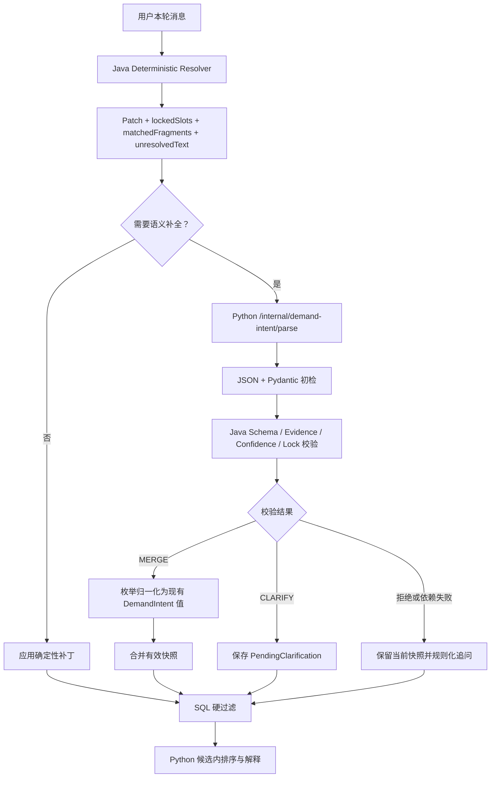

# LLM 结构化需求补丁 MVP 设计

**日期：** 2026-07-16  
**状态：** 已确认，待实施  
**上游设计：** `2026-07-16-hybrid-demand-intent-refinement-design.md`

## 1. 目标

在现有 Java 确定性需求解析和持久化快照之上，引入受控的 LLM 语义补全能力，处理“给对象买”“成熟硬朗一点”“像电影主角那种”等规则无法完整解释的导购表达。

职责固定为：

```text
Java 规则负责确定事实
LLM 负责提出候选补丁或澄清建议
Java 负责最终裁决、归一化和状态写入
SQL 只消费已经确认的有效快照
```

LLM 不直接查询数据库，不直接写入 `DemandIntent`，也不能覆盖本轮 Java 已锁定的槽位。

## 2. 本阶段范围

### 2.1 实施范围

- Java 确定性解析结果增加匹配片段、未解析文本和本轮锁定槽位；
- Python 新增独立内部需求解析接口；
- LLM 输出稀疏、枚举化、带逐槽位置信度和证据的候选结果；
- Java 对 LLM 响应执行完整业务校验；
- 低置信度硬条件进入结构化待确认状态；
- 用户下一轮回答可以确认、取消或替换待确认状态；
- 待确认状态持久化并保留转换审计；
- 模型不可用时不阻塞确定性筛选和商品候选浏览。

### 2.2 待开发清单

以下能力不进入本 MVP：

1. 颜色槽位与 SQL 硬过滤；
2. 全商品 `male/female/unisex` 人工校准；
3. 历史条件恢复及男女款对比专用流程。

## 3. 总体数据流



## 4. Java 确定性解析元数据

确定性解析器除本轮补丁外，还需要返回：

```json
{
  "deterministicPatch": {
    "targetGender": "MALE"
  },
  "lockedSlots": ["targetGender"],
  "matchedFragments": ["男性"],
  "unresolvedText": "成熟硬朗一点",
  "hasShoppingSignal": true
}
```

字段含义：

- `deterministicPatch`：Java 本轮已经确认的槽位变更；
- `lockedSlots`：本轮规则或筛选控件明确确认的槽位；
- `matchedFragments`：确定性规则实际消费的原文片段；
- `unresolvedText`：移除已匹配片段和通用连接词后剩余的有效文本；
- `hasShoppingSignal`：是否包含买、穿、搭配、推荐、找一件等导购信号。

LLM 请求始终携带完整原文。`unresolvedText` 只用于触发判断，不作为 evidence 校验原文。

## 5. LLM 调用触发规则

### 5.1 调用

- 会话存在有效 `PendingClarification`；
- Java 解析出部分槽位，但仍有非通用的未解析语义；
- Java 未解析出槽位，但本轮含有明确导购信号。

### 5.2 不调用

- 男性、女性、500 以内等已被规则完整覆盖；
- 剩余文本只有推荐、穿搭、帮我看看等通用连接词；
- 当前是订单、库存、价格、售后或普通闲聊意图；
- 输入为空或不具备导购语义。

## 6. Python 内部接口

新增内部接口：

```http
POST /internal/demand-intent/parse
X-Internal-Token: <shared-token>
Content-Type: application/json
```

接口只允许 Java 内部调用，不暴露给浏览器。沿用现有内部 Token 鉴权，但使用独立的客户端超时和熔断器。

### 6.1 请求

```json
{
  "schemaVersion": "1.0",
  "requestId": "req-123",
  "currentMessage": "男性，成熟硬朗一点",
  "currentDemand": {
    "targetGender": "MALE"
  },
  "lockedSlots": ["targetGender"],
  "pendingClarification": null,
  "recentHistory": [
    {
      "role": "user",
      "content": "想看通勤外套"
    },
    {
      "role": "assistant",
      "content": "已筛选通勤外套"
    }
  ]
}
```

历史限制：

- 最多最近三轮完整问答；
- 总文本长度最多 4000 字符；
- 超出后从最旧消息开始截断；
- 当前有效快照和 pending 不计入历史截断；
- 历史只能帮助理解语境，禁止成为硬条件 evidence。

## 7. LLM 响应契约

MVP 只允许 `MERGE` 和 `CLARIFY`。

### 7.1 MERGE

```json
{
  "schemaVersion": "1.0",
  "action": "MERGE",
  "slots": {
    "style": ["MATURE", "RUGGED"]
  },
  "slotConfidence": {
    "style": 0.81
  },
  "evidence": {
    "style": [
      {
        "text": "成熟",
        "source": "CURRENT_MESSAGE"
      },
      {
        "text": "硬朗",
        "source": "CURRENT_MESSAGE"
      }
    ]
  },
  "needsClarification": false,
  "clarificationSlot": null,
  "clarificationCandidateValue": null,
  "clarificationQuestion": null
}
```

约束：

- `slots` 是稀疏对象，未出现字段表示不修改；
- 不用空数组表示清除；
- `slots` 至少包含一个支持字段；
- 每个 slot 必须有同名 confidence 和 evidence；
- `needsClarification` 必须为 `false`；
- `clarificationSlot`、`clarificationCandidateValue` 和 `clarificationQuestion` 必须为 `null`。

### 7.2 CLARIFY

```json
{
  "schemaVersion": "1.0",
  "action": "CLARIFY",
  "slots": {},
  "slotConfidence": {},
  "evidence": {},
  "needsClarification": true,
  "clarificationSlot": "targetGender",
  "clarificationCandidateValue": "FEMALE",
  "clarificationQuestion": "确认要筛选女士商品吗？"
}
```

约束：

- 不生成正式补丁；
- 只允许澄清一个最关键槽位；
- `clarificationSlot` 和 `clarificationQuestion` 必须存在；
- `clarificationCandidateValue` 可以为空；模型已有低置信度候选时可以返回对应标准枚举；
- 问题不能为空且有最大长度限制；
- 当前有效快照保持不变。

## 8. 标准枚举与兼容映射

LLM 边界使用受限的大写枚举，例如：

```text
MALE / FEMALE
OUTERWEAR / SKIRT / SHORTS / SHIRT
COMMUTE / DATE / CAMPUS / DAILY / TRAVEL / SPORT
MATURE / RUGGED / MINIMAL / CASUAL
```

Java 校验后映射为现有兼容值：

```text
FEMALE    -> female
OUTERWEAR -> 外套
MATURE    -> mature
RUGGED    -> rugged
```

本阶段不全面迁移现有 `DemandIntent`、SQL、前端和 Python 排序契约。

## 9. Evidence 模型

```java
public record SlotEvidence(String text, EvidenceSource source) {}

public enum EvidenceSource {
    CURRENT_MESSAGE,
    PENDING_CLARIFICATION
}
```

### 9.1 CURRENT_MESSAGE

- `text` 必须能在本轮用户原文中找到；
- 证据必须与所属槽位和值兼容；
- 空白、模型总结或改写文本无效。

### 9.2 PENDING_CLARIFICATION

- 当前会话必须存在有效 pending；
- evidence 所属槽位必须与 pending 槽位一致；
- `text` 必须来自 pending 保存的原始文本；
- pending 候选值必须与本次输出兼容。

普通历史消息禁止作为 evidence，只能作为非强制语境。

## 10. Locked Slots

锁定范围只包括：

1. Java 从本轮原文确定性解析出的槽位；
2. 用户通过本轮筛选控件明确提交的槽位；
3. 本轮明确确认的切换或清除动作。

锁定只在本轮解析请求内生效。历史有效快照不是永久锁定字段，用户可以在后续轮次通过新证据正式覆盖。

优先级固定为：

```text
本轮 Java 明确规则或筛选控件
> 本轮通过验证的 LLM 补丁
> 当前会话有效快照
> 用户档案默认值
```

LLM 可以返回 locked slot，但 Java 必须拒绝该字段，并记录安全的拒绝原因，不记录敏感 Prompt 或完整模型响应。

## 11. 逐槽位置信度

| 槽位 | 类型 | 自动合并阈值 | 未达到时 |
| --- | --- | ---: | --- |
| `targetGender` | 硬条件 | 0.85 | 追问 |
| `category` | 硬条件 | 0.80 | 必要时追问，否则不修改 |
| `budgetMax` | 硬条件 | 0.95 | 拒绝或追问 |
| `scene` | 软条件 | 0.65 | 静默忽略 |
| `style` | 软条件 | 0.65 | 静默忽略 |
| `attributes` | 软条件 | 0.65 | 静默忽略 |

预算附加约束：

- evidence 必须包含明确数字；
- 平价、别太贵等表达不能生成具体预算；
- 数值必须通过 Java 范围校验；
- 非整数、负数和超上限值拒绝进入补丁。

## 12. Java 校验顺序

```text
schemaVersion
-> action
-> 字段白名单
-> 枚举合法性
-> slots/confidence/evidence 完整性
-> evidence 来源真实性
-> lockedSlots 冲突
-> 逐槽位置信度
-> 数值范围
-> 枚举归一化
-> DemandIntentPatch
```

Python Pydantic 只负责接口格式初检，Java 是最终业务安全边界。

## 13. PendingClarification

Pending 不是正式补丁，不进入 SQL：

```json
{
  "slot": "targetGender",
  "proposedValue": "FEMALE",
  "rawText": "应该是给女生买的吧",
  "question": "确认要筛选女士商品吗？",
  "sourceRequestId": "req-123"
}
```

状态转换：

```text
低置信度候选
-> PendingClarification
-> 用户回答
-> Java/LLM 校验
-> DemandIntentPatch
-> 合并有效快照
-> 清除 pending
```

生命周期：

- 用户确认：生成正式补丁并清除 pending；
- 用户说算了：取消 pending，不修改快照；
- 用户提出明确新需求：Java 规则优先并取消旧 pending；
- 用户转向订单、库存、价格或售后：取消导购 pending；
- 新的澄清替换旧澄清；
- 一个会话最多保留一个 pending。

## 14. 持久化

新增 Flyway V21：

```sql
ALTER TABLE chat_demand_state
ADD COLUMN pending_clarification_json LONGTEXT NULL;
```

`chat_demand_transition.action` 新增语义值：

```text
clarify
confirm
cancel_clarify
```

写入规则：

- `clarify`：有效快照不变，只保存或替换 pending；
- `confirm`：合并正式补丁并清除 pending；
- `cancel_clarify`：有效快照不变并清除 pending；
- 原始用户消息继续只保存在 `chat_message`；
- requestId 幂等、状态版本更新、pending 变化和 transition 写入位于同一 MySQL 本地事务。

## 15. Python 输出约束

采用 provider-neutral 严格 JSON：

```text
模型只返回 JSON
-> json.loads
-> Pydantic extra=forbid
-> Java 二次校验
```

运行配置：

- 独立解析超时 8 秒；
- 模型重试 0 次；
- 非法 JSON、字段缺失、多余字段和非法枚举直接失败；
- 不使用正则从自然语言回答中猜测 JSON；
- 不依赖供应商原生 Structured Output 才能运行。

## 16. 故障降级

### 16.1 Java 已解析出部分条件

- 确定性补丁照常生效；
- 放弃本轮 LLM 模糊补充；
- 继续查询并展示 Java 候选；
- 返回可理解的补充条件提示。

### 16.2 Java 完全无法解析

- 当前有效快照保持不变；
- 不创建补丁或虚假 pending；
- 不暴露模型、密钥、URL、Prompt 或异常堆栈；
- 返回规则化追问。

LLM 解析接口不得成为商品候选浏览的单点故障。

## 17. 开发模块框架

### 17.1 Java

```text
assistant/
├─ dto/
│  ├─ DeterministicDemandParseResult
│  ├─ LlmDemandParseRequest
│  ├─ LlmDemandParseResponse
│  ├─ SlotEvidence
│  └─ PendingClarification
├─ client/
│  ├─ DemandIntentParseClient
│  ├─ RestDemandIntentParseClient
│  └─ ResilientDemandIntentParseClient
├─ service/
│  ├─ DemandIntentResolver
│  ├─ DemandIntentParseTrigger
│  ├─ LlmDemandPatchValidator
│  ├─ DemandIntentEnumNormalizer
│  ├─ DemandIntentMerger
│  └─ DemandIntentStateService
└─ config/
   └─ DemandIntentParseResilienceConfig

conversation/
└─ service/
   └─ ConversationDemandStateStore
```

边界：`assistant` 只能通过 `ConversationDemandStateStore` 访问会话状态，不跨模块访问 Conversation Mapper。

### 17.2 Python

```text
clothing_assistant/
├─ api/
│  ├─ schemas.py
│  └─ app.py
├─ application/
│  └─ demand_intent_parse_service.py
├─ domain/
│  └─ demand_intent_models.py
└─ infrastructure/
   └─ llm_client.py
```

Python 解析服务只负责 Prompt、模型调用、JSON 解码和 Pydantic 初检，不负责 SQL、会话状态合并或 Java 枚举归一化。

## 18. 测试策略

### 18.1 Java

- locked slot 不被 LLM 覆盖；
- 稀疏 slots 不清除旧值；
- CURRENT_MESSAGE evidence 必须存在于本轮原文；
- PENDING_CLARIFICATION evidence 必须匹配 pending 槽位和原始文本；
- 各槽位使用独立阈值；
- 低分硬条件创建 pending，低分软条件静默忽略；
- pending 不进入 SQL；
- confirm 后才形成正式补丁；
- requestId 重试不会重复合并；
- 较早并发请求不能覆盖较新状态；
- assistant 与 conversation 模块边界测试保持通过。

### 18.2 Python

- MERGE 和 CLARIFY 合法响应通过；
- 空数组清除、多余字段、非法枚举和字段关系冲突被拒绝；
- slots 中每个字段必须有 confidence 和 evidence；
- 普通历史不能成为 evidence；
- 缺少模型密钥、超时和非法 JSON 安全失败；
- 内部 Token 缺失或错误返回 401。

### 18.3 端到端

```text
男性，成熟硬朗一点
-> Java 锁定 male
-> LLM 只补充 mature/rugged
-> SQL 继续按 male/unisex 过滤
```

```text
给对象买外套
-> CLARIFY
-> 用户回答女朋友
-> 生成 female 补丁
-> SQL 正式切换 female/unisex
```

```text
男性，像电影主角那种
-> LLM 超时
-> male 确定性条件仍生效
-> 页面保留候选且不显示技术异常
```

## 19. 验收标准

- 已完全被 Java 规则覆盖的输入不调用 LLM；
- 部分确定、部分模糊的输入只由 LLM 补全未锁定槽位；
- LLM 无法覆盖本轮 Java 锁定槽位；
- 低置信度硬条件不会进入 SQL；
- pending 与正式补丁严格分离；
- 用户确认后 pending 才转换为补丁；
- 普通历史不能成为硬条件 evidence；
- 非法模型响应和依赖故障不会改变当前有效快照；
- 所有实际进入 SQL 的条件都可追溯到 Java 规则或通过 Java 校验的证据。
