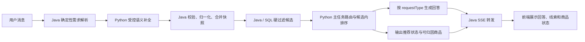

# 自然语言穿搭请求识别与推荐展示修复设计

**日期：** 2026-07-17  
**状态：** 设计方向已确认，模块开发细节待继续评审  
**影响仓库：** `Intelligent Outfit Recommendation System`、`AI Clothing Shopping Assistant System`  
**上游设计：** `2026-07-16-hybrid-demand-intent-refinement-design.md`、`2026-07-16-llm-demand-intent-patch-mvp-design.md`

## 1. 问题背景

以下自然语言请求同时包含问候、穿搭目标、身体数据、季节和目标性别：

> 你好，我想要轻松一点的，我177 130，夏天的衣服该怎么穿呢？男性

当前页面只稳定展示了 `targetGender=male`，回答偏向通用导购介绍，商品区同时出现“没有强匹配商品”和“AI 首选 / AI 精选”。这不是单点解析缺陷，而是意图路由、统一需求模型、回答编排、候选匹配和前端展示状态之间的链路问题。

已经确认的直接原因包括：

1. Python `intent_router` 在业务判断之前匹配问候词，混合请求可能被短路为 `chat`。
2. 身高体重信号的路由优先级高于穿搭推荐，复合问题可能被错误收窄为尺码问题。
3. Java `DemandIntent` 尚未正式承载请求类型、季节、版型偏好和本轮身体数据；季节仍有从 `rawQuery` 临时推导的逻辑。
4. “怎么穿”与“推荐单品”共用推荐回答路径，缺少先输出搭配方案、再关联商品的编排。
5. 前端 `RecommendationResultMeta` 只使用布尔值表达强匹配，`ProductCard` 又根据卡片版式自动显示 AI 标签，导致弱候选也被包装成 AI 精选。

## 2. 目标

- 正确处理“问候语 + 业务需求”的混合输入。
- 识别用户的主任务，避免身高体重覆盖“怎么穿”的真实意图。
- 让 Java 维护可持久化、可验证、可用于 SQL 过滤的统一需求快照。
- 对穿搭咨询先给可执行的搭配方案，再展示能够追溯到 Java 候选池的商品。
- 明确区分强匹配、弱候选和空结果，杜绝互相矛盾的标签与提示。
- 保持现有边界：Java 掌握商品与用户事实，Python 负责意图辅助、候选内排序、解释和自然语言生成，前端不自行推断推荐事实。

## 3. 非目标

- 不建设通用自然语言理解平台。
- 不允许 Python 绕过 Java 候选池补造商品、价格、库存或商品属性。
- 不根据一次对话自动永久修改用户身高体重资料。
- 不在本次修复中建设完整的多件套装库存或虚拟试衣系统。
- 不使用 BMI 给用户贴“偏瘦”“肥胖”等身体标签；身高体重只用于尺码和版型参考。

## 4. 核心设计决策

### 4.1 主任务与辅助信号分离

一条消息只能有一个主任务，但可以携带多个辅助信号：

| 用户表达 | 主任务 |
|---|---|
| 怎么穿、如何搭配、穿什么好 | `OUTFIT_ADVICE` |
| 推荐几件、想买、帮我找 | `PRODUCT_RECOMMENDATION` |
| 穿什么码、尺码合适吗 | `SIZE_RECOMMENDATION` |
| 纯“你好”“谢谢” | `CHAT` |

问候、性别、身高、体重、季节、风格和版型都不是主任务。只有用户明确询问尺码时，身高体重才会把主任务确定为 `SIZE_RECOMMENDATION`。

### 4.2 Java 的统一需求快照是筛选事实源

扩展后的有效需求示例：

```json
{
  "requestType": "OUTFIT_ADVICE",
  "targetGender": "male",
  "category": null,
  "season": "summer",
  "scene": [],
  "style": ["casual"],
  "fitPreferences": ["relaxed"],
  "budgetMax": null,
  "attributes": [],
  "turnMeasurements": {
    "heightCm": 177,
    "weightKg": 65,
    "source": "CURRENT_MESSAGE"
  }
}
```

字段边界：

- `requestType` 决定回答编排，不直接进入 SQL。
- `targetGender`、`season`、明确的 `category` 和 `budgetMax` 是硬过滤条件。
- `scene`、`style`、`fitPreferences` 和 `attributes` 是排序偏好。
- `turnMeasurements` 是本轮辅助上下文，不进入商品关键词，不默认写入永久用户资料。

### 4.3 推荐结果使用显式状态

推荐状态统一为：

```text
STRONG_MATCH
WEAK_FALLBACK
EMPTY
```

- `STRONG_MATCH`：Python 在 Java 候选池中选出了可归因商品，允许展示 AI 标签、理由和排序分。
- `WEAK_FALLBACK`：Java 有可浏览候选，但 AI 没有选出强匹配商品；不展示 AI 标签和虚构理由。
- `EMPTY`：硬过滤后没有候选；不展示无关商品，回答中说明缺口并建议用户放宽一个条件。

## 5. 总体数据流



## 6. 各模块开发与修复方式

### 6.1 Python 意图路由模块

**主要位置：**

- `AI Clothing Shopping Assistant System/clothing_assistant/agent/router.py`
- `AI Clothing Shopping Assistant System/clothing_assistant/agent/nodes.py`
- 对应 Router、Pipeline 和 API 测试

**开发方式：**

1. 将“包含问候词”改为“去除问候词后没有有效内容”才判定 `CHAT`。
2. 新增主任务判定函数，先识别用户真正提出的问题，再读取身高体重等辅助信号。
3. 调整优先级：明确的“怎么穿/搭配”优先于测量信号；明确的“什么码/尺码”才进入尺码主任务。
4. 优先消费 Java 提供的 `requestType`；只有旧版请求没有该字段时，才使用 Python 兼容路由。
5. 保留 `has_bare_measurement_pair`，但它只负责识别 `177 130`，不再直接决定主任务。

**输出要求：**

```json
{
  "intent": "recommendation",
  "query_type": "outfit_advice",
  "reason": "命中穿搭建议问题；身高体重作为辅助信息",
  "need_history": false
}
```

**关键测试：**

- `你好` → `chat`
- `你好，夏天怎么穿` → `outfit_advice`
- `177 130 夏天怎么穿` → `outfit_advice`
- `177 130 穿什么码` → `size`
- `男性，想买夏季 T 恤` → `recommendation`

### 6.2 Java 需求模型与解析模块

**主要位置：**

- `backend/.../assistant/dto/DemandIntent.java`
- `backend/.../assistant/dto/DemandIntentPatch.java`
- `backend/.../assistant/dto/LlmDemandSlots.java`
- `backend/.../assistant/service/DemandIntentResolver.java`
- `backend/.../assistant/service/DemandIntentNormalizer.java`
- `backend/.../assistant/service/DemandIntentMerger.java`
- `backend/.../assistant/service/LlmDemandIntentValidator.java`
- 会话需求状态及迁移记录

**开发方式：**

1. 为需求模型增加 `requestType`、`season`、`fitPreferences` 和 `turnMeasurements`。
2. 将“夏天/夏季”“冬天/冬季”等确定性季节词直接解析为标准 code，不再只在候选查询阶段扫描 `rawQuery`。
3. 把“怎么穿/如何搭配”“穿什么码”等明确表达纳入 Java 确定性规则，并锁定 `requestType`。
4. 将“轻松一点”交给受控 LLM 补全；允许输出 `style=CASUAL` 和 `fitPreferences=RELAXED`，由 Java 根据证据和置信度校验。
5. 解析裸数字对时执行范围校验和单位归一化：`177 130` → `177 cm / 65 kg`。无法形成可信数字对时不猜测。
6. 合并快照时，新的本轮测量覆盖旧的本轮测量，但不覆盖用户资料表；新 `requestType` 覆盖上一轮主任务。
7. 更新 JSON 快照的兼容读取策略：旧快照缺少新字段时使用空值，避免升级后历史会话反序列化失败。

**硬过滤与软偏好：**

- `hardFilters` 增加 `season`。
- `softPreferences` 增加 `fitPreferences`。
- `requestType`、`turnMeasurements` 不进入上述两个列表。

### 6.3 Java 上下文与候选查询模块

**主要位置：**

- `backend/.../assistant/service/AssistantContextService.java`
- `backend/.../product/dto/RecommendationCandidateQuery.java`
- `backend/.../product/service/RecommendationCandidateQueryService.java`
- 商品候选 Mapper 与 SQL

**开发方式：**

1. `AssistantContextService` 直接从有效 `DemandIntent.season` 构造查询，删除或降级现有基于 `rawQuery` 的季节猜测逻辑。
2. 硬过滤顺序保持可解释：在售与库存 → 性别 → 季节 → 分类 → 预算。
3. `style` 和 `fitPreferences` 不作为必然清空候选池的条件，而是候选内排序特征；只有用户在筛选器中明确选择版型时才允许硬过滤。
4. 将 `turnMeasurements` 和用户资料中的身体数据分别传给 Python，并明确优先级：本轮明确输入优先，用户资料作为回退。
5. 当硬过滤后为空时返回 `EMPTY`，不自动撤销用户条件并混入无关商品。
6. 候选存在但 Python 未选中商品时返回 `WEAK_FALLBACK`。

### 6.4 Python 穿搭回答与推荐编排模块

**主要位置：**

- `AI Clothing Shopping Assistant System/clothing_assistant/agent/nodes.py`
- 推荐服务、回答生成器、Validator 及其测试

**开发方式：**

1. 为 `OUTFIT_ADVICE` 建立独立回答模板，不再复用单品推荐开场。
2. 回答按固定层次生成：需求确认 → 搭配公式 → 版型/材质/颜色建议 → 可购买商品 → 一个可选追问。
3. 身高体重只支持尺码和版型建议，不输出未经规则支持的身体类型判断。
4. 商品名称、SKU、价格、库存和推荐理由必须来自 Java 候选及排序结果。
5. 即使没有强匹配商品，也必须先回答不依赖库存事实的穿搭方法；商品部分明确说明当前没有强匹配。
6. 对强匹配结果按搭配角色组织推荐，例如 `TOP`、`BOTTOM`、`OUTER`；本阶段只组织已有候选，不创建“套装商品”实体。

**建议回答骨架：**

```text
按男性、177cm、65kg、夏季休闲穿搭的需求：
1. 搭配公式：略宽松上衣 + 直筒下装。
2. 材质与版型：轻薄、透气，上衣不过长，避免过度肥大。
3. 颜色：基础色上衣搭配卡其或深灰下装。
4. 当前商品库匹配：仅列出可归因商品；没有则明确说明。
5. 可选追问：更偏日常还是通勤？
```

### 6.5 Java-Python API 与 SSE 契约模块

**主要位置：**

- Java `PythonChatRequest`、`PythonChatResponse`、SSE DTO 和客户端
- Python `clothing_assistant/api/schemas.py`、`clothing_assistant/api/app.py`
- `outfit-project-contract/contracts/java-python-chat/v1.fields.json`
- Java、Python 和前端契约测试

**开发方式：**

1. 在 Java → Python 请求中加入 `request_type`、`season`、`fit_preferences` 和 `turn_measurements`。
2. 在 Python → Java 结果中加入 `recommendation_status`；保留 `recommended_items` 作为唯一商品归因清单。
3. SSE `done` 事件将 `resolved_intent` 和 `recommendation_status` 一并发给前端。
4. 新字段在滚动升级期间均按可选字段处理；缺少 `recommendation_status` 时，Java 根据 `recommended_items` 和候选数量生成兼容状态。
5. 先更新共享字段清单和契约测试，再分别修改 Java、Python 实现，避免两端字段漂移。

### 6.6 前端需求线索展示模块

**主要位置：**

- `frontend/src/shared/api/types.ts`
- `frontend/src/shared/api/assistantStream.ts`
- `frontend/src/features/assistant/ChatPanel.tsx`
- 相关状态与流式事件测试

**开发方式：**

1. 扩展前端 `DemandIntent` 类型并消费后端快照，不在浏览器中重新解析自然语言。
2. `requestFiltersFromResolvedIntent` 增加季节映射，避免解析出的季节在二次查询时丢失。
3. “当前穿搭线索”使用用户可读中文展示：男性、夏季、休闲、舒适略宽松、177 cm、65 kg、整套穿搭建议。
4. 原始用户消息只用于聊天展示，不再以“最近需求”代替结构化信息。
5. 未识别字段不显示，不用 `null`、英文枚举或原始 JSON 污染界面。

### 6.7 前端推荐状态与商品卡片模块

**主要位置：**

- `frontend/src/features/assistant/ChatPanel.tsx`
- `frontend/src/pages/AiShoppingPage.tsx`
- `frontend/src/features/catalog/ProductCard.tsx`
- 页面、商品卡片和推荐状态测试

**开发方式：**

1. 将 `RecommendationResultMeta.hasStrongMatch` 替换或封装为 `recommendationStatus`。
2. 为 `ProductCard` 增加显式的推荐展示信息，例如 `recommendationBadge`；卡片不得根据 `featured/supporting` 版式自行生成 AI 标签。
3. “AI 首选”“AI 推荐”“匹配百分比”和推荐理由，只对 `recommendedItems` 中可归因的商品显示。
4. `WEAK_FALLBACK` 的卡片显示“当前候选”或不显示徽标，页面提示“暂无强匹配，以下为当前筛选候选”。
5. `EMPTY` 显示空状态和一个放宽条件建议，不渲染旧候选冒充本轮结果。
6. 行为埋点继续只记录可归因商品，弱候选不能携带 `recommendationId` 归因。

### 6.8 商品标签与测试数据模块

**主要位置：**

- 商品季节、风格、版型和属性表
- Flyway 测试数据迁移
- 推荐候选查询测试和端到端验收数据

**开发方式：**

1. 审计现有候选商品是否具备性别、季节、风格、版型和材质标签。
2. 统一 code，避免 `summer/夏季/夏天` 等多种值进入数据库。
3. 测试数据至少准备男性夏季休闲上衣和下装，以及一个只满足性别但不满足季节的反例。
4. 强匹配测试必须验证匹配依据来自真实标签，不允许依赖商品名称猜测。
5. 数据不足时返回弱候选或空结果，不降低硬过滤条件伪造成功推荐。

## 7. 推荐状态展示规则

| 状态 | 页面提示 | 商品徽标 | 推荐理由 | 推荐归因 |
|---|---|---|---|---|
| `STRONG_MATCH` | 已按当前需求推荐 | 允许 AI 首选/推荐 | 必须来自 Python 排序结果 | 允许 |
| `WEAK_FALLBACK` | 暂无强匹配，以下为当前候选 | 无 AI 徽标 | 不显示 AI 理由 | 不允许 |
| `EMPTY` | 当前条件下暂无商品 | 无商品卡片 | 无 | 不允许 |

## 8. 验收标准

主验收输入：

> 你好，我想要轻松一点的，我177 130，夏天的衣服该怎么穿呢？男性

必须满足：

1. 主任务为 `OUTFIT_ADVICE`，不得为 `CHAT` 或 `SIZE_RECOMMENDATION`。
2. 有效需求包含 `male`、`summer`、`casual`、`relaxed`、`177 cm`、`65 kg`。
3. 回答先提供搭配方案，再关联商品。
4. Java 候选不得包含明确不适合男性或夏季的商品。
5. 没有强匹配时，不出现“AI 首选”“AI 精选”或匹配百分比。
6. 有强匹配时，AI 标签、理由、商品 ID 和 `recommendationId` 可以相互追溯。
7. 纯问候、纯尺码请求和普通单品推荐的既有能力不回归。

## 9. 建议开发顺序

1. 共享契约和 Java `DemandIntent` 扩展。
2. Java 确定性解析、归一化、状态合并和候选查询。
3. Python 主任务路由兼容与穿搭回答编排。
4. 推荐状态贯穿 Python、Java、SSE 和前端。
5. 前端线索区和商品卡片展示修复。
6. 商品标签补齐、端到端测试和回归测试。

该顺序保证每一步都沿用 Java 事实边界，避免先修前端文案后仍然消费错误状态。

## 10. 风险与控制

- **历史快照兼容：** 新字段必须可空，旧 JSON 可正常读取。
- **两端版本错配：** 新契约字段先可选、后强校验，保留一轮兼容窗口。
- **“轻松”语义歧义：** 作为软偏好同时给出休闲和舒适版型候选，不升级为硬过滤。
- **裸数字误识别：** 只有符合身高体重范围且成对出现时才解析，并保留当前消息证据。
- **候选数据不足：** 诚实返回弱候选或空结果，不撤销性别、季节等硬条件。
- **回答与商品脱节：** 回答中的商品事实只能引用 `recommendedItems` 和 Java 候选。

## 11. 待用户继续评审的决策

当前建议优先讨论以下产品决策：

1. `WEAK_FALLBACK` 是否继续展示普通候选，还是只展示穿搭建议和空状态。
2. `177 130` 解析出的身高体重是否允许提示用户一键保存到个人资料。
3. 穿搭方案第一期是否只提供文字搭配公式，还是要求按上装/下装分组展示商品。

