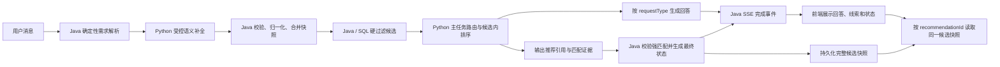

# 自然语言穿搭请求识别与推荐展示修复设计

**日期：** 2026-07-17
**状态：** 已完成代码对照自审与第二轮设计修订，等待最终确认
**影响仓库：** `Intelligent Outfit Recommendation System`、`AI Clothing Shopping Assistant System`
**上游设计：** `2026-07-16-hybrid-demand-intent-refinement-design.md`、`2026-07-16-llm-demand-intent-patch-mvp-design.md`

## 1. 问题背景

以下自然语言请求同时包含问候、穿搭目标、身体数据、季节和目标性别：

> 你好，我想要轻松一点的，我177 130，夏天的衣服该怎么穿呢？男性

当前页面只稳定展示了 `targetGender=male`，回答偏向通用导购介绍，商品区同时出现“没有强匹配商品”和“AI 首选 / AI 精选”。这不是单点解析缺陷，而是意图路由、统一需求模型、回答编排、候选匹配和前端展示状态之间的链路问题。

已经确认的直接原因包括：

1. Python `intent_router` 在业务判断之前匹配问候词，混合请求可能被短路为 `chat`。
2. 身高体重信号的路由优先级高于穿搭推荐，复合问题可能被错误收窄为尺码问题。
3. Java `DemandIntent` 尚未正式承载请求类型、季节、版型偏好和本轮身体数据；季节仍有从 `rawQuery` 临时推导的逻辑。
4. “怎么穿”与“推荐单品”共用推荐回答路径，缺少先输出搭配方案、再关联商品的编排。
5. 前端 `RecommendationResultMeta` 只使用布尔值表达强匹配，`ProductCard` 又根据卡片版式自动显示 AI 标签，导致弱候选也被包装成 AI 精选。

## 2. 目标

- 正确处理“问候语 + 业务需求”的混合输入。
- 识别用户的主任务，避免身高体重覆盖“怎么穿”的真实意图。
- 让 Java 维护可持久化、可验证、可用于 SQL 过滤的统一需求快照。
- 对穿搭咨询先给可执行的搭配方案，再展示能够追溯到 Java 候选池的商品。
- 明确区分强匹配、弱候选和空结果，杜绝互相矛盾的标签与提示。
- 保持现有边界：Java 掌握商品与用户事实，Python 负责意图辅助、候选内排序、解释和自然语言生成，前端不自行推断推荐事实。

## 3. 非目标

- 不建设通用自然语言理解平台。
- 不允许 Python 绕过 Java 候选池补造商品、价格、库存或商品属性。
- 不根据一次对话自动永久修改用户身高体重资料。
- 不在本次修复中建设完整的多件套装库存或虚拟试衣系统。
- 不使用 BMI 给用户贴“偏瘦”“肥胖”等身体标签；身高体重只用于尺码和版型参考。

## 4. 核心设计决策

### 4.1 主任务与辅助信号分离

一条消息只有一个负责回答编排的主任务，但可以同时声明多个待执行能力，避免“怎么穿，顺便看看尺码”丢失其中一个诉求：

| 用户表达 | 主任务 |
|---|---|
| 怎么穿、如何搭配、穿什么好 | `OUTFIT_ADVICE` |
| 推荐几件、想买、帮我找 | `PRODUCT_RECOMMENDATION` |
| 穿什么码、尺码合适吗 | `SIZE_RECOMMENDATION` |
| 纯“你好”“谢谢” | `CHAT` |

问候、性别、身高、体重、季节、风格和版型都不是主任务。`requestType` 是 Java 维护的规范主任务枚举；`requestedCapabilities` 可包含 `OUTFIT_PLAN`、`PRODUCT_SELECTION`、`SIZE_GUIDANCE`。只有用户明确询问尺码且没有更主要的穿搭问题时，主任务才是 `SIZE_RECOMMENDATION`；同时提出穿搭和尺码时以 `OUTFIT_ADVICE` 编排回答，并附加 `SIZE_GUIDANCE`。

### 4.2 Java 的统一需求快照是筛选事实源

扩展后的有效需求示例：

```json
{
  "version": "demand-intent-v2",
  "requestType": "OUTFIT_ADVICE",
  "requestedCapabilities": ["OUTFIT_PLAN", "PRODUCT_SELECTION"],
  "targetGender": "male",
  "category": null,
  "season": "summer",
  "scene": [],
  "style": ["casual"],
  "fitPreferences": ["relaxed"],
  "budgetMax": null,
  "attributes": [],
  "subjectMeasurements": {
    "heightCm": 177,
    "weightKg": 65,
    "originalText": "我177 130",
    "normalizedFrom": "ASSUMED_JIN",
    "subject": "SELF",
    "scope": "ACTIVE_DEMAND",
    "source": "CURRENT_MESSAGE"
  }
}
```

字段边界：

- `requestType` 决定回答编排，`requestedCapabilities` 决定同一回答还需执行哪些能力，二者都不直接进入 SQL。
- `targetGender`、`season`、明确的 `category` 和 `budgetMax` 是硬过滤条件。
- `scene`、`style`、`fitPreferences` 和 `attributes` 是排序偏好。
- `subjectMeasurements` 是当前有效需求对象的会话级上下文，不进入商品关键词，不等于当前账户的永久资料。它可以支持后续“再宽松一点”等追问，但在重置需求、切换咨询对象或明确清除时失效。
- `subjectMeasurements.subject` 统一为 `SELF`、`OTHER` 或 `UNKNOWN`；只有 `SELF` 才允许出现“保存为我的身体数据”。
- 对 `177 130` 这类省略单位的表达，可在中文场景按 `177 cm / 130 斤` 归一化，但必须保留假设来源并向用户显示“按 130 斤理解”，保存前再次确认。

### 4.3 推荐结果使用显式状态

推荐状态统一为：

```text
STRONG_MATCH
WEAK_FALLBACK
EMPTY
```

- `STRONG_MATCH`：Java 校验后的推荐项满足强匹配证据规则，允许展示 AI 标签和可验证理由。
- `WEAK_FALLBACK`：Java 有可浏览候选，但 AI 没有选出强匹配商品；不展示 AI 标签和虚构理由。
- `EMPTY`：硬过滤后没有候选；不展示无关商品，回答中说明缺口并建议用户放宽一个条件。

强匹配不能再用“`recommendedItems` 非空”直接判断。每个强匹配项必须：

1. 来自本轮 Java 候选快照并继续满足实时可售条件；
2. 携带结构化 `matchedDimensions`，证据可追溯到商品分类、季节、风格、版型、属性、预算或尺码事实；
3. 除性别、库存和基础价格分之外，至少满足一个有信息量的显式需求；只有性别或只有通用库存分时必须降级为 `WEAK_FALLBACK`；
4. 不与用户明确的规避项冲突。

现有 `rankScore` 是可超过 1 的内部排序分，不是概率，也不是匹配百分比。前端不得再计算 `rankScore * 100%`；如果未来需要百分比，必须另行设计经过校准的 `matchConfidence`。

## 5. 总体数据流



## 6. 各模块开发与修复方式

### 6.1 Python 意图路由模块

**主要位置：**

- `AI Clothing Shopping Assistant System/clothing_assistant/agent/router.py`
- `AI Clothing Shopping Assistant System/clothing_assistant/agent/nodes.py`
- 对应 Router、Pipeline 和 API 测试

**开发方式：**

1. 将“包含问候词”改为“去除问候词后没有有效内容”才判定 `CHAT`。
2. 新增主任务和附加能力判定函数，先识别用户真正提出的问题，再读取身高体重等辅助信号。
3. 调整优先级：明确的“怎么穿/搭配”优先于测量信号；明确的“什么码/尺码”才进入尺码主任务。
4. 优先消费 Java 提供的规范 `requestType` 和 `requestedCapabilities`；只有 `demand-intent-v1` 没有这些字段时，才使用 Python 兼容路由。
5. 保留 `has_bare_measurement_pair`，但它只负责识别 `177 130`，不再直接决定主任务。

**输出要求：**

```json
{
  "intent": "recommendation",
  "request_type": "OUTFIT_ADVICE",
  "requested_capabilities": ["OUTFIT_PLAN", "PRODUCT_SELECTION"],
  "reason": "命中穿搭建议问题；身高体重作为辅助信息",
  "need_history": false
}
```

其中 `intent=recommendation` 只为兼容现有工作流，不能与 Java 的规范 `requestType` 形成第二套主任务事实源。

**关键测试：**

- `你好` → `CHAT`
- `你好，夏天怎么穿` → `OUTFIT_ADVICE`
- `177 130 夏天怎么穿` → `OUTFIT_ADVICE`
- `177 130 穿什么码` → `SIZE_RECOMMENDATION`
- `男性，想买夏季 T 恤` → `PRODUCT_RECOMMENDATION`

### 6.2 Java 需求模型与解析模块

**主要位置：**

- `backend/.../assistant/dto/DemandIntent.java`
- `backend/.../assistant/dto/DemandIntentPatch.java`
- `backend/.../assistant/dto/LlmDemandSlots.java`
- `backend/.../assistant/service/DemandIntentResolver.java`
- `backend/.../assistant/service/DemandIntentNormalizer.java`
- `backend/.../assistant/service/DemandIntentMerger.java`
- `backend/.../assistant/service/LlmDemandIntentValidator.java`
- 会话需求状态及迁移记录

**开发方式：**

1. 将需求模型升级为 `demand-intent-v2`，增加 `requestType`、`requestedCapabilities`、`season`、`fitPreferences` 和 `subjectMeasurements`；旧 `demand-intent-v1` 快照按缺省值兼容读取。
2. 将“夏天/夏季”“冬天/冬季”等确定性季节词直接解析为标准 code，不再只在候选查询阶段扫描 `rawQuery`。
3. 把“怎么穿/如何搭配”“穿什么码”等明确表达纳入 Java 确定性规则，并锁定 `requestType`。
4. 将“轻松一点”交给受控 LLM 补全；允许输出 `style=CASUAL` 和 `fitPreferences=RELAXED`，由 Java 根据证据和置信度校验。
5. 解析裸数字对时执行范围校验和单位归一化：`177 130` → `177 cm / 65 kg`，同时记录 `normalizedFrom=ASSUMED_JIN`。无法形成可信数字对时不猜测，也不得提供保存入口。
6. 合并快照时，新的咨询对象测量覆盖当前有效对象测量，但不覆盖用户资料表；新的明确 `requestType` 覆盖上一轮主任务。只有用户提出新主任务或明确增删能力时才替换 `requestedCapabilities`，单纯补充“再宽松一点”等条件时保留当前能力，避免后续轮次丢失回答目标。
7. 当用户重置需求、切换为朋友/家人或明确更换咨询对象时，清除或替换 `subjectMeasurements`，避免把本人的尺寸用于他人。
8. 更新 JSON 快照的兼容读取策略：旧快照缺少新字段时使用空值，避免升级后历史会话反序列化失败。

**硬过滤与软偏好：**

- `hardFilters` 增加 `season`。
- `softPreferences` 增加 `fitPreferences`。
- `requestType`、`requestedCapabilities`、`subjectMeasurements` 不进入上述两个列表。

### 6.3 Java 上下文与候选查询模块

**主要位置：**

- `backend/.../assistant/service/AssistantContextService.java`
- `backend/.../product/dto/RecommendationCandidateQuery.java`
- `backend/.../product/service/RecommendationCandidateQueryService.java`
- 商品候选 Mapper 与 SQL

**开发方式：**

1. `AssistantContextService` 直接从有效 `DemandIntent.season` 构造查询，删除或降级现有基于 `rawQuery` 的季节猜测逻辑。
2. 硬过滤顺序保持可解释：在售与库存 → 性别 → 季节 → 分类 → 预算。
3. 自然语言中的 `style` 和 `fitPreferences` 是软偏好；用户在显式筛选器中选择的 style/fit 保持现有精确筛选语义。Java 必须保留槽位来源或筛选器来源，不能只根据字段名猜测强弱。
4. 将 `subjectMeasurements` 和用户资料中的身体数据分别传给 Python，并明确优先级：当前咨询对象数据优先；仅当咨询对象为 `SELF` 且会话没有明确测量时，才回退到当前用户资料。
5. 当硬过滤后为空时返回 `EMPTY`，不自动撤销用户条件并混入无关商品。
6. 候选存在但 Python 未选中商品时返回 `WEAK_FALLBACK`。
7. Java 根据 Python 返回的 `matchedDimensions` 校验强匹配，最终 `recommendationStatus` 由 Java 生成；Python 不拥有最终状态裁决权。

### 6.4 Python 穿搭回答与推荐编排模块

**主要位置：**

- `AI Clothing Shopping Assistant System/clothing_assistant/agent/nodes.py`
- 推荐服务、回答生成器、Validator 及其测试

**开发方式：**

1. 为 `OUTFIT_ADVICE` 建立独立回答模板，不再复用单品推荐开场。
2. 回答按固定层次生成：需求确认 → 搭配公式 → 版型/材质/颜色建议 → 可购买商品 → 一个可选追问。
3. 身高体重只支持尺码和版型建议，不输出未经规则支持的身体类型判断。
4. 商品名称、SKU、价格、库存和推荐理由必须来自 Java 候选及排序结果。
5. 即使没有强匹配商品，也必须先回答不依赖库存事实的穿搭方法；商品部分明确说明当前没有强匹配。
6. 对强匹配结果按搭配角色组织推荐，例如 `TOP`、`BOTTOM`、`OUTER`；本阶段只组织已有候选，不创建“套装商品”实体。该分组展示方案已确认采用。
7. 推荐项除自然语言理由外还必须返回 `matchedDimensions`；库存、基础价格或行为偏好只能影响排序，不能单独把商品升级为强匹配。
8. Python `product_refs` 只包含具备强匹配证据的候选；其他候选保留在 Java 完整候选快照中供 `WEAK_FALLBACK` 浏览，不能再因为基础得分 `>= 0` 就全部变成推荐项。

`matchedDimensions` 使用结构化事实，不允许只返回自由文本：

```json
[
  {
    "dimension": "season",
    "requestedValue": "summer",
    "candidateValue": "summer",
    "evidenceSource": "PRODUCT_SEASON"
  },
  {
    "dimension": "style",
    "requestedValue": "casual",
    "candidateValue": "casual",
    "evidenceSource": "PRODUCT_STYLE_TAG"
  }
]
```

允许的证据源必须映射到 Java 候选字段或属性标签；Java 无法从候选事实复核的维度不得用于强匹配。

**建议回答骨架：**

```text
按男性、177cm、65kg、夏季休闲穿搭的需求：
1. 搭配公式：略宽松上衣 + 直筒下装。
2. 材质与版型：轻薄、透气，上衣不过长，避免过度肥大。
3. 颜色：基础色上衣搭配卡其或深灰下装。
4. 当前商品库匹配：仅列出可归因商品；没有则明确说明。
5. 可选追问：更偏日常还是通勤？
```

### 6.5 Java-Python API 与 SSE 契约模块

**主要位置：**

- Java `PythonChatRequest`、`PythonChatResponse`、SSE DTO 和客户端
- Python `clothing_assistant/api/schemas.py`、`clothing_assistant/api/app.py`
- `outfit-project-contract/contracts/java-python-chat/v1.fields.json`
- Java、Python 和前端契约测试

**开发方式：**

1. Java → Python 仍只保留一个权威 `demand_intent` 对象，在该嵌套对象中增加 `requestType`、`requestedCapabilities`、`season`、`fitPreferences` 和 `subjectMeasurements`；禁止再增加同义顶层字段。
2. Python → Java 的 `product_refs` 增加结构化 `matched_dimensions`，但不返回最终 `recommendation_status`，避免 Python 与 Java 同时成为状态事实源。
3. Java 校验商品身份、实时可售性和匹配证据后生成 `recommendationStatus`，SSE `done` 事件将 `resolved_intent`、`recommendation_status` 和 `recommendation_id` 一并发给前端。
4. Java 的同步响应和 SSE 响应必须使用同一状态计算模块，不能分别复制判断规则。
5. 新字段在滚动升级期间按可选字段处理。旧 Python 没有 `matched_dimensions` 时，推荐项只能按弱候选处理，不能沿用“引用非空即强匹配”的旧逻辑。
6. 先更新共享字段清单和契约测试，再分别修改 Java、Python 实现，避免两端字段漂移。
7. 新增受当前用户权限校验的候选快照读取接口：`GET /api/assistant/recommendations/{recommendationId}/candidates`。接口从 `assistant_recommendation_item` 的本轮完整候选集恢复商品身份，并补齐当前实时价格与库存。
8. 为 `assistant_recommendation_item` 增加 `candidate_position`，记录进入 Python 前的确定性候选顺序。候选快照接口按已选排名优先、其余按 `candidate_position` 返回；已下架或无库存 SKU 标记不可购买或排除，不能再次按前端拼出的筛选条件生成另一批候选。

### 6.6 前端需求线索展示模块

**主要位置：**

- `frontend/src/shared/api/types.ts`
- `frontend/src/shared/api/assistantStream.ts`
- `frontend/src/features/assistant/ChatPanel.tsx`
- 相关状态与流式事件测试

**开发方式：**

1. 扩展前端 `DemandIntent` 类型并消费后端快照，不在浏览器中重新解析自然语言。
2. 对话完成后不再通过 `requestFiltersFromResolvedIntent` 重新查询候选；前端使用 `recommendationId` 读取本轮 Java 已持久化的候选快照，避免 Python 排序池与页面商品池不一致。该函数只保留给用户手动筛选或旧版本兼容路径。
3. “当前穿搭线索”使用用户可读中文展示：男性、夏季、休闲、舒适略宽松、177 cm、65 kg、整套穿搭建议。
4. 原始用户消息只用于聊天展示，不再以“最近需求”代替结构化信息。
5. 未识别字段不显示，不用 `null`、英文枚举或原始 JSON 污染界面。
6. `subjectMeasurements.normalizedFrom=ASSUMED_JIN` 时显示“按 130 斤理解”，不能把推定单位伪装成用户明确输入。

### 6.7 前端推荐状态与商品卡片模块

**主要位置：**

- `frontend/src/features/assistant/ChatPanel.tsx`
- `frontend/src/pages/AiShoppingPage.tsx`
- `frontend/src/features/catalog/ProductCard.tsx`
- 页面、商品卡片和推荐状态测试

**开发方式：**

1. 将 `RecommendationResultMeta.hasStrongMatch` 替换为 `recommendationStatus`，并建立 `IDLE / LOADING / STRONG_MATCH / WEAK_FALLBACK / EMPTY / ERROR` 单一状态机。
2. 为 `ProductCard` 增加显式的推荐展示信息，例如 `recommendationBadge`；卡片不得根据 `featured/supporting` 版式自行生成 AI 标签。
3. “AI 首选”“AI 推荐”和推荐理由只对通过 Java 强匹配校验的商品显示；删除基于 `rankScore` 的匹配百分比展示。
4. `WEAK_FALLBACK` 的卡片显示“当前候选”或不显示徽标，页面提示“暂无强匹配，以下为当前筛选候选”。
5. `EMPTY` 显示空状态和一个放宽条件建议，不渲染旧候选冒充本轮结果。
6. 行为埋点继续只记录可归因商品，弱候选不能携带 `recommendationId` 归因。
7. `OUTFIT_ADVICE` 的强匹配商品按上装、下装、外搭、鞋履和配饰分组；缺少某组商品时显示文字建议，不生成不存在的商品卡片。
8. 提交新消息时进入 `LOADING` 并清除本轮商品状态；只接受与当前 `requestId` 对应的完成或错误事件，迟到的旧 SSE 事件不得覆盖新结果。
9. Python 超时或降级但 Java 仍有候选时使用 `WEAK_FALLBACK`；候选查询本身失败时进入 `ERROR`，不得把上一次商品继续标成当前结果。

### 6.8 商品标签与测试数据模块

**主要位置：**

- 商品季节、风格、版型和属性表
- Flyway 测试数据迁移
- 推荐候选查询测试和端到端验收数据

**开发方式：**

1. 审计现有候选商品是否具备性别、季节、风格、版型和材质标签。
2. 统一 code，避免 `summer/夏季/夏天` 等多种值进入数据库。
3. 测试数据至少准备男性夏季休闲上衣和下装，以及一个只满足性别但不满足季节的反例。
4. 强匹配测试必须验证匹配依据来自真实标签，不允许依赖商品名称猜测。
5. 数据不足时返回弱候选或空结果，不降低硬过滤条件伪造成功推荐。

### 6.9 前端资料表单可读性与输入状态模块

**问题现象：**

- 深色卡片中出现接近白色的输入背景，但文字、占位符和日期提示仍使用浅色，导致内容几乎不可见。
- Windows 原生 `select` 下拉面板使用了浅色系统背景，未选中项的浅色文字缺乏对比度。
- 全局 `select { appearance: none; }` 移除了原生箭头，但没有补充明确的下拉图标，控件不像可以展开的选择框。
- 日期输入的 `mm/dd/yyyy` 和日历图标对比度不足，空值、已有值和禁用状态不容易区分。
- 当前表单没有为默认、悬停、键盘聚焦、错误和禁用状态建立统一视觉规则。

**主要位置：**

- `frontend/src/styles.css`
- `frontend/src/pages/ProfilePreferencesPage.tsx`
- 如需复用，新增轻量的表单控件样式或包装组件
- `ProfilePreferencesPage` 组件测试和浏览器视觉验收

**已确认方案（方案 A）：保持原生表单能力，统一为深色控件。** 不在本次修复中实现自定义下拉框或日期选择器，避免额外引入键盘导航、焦点管理和无障碍风险。

**开发方式：**

1. 在个人资料页面容器声明 `color-scheme: dark`，让浏览器原生日期控件和下拉面板优先采用深色系统主题。
2. 对 `.profile-form-grid` 内的 `input`、`select` 和 `textarea` 显式设置深色背景、高对比文字、边框和插入光标颜色，不能只依赖全局变量继承。
3. 为 `select option` 设置与控件一致的深色背景和浅色文字；首项“未设置”使用正常可读的次级文字，而不是接近背景色的占位符颜色。
4. 使用背景图标或轻量包装元素补回下拉箭头，并给右侧留出点击空间；图标只负责提示，不拦截点击。
5. 日期输入继续使用原生 `type=date`，通过深色 `color-scheme` 和日历指示器样式保证可见；标签改为“生日（可选）”，避免用户把空日期误认为加载失败。
6. 统一占位符颜色，普通字号下与背景的对比度目标不低于 4.5:1；真实输入值必须比占位符更醒目。
7. 建立完整控件状态：
   - 默认：边界清楚，值可读；
   - 悬停：边框轻微增强；
   - `:focus-visible`：显示 2 到 3 px 高对比焦点环；
   - 错误：红色边框并显示字段级错误文字，不能只靠颜色；
   - 禁用：降低整体强调度，但文字仍可阅读。
8. 调整两列表单的最小宽度和间距，窄屏下降为单列，避免输入内容或原生下拉面板被卡片裁切。
9. 保留原生键盘操作、Tab 顺序、方向键选择和屏幕阅读器标签，不使用只有视觉效果的 `div` 模拟输入框。

**建议视觉令牌：**

```text
控件背景：#10151f 或现有 --surface
输入文字：#f5f7ff
占位文字：不低于 #aeb7ca
默认边框：rgba(203, 213, 255, 0.25)
聚焦边框：#7be7e0
聚焦外环：rgba(123, 231, 224, 0.22)
错误文字：使用项目统一 danger 色，并附带明确错误说明
```

最终颜色应通过浏览器计算后的对比度验证，不以肉眼判断代替验收。

### 6.10 对话身体数据临时使用与一键保存模块

**已确认方案：方案 C。** 对话中识别出的咨询对象身高体重立即服务当前有效需求，但不自动修改用户资料。

**主要位置：**

- Java `DemandIntent.subjectMeasurements`、用户身体数据查询与窄字段更新接口
- Java SSE 完成事件中的有效需求快照
- 前端 `ChatPanel` 的已识别线索和保存操作
- `ProfilePreferencesPage` 的身体数据状态刷新
- Java API 测试和前端交互测试

**开发方式：**

1. Java 在解析消息时保留测量值、原始单位、归一化方式、咨询对象和 `CURRENT_MESSAGE` 证据。
2. Python 只消费当前有效 `subjectMeasurements` 完成尺码与版型建议，不负责写用户资料。
3. 只有 `subject=SELF` 时，前端才比较 `subjectMeasurements` 与已加载的用户身体数据：完全相同则不显示保存入口；不同或资料为空时显示“保存为我的身体数据”。`OTHER` 和 `UNKNOWN` 均不显示入口。
4. 用户点击后展示确认内容。资料已有值时同时显示旧值和新值；省略单位的数据必须展示换算说明。
5. 新增 `PATCH /api/me/body-data/measurements`，只接受并更新 `heightCm`、`weightKg`。不得直接把两个字段提交到现有全量 `PUT /api/me/body-data`，否则会把肩宽、胸围、腰围、臀围、性别和版型偏好覆盖为 `null`。
6. PATCH 接口重新校验数值范围并只更新指定列；它保持幂等，由 Java 身体资料模块负责缓存失效与最新结果返回。
7. 保存成功后更新前端用户资料缓存并移除保存提示；保存失败只显示操作错误，不撤销当前解析结果、不重新运行推荐。
8. 保存行为必须是独立的用户动作，不能由聊天提交、SSE 完成事件或页面卸载自动触发。

**交互文案：**

```text
本次识别：177 cm、65 kg（按 130 斤理解）
[保存为我的身体数据]

确认更新身体数据？
原数据：175 cm、68 kg
新数据：177 cm、65 kg
[取消] [确认保存]
```

### 6.11 穿搭角色分组展示模块

**已确认方案：方案 B。** 第一阶段按搭配角色组织商品，但加购、立即购买、价格和库存仍以单个 SKU 为单位，不建设套装商品和整套交易能力。

**主要位置：**

- Python 推荐项模型、候选排序和回答生成
- Java `AssistantRecommendationItem`、分类角色映射模块与 SSE DTO
- 前端 `RecommendedItem` 类型、流式事件解析和 AI 导购商品区域
- Java-Python 契约测试、前端分组渲染测试和端到端验收

**角色枚举：**

```text
TOP
BOTTOM
OUTER
SHOES
ACCESSORY
OTHER
```

**开发方式：**

1. 商品分类是 Java 事实，因此最终 `outfitRole` 由 Java 根据候选的标准分类映射：T恤/衬衫/卫衣为 `TOP`，外套/西装/羽绒服为 `OUTER`，牛仔裤/休闲裤/短裤/半裙为 `BOTTOM`；未映射分类使用 `OTHER`。
2. Python 只选择候选和生成穿搭方案，不在跨服务 `product_refs` 中声明商品角色，避免形成第二套分类事实。
3. Java 继续校验 SPU/SKU 必须来自本轮候选池，并在构造 `recommended_items` 时附加角色；SSE 将角色传给前端，旧事件没有角色时保持当前平铺展示。
4. 前端仅在 `requestType=OUTFIT_ADVICE` 且存在合法角色时启用分组；普通单品推荐继续使用现有推荐布局。
5. 每个角色只渲染真实商品卡片。没有匹配下装或鞋履时，回答可以给文字搭配建议，但页面不得构造占位商品、价格或购买按钮。
6. 商品卡片仍保留单件加购和立即购买；第一阶段不增加“一键购买整套”入口。
7. 推荐归因仍落到单个 `recommendedItem`，分组标题本身不产生点击或购买归因。

## 7. 推荐状态展示规则

| 状态 | 页面提示 | 商品徽标 | 推荐理由 | 推荐归因 |
|---|---|---|---|---|
| `STRONG_MATCH` | 已按当前需求推荐 | 允许 AI 首选/推荐 | Python 生成且经 Java 证据校验 | 允许 |
| `WEAK_FALLBACK` | 暂无强匹配，以下为当前候选 | 无 AI 徽标 | 不显示 AI 理由 | 不允许 |
| `EMPTY` | 当前条件下暂无商品 | 无商品卡片 | 无 | 不允许 |

`recommendationId` 在三个状态下都可以作为读取本轮候选快照的技术标识，但只有 `STRONG_MATCH` 中通过校验的商品才能把该 ID 用作点击、加购和购买的推荐归因。技术关联不等于 AI 推荐归因。

## 8. 验收标准

主验收输入：

> 你好，我想要轻松一点的，我177 130，夏天的衣服该怎么穿呢？男性

必须满足：

1. 主任务为 `OUTFIT_ADVICE`，不得为 `CHAT` 或 `SIZE_RECOMMENDATION`。
2. 有效需求包含 `male`、`summer`、`casual`、`relaxed`、`177 cm`、`65 kg`。
3. 回答先提供搭配方案，再关联商品。
4. Java 候选不得包含明确不适合男性或夏季的商品。
5. 没有强匹配时，不出现“AI 首选”“AI 精选”或匹配百分比。
6. 有强匹配时，AI 标签、结构化匹配证据、理由、商品 ID 和 `recommendationId` 可以相互追溯；`rankScore` 不显示为百分比。
7. 纯问候、纯尺码请求和普通单品推荐的既有能力不回归。
8. 个人资料输入值、占位符、下拉选项和日期提示在深色主题下均清晰可读。
9. 性别下拉框在 Windows Chromium 中展开后，未设置、男、女三个选项均具有足够对比度。
10. 所有资料控件可通过键盘操作，焦点位置清晰可见，移动端不会被卡片裁切。
11. 对话中的身高体重不经用户操作不得写入个人资料；点击确认后才更新，并且保存失败不影响当前推荐。
12. 用户为朋友或家人咨询时不显示“保存为我的身体数据”入口。
13. 穿搭建议中的强匹配商品能够按合法角色分组，缺失角色只显示文字建议，不出现虚构商品。
14. 普通单品推荐保持现有布局，分组功能不会把所有推荐请求强制转换成套装展示。
15. 对话完成后的商品来自本轮 `recommendationId` 对应的候选快照，不再由前端按部分筛选条件重新查询。
16. Python 超时、有候选时显示 `WEAK_FALLBACK`；候选查询失败时显示 `ERROR`，旧请求事件不能覆盖新请求状态。
17. 一条消息同时要求穿搭和尺码时，以 `OUTFIT_ADVICE` 编排，并保留 `SIZE_GUIDANCE` 能力。
18. 保存 177 cm、65 kg 时只更新身高体重，不清空用户已有的肩宽、胸围、腰围、臀围、性别和版型偏好。

## 9. 建议开发顺序

1. 共享契约和 Java `DemandIntent` 扩展。
2. 商品标签审计、标准分类到穿搭角色的 Java 映射和强匹配证据模型。
3. Java 确定性解析、需求对象测量生命周期、状态合并和候选查询。
4. Python 主任务兼容、附加能力、结构化匹配证据和穿搭回答编排。
5. Java 最终推荐状态、完整候选快照读取接口以及同步/SSE 一致输出。
6. 前端请求状态机、候选快照消费、线索区和商品卡片展示修复。
7. 个人资料表单可读性和控件状态修复。
8. 身体数据窄字段 PATCH、一键保存与资料同步。
9. 穿搭角色分组展示、端到端测试和回归测试。

该顺序保证每一步都沿用 Java 事实边界，避免先修前端文案后仍然消费错误状态。

## 10. 风险与控制

- **历史快照兼容：** 新字段必须可空，旧 JSON 可正常读取。
- **两端版本错配：** 新契约字段先可选、后强校验，保留一轮兼容窗口。
- **字段重复导致事实冲突：** 新需求字段只放在 `demand_intent` 内，不增加同义顶层字段；Java 有效快照始终是唯一事实源。
- **“轻松”语义歧义：** 作为软偏好同时给出休闲和舒适版型候选，不升级为硬过滤。
- **裸数字误识别：** 只有符合身高体重范围且成对出现时才解析，并保留当前消息证据。
- **咨询对象串用：** 会话测量携带 `SELF/OTHER/UNKNOWN` 和 `ACTIVE_DEMAND` 作用域；切换对象或重置需求时必须清理。
- **候选数据不足：** 诚实返回弱候选或空结果，不撤销性别、季节等硬条件。
- **排序分误当概率：** `rankScore` 只用于排序和调试，前端不显示百分比；强匹配依赖可验证维度而不是单一阈值。
- **回答与商品脱节：** 回答中的商品事实只能引用 `recommendedItems` 和 Java 候选。
- **候选池漂移：** 前端按 `recommendationId` 读取同一持久化候选快照，不再重建筛选请求；接口必须校验快照归属当前用户。
- **全量 PUT 清空资料：** 对话保存只走身高体重 PATCH，不复用会把其他字段写成 `null` 的全量资料更新。
- **原生控件跨平台差异：** 至少在 Windows Chromium 和项目支持的移动端浏览器完成展开态、日期态和键盘焦点验收。
- **过度自定义表单：** 第一阶段保留原生 `select` 和日期输入，只修复主题、对比度和状态，避免引入自定义控件的无障碍回归。

## 11. 已确认的产品决策

1. **资料表单：** 采用方案 A，使用与页面一致的深色输入框，保留原生 `select` 和 `type=date`，通过显式颜色、`color-scheme: dark`、下拉箭头和完整控件状态保证可读性。
2. **弱候选：** `WEAK_FALLBACK` 继续展示满足性别、季节、预算等硬条件的普通候选，统一使用“当前候选”语义，不显示“AI 首选”“AI 精选”、匹配百分比、AI 推荐理由或推荐归因。
3. **身体数据：** 采用方案 C。对话中识别出的咨询对象身高体重立即作为当前有效需求的会话上下文使用，但只有对象明确为 `SELF` 且用户点击“保存为我的身体数据”后才写入个人资料。资料中数值相同时不提示；数值不同时展示新旧值和单位换算并二次确认；保存失败不影响当前穿搭回答和推荐结果。
4. **穿搭商品：** 采用方案 B。Java 按标准商品分类映射 `TOP`、`BOTTOM`、`OUTER`、`SHOES`、`ACCESSORY`、`OTHER` 并分组展示真实候选商品，缺失角色只给文字建议，购买行为仍以单个 SKU 为单位。

## 12. 第二轮代码对照自审修订记录

本轮不是只检查文字完整性，而是将设计逐项与现有 Java、Python 和前端实现对照。发现并修正了以下问题：

| 原设计问题 | 可能后果 | 本轮修订 |
|---|---|---|
| Python 和 Java 都可能决定推荐状态 | 两端判断不一致，再次出现“无强匹配 + AI 首选” | Python 返回引用和证据，Java 统一校验并生成最终状态 |
| 只要 `recommendedItems` 非空就算强匹配 | 当前基础库存分即可让无关商品被选中 | 强匹配必须包含可验证的显式需求维度 |
| 把 `rankScore` 当匹配百分比 | 当前加法分数可能超过 1，百分比失真 | 排序分仅内部使用，删除百分比展示 |
| 在顶层请求和 `demand_intent` 重复新增相同字段 | 跨服务出现两个事实源 | 所有需求字段只扩展嵌套 `demand_intent` |
| 前端根据解析字段再次查询候选 | 页面商品可能不是 Python 实际排序的候选池 | 按 `recommendationId` 读取同一完整候选快照 |
| `turnMeasurements` 名称与持久化行为冲突 | 后续追问丢数据，或切换咨询对象后串用数据 | 改为带对象和作用域的 `subjectMeasurements` |
| 使用现有全量 PUT 保存身高体重 | 其他身体资料字段可能被覆盖为 `null` | 新增只更新身高体重的窄字段 PATCH |
| Python 决定商品穿搭角色 | 商品分类事实可能被模型错误改写 | Java 根据标准分类映射最终角色 |
| 只有单一任务字段 | 同时询问穿搭和尺码时丢失一个诉求 | 增加 `requestedCapabilities` 表达附加能力 |
| 没有定义加载、降级和迟到事件 | 上一轮商品或旧 SSE 结果可能冒充当前结果 | 建立前端单一状态机并按 `requestId` 丢弃旧事件 |
