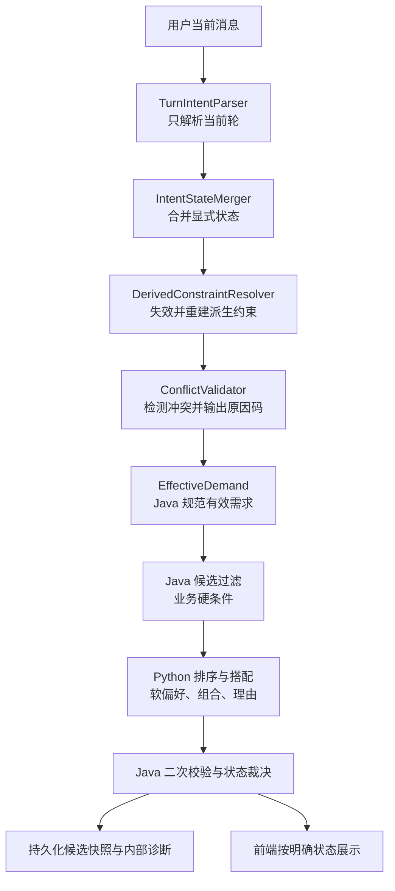

# 多轮意图生命周期与管理端数据访问治理设计

**日期：** 2026-07-21

**状态：** 推荐工作流已实现并验证；Admin 工作流待独立计划

**影响仓库：** `Intelligent Outfit Recommendation System`、`AI Clothing Shopping Assistant System`、`outfit-project-contract`

**关联设计：** `2026-07-17-natural-language-outfit-request-repair-design.md`

**设计性质：** 对既有推荐修复方案的架构升级，并新增管理端 SQL 分层治理方案

## 1. 讨论结论

本轮讨论确认，当前问题不能只按“删除残留的保暖属性”和“把弱候选显示出来”处理。最终优化目标是建立两条可长期约束后续开发的治理主线：

1. **推荐链路：** 建立带来源、强度和生命周期的多轮意图状态模型，阻止历史派生条件持续污染后续轮次；Java 统一解释业务约束，Python 只按明确契约执行候选排序、搭配和解释。
2. **管理端数据访问：** 延续项目既有 MyBatis 规范，将 `AdminCatalogService` 中的 SQL 按模块逐步等价迁移到 Mapper XML；SQL 全部迁移完成后再拆分巨型 Service，并用架构测试防止回退。

两个工作流必须分别规划、分别验收。推荐链路是当前用户功能故障，优先实施；Admin 重构属于结构性治理，不能与推荐修复捆绑提交。

## 2. 已确认的运行证据

本次故障不是商品库为空：

- Java 已为最终一轮“女性 + 夏季 + 日常休闲”筛选出 24 个可售候选；
- 会话有效状态同时包含 `season=summer` 和历史残留 `attributes=["保暖"]`；
- Python 将“保暖”再次解释为 `warm + winter`，继而硬淘汰全部夏季候选；
- Java 收到空 `product_refs` 后返回弱降级状态；
- 前端读取到了 24 个候选快照，但穿搭页面仅渲染带 `outfitRole` 的商品，弱候选没有角色，因此页面显示 24 件却没有任何商品卡片。

当前状态污染来自两个实现事实：

1. Java 的 `DemandIntentMerger` 对 `attributes`、`style`、`scene` 等列表只做并集，不记录值的来源和失效条件；
2. Python 将本应属于软偏好的“保暖”升级成硬淘汰规则，形成第二套业务解释。

## 3. 目标与非目标

### 3.1 目标

- 当前轮解析、历史合并、派生约束、冲突检测、候选过滤和 AI 排序各自只有一个明确职责。
- 每个约束都能回答：谁提出、何时提出、是否由其他字段推导、强度是什么、何时失效。
- 当前轮明确表达优先于历史状态；用户明确表达优先于系统推导。
- Java 是商品事实、业务硬条件和最终推荐状态的唯一事实源。
- Python 不再从中文属性重新推导季节或其他 Java 业务含义。
- 降级状态含义单一，候选存在时前端必须展示真实商品。
- 推荐链路能够解释“为什么没有选中”，而不是只记录数量为零。
- Admin SQL 逐模块迁入 MyBatis XML，迁移过程不改变接口、事务或返回值。

### 3.2 非目标

- 不建设通用知识图谱或通用规则引擎。
- 不把完整对话事件溯源作为本期的主要状态读取方式。
- 不允许 Python 绕过 Java 候选池查询或编造商品事实。
- 不在推荐修复中顺带重构 Admin 模块。
- 不在 SQL 迁移时同时修改 DTO、接口响应、业务规则和事务语义。
- 不在 SQL 尚未迁移完成时一次性拆分七个 Service。

## 4. 方案比较与选择

### 4.1 多轮意图

| 方案 | 内容 | 优点 | 问题 | 结论 |
|---|---|---|---|---|
| A. 针对字段清理 | 切换到夏季时删除“保暖/厚款” | 改动最小 | 会持续出现其他残留组合；可能误删用户明确要求 | 拒绝 |
| B. 带来源的约束生命周期 | 显式保存来源、强度、父约束和轮次；统一失效和重推导 | 能系统解决状态污染；便于诊断和测试 | 需要升级状态与跨服务契约 | **采用** |
| C. 完整事件溯源重放 | 每轮从全部历史事件重新计算意图 | 可审计性最强 | 当前规模下复杂度和迁移成本过高 | 延后 |

### 4.2 Admin 数据访问

| 方案 | 内容 | 优点 | 问题 | 结论 |
|---|---|---|---|---|
| A. 一次性大重构 | 同时迁移全部 SQL、拆 Mapper、拆 Service | 最终结构一步到位 | 回归面过大，无法隔离错误来源 | 拒绝 |
| B. 逐模块等价迁移 | 特征测试保护下逐个迁移到 Mapper XML，最后拆 Service | 风险可控，可形成迁移模板 | 阶段内会短暂保留混合结构 | **采用** |
| C. 保留 JdbcTemplate 并抽 Repository | 将 SQL 从 Service 移到 JDBC Repository | 也能隔离 SQL | 与项目既有 MyBatis XML 主路径不一致 | 拒绝 |

## 5. 推荐链路目标调用链



关键顺序固定为：

1. 只解析当前轮；
2. 合并用户显式状态；
3. 删除父条件已经失效的派生约束；
4. 根据新的有效状态重新推导；
5. 检测但不擅自删除合法的显式组合；
6. Java 执行硬过滤；
7. Python 执行软排序和搭配；
8. Java 校验商品引用、证据并裁决最终状态。

上述阶段不得再次合并成一个同时负责解析、推导和筛选的类。

## 6. 意图状态模型

### 6.1 当前轮与有效状态分离

`TurnIntent` 是短生命周期对象，只表达当前消息中有证据的增删改，不继承历史值。它的接口应至少表达：

- 当前轮锁定的标量槽位；
- 当前轮新增或移除的多值槽位；
- 当前轮明确要求清除的槽位；
- 当前消息证据片段；
- 当前轮 ID 和请求 ID。

`EffectiveDemand` 是合并、派生、冲突校验后的 Java 权威快照。候选查询和 Java→Python 契约只能消费该快照，不能直接消费原始解析结果。

### 6.2 约束结构

约束不能只保存字符串值。建议采用等价于以下结构的模型，最终命名可在实施计划中按项目风格确定：

```java
public record IntentConstraint(
        String id,
        String field,
        String operator,
        List<String> values,
        ConstraintStrength strength,
        ConstraintOrigin origin,
        String originTurnId,
        String derivedFromConstraintId,
        String scope
) {}
```

枚举含义：

```text
ConstraintStrength = HARD | SOFT
ConstraintOrigin   = USER_EXPLICIT | PROFILE | SYSTEM_DERIVED | LEGACY_UNPROVENANCED
scope              = ACTIVE_DEMAND | USER_PROFILE
```

不单独保存“CURRENT_MESSAGE/HISTORY”来源枚举；是否来自当前轮由 `originTurnId` 与当前轮 ID 比较得到。这样历史轮的用户明确表达仍然保留 `USER_EXPLICIT` 身份，不会和系统派生值混淆。

冬季派生保暖示例：

```json
{
  "id": "c-thermal-warm-turn-1",
  "field": "thermal",
  "operator": "EQUALS",
  "values": ["WARM"],
  "strength": "SOFT",
  "origin": "SYSTEM_DERIVED",
  "originTurnId": "turn-1",
  "derivedFromConstraintId": "c-season-winter-turn-1",
  "scope": "ACTIVE_DEMAND"
}
```

用户明确说“夏天办公室空调冷，想保暖”时，保暖约束为 `USER_EXPLICIT + SOFT`，没有 `derivedFromConstraintId`。季节切换或重新推导不得删除它。

### 6.3 优先级

合并优先级固定为：

```text
当前轮 USER_EXPLICIT
    > 历史 USER_EXPLICIT
    > PROFILE
    > SYSTEM_DERIVED
```

补充规则：

- 标量槽位（性别、分类、季节、预算上限）由当前轮明确值覆盖历史值；
- 多值槽位必须按字段定义 `REPLACE / APPEND / REMOVE` 策略，禁止统一使用集合并集；
- 派生约束永远不能覆盖用户明确约束；
- 画像只在当前有效需求没有用户明确值时提供默认偏好；
- 当前轮没有提到某字段不等于清空该字段，只有显式清除、需求重置或作用域切换才能清除用户明确状态。

### 6.4 派生约束生命周期

`DerivedConstraintResolver` 每轮执行“先失效、后重建”：

1. 找到父约束不存在、值已变化或作用域已结束的 `SYSTEM_DERIVED` 约束；
2. 仅删除这些派生约束；
3. 根据新的有效显式状态生成派生约束；
4. 生成过程必须幂等，同一父约束不会重复产生相同约束。

例如 `WINTER → SUMMER`：

- 删除由旧 `season=WINTER` 派生的 `thermal=WARM`、`thickness=THICK`；
- 保留用户明确提出的 `thermal=WARM`；
- 可以从 `season=SUMMER` 派生 `BREATHABLE/LIGHTWEIGHT/COOLING`，但默认均为 `SOFT`。

### 6.5 冲突处理

`ConflictValidator` 不把所有少见组合当错误。它输出结构化结果：

```text
VALID
VALID_UNCOMMON_COMBINATION
RESOLVED_BY_PRIORITY
UNRESOLVED_HARD_CONFLICT
```

规则：

- “夏季 + 用户明确保暖”是 `VALID_UNCOMMON_COMBINATION`，保留两者；
- “夏季 + 旧冬季派生保暖”在生命周期阶段已经删除，不应再成为冲突；
- 同一标量的当前轮值与历史值冲突，按优先级解决并记录 `RESOLVED_BY_PRIORITY`；
- 两个同轮用户明确硬条件无法同时满足时，不静默猜测，进入澄清或空结果路径。

## 7. Java 与 Python 的职责和契约

### 7.1 Java 唯一负责

- 商品上下架、删除状态、实时库存和可售性；
- 性别、明确分类、明确季节、价格范围等业务硬过滤；
- 当前轮解析结果的校验、历史合并、派生生命周期和冲突裁决；
- Python 商品引用、匹配证据和实时可售性的二次校验；
- 最终推荐状态和候选快照；
- 跨服务契约版本和兼容策略。

### 7.2 Python 负责

- Java 候选池内的风格、颜色、场景、版型等软偏好评分；
- 尺码算法自身明确声明的候选约束；
- 穿搭组合、排序、候选在本次组合中的建议角色、推荐理由和回答生成；
- 输出可供 Java 验证的结构化匹配证据；
- 输出内部淘汰原因统计。

Python 不再执行以下推导：

```text
中文“保暖” → winter 硬条件
中文“正式” → Java 分类或上下架条件
自然语言属性 → 绕过契约的新业务硬过滤
```

只有 Java 契约中标记为 `HARD` 的约束才允许 Python 淘汰候选。`SOFT` 只能加权、降权或影响组合，不得直接 reject。

`outfitRole` 属于“本次搭配如何使用商品”的算法结果，而不是商品分类本身。Python 可以在 `product_ref` 中提出 `TOP/BOTTOM/OUTER/SHOES/ACCESSORY/OTHER` 建议角色；Java 必须根据标准商品分类和允许的角色映射校验，拒绝不可能的角色，并只把 Java 校验后的最终角色发给前端。这样既保留 Python 的组合能力，又不允许 Python 改写商品分类事实。

### 7.3 Java → Python 契约

现有 `demand_intent` 升级为带版本的规范结构，禁止新增同义顶层字段：

```json
{
  "version": "demand-intent-v3",
  "requestType": "OUTFIT_ADVICE",
  "requestedCapabilities": ["OUTFIT_PLAN", "PRODUCT_SELECTION"],
  "hardFilters": [
    {
      "id": "c-season-summer-turn-4",
      "field": "season",
      "operator": "CONTAINS",
      "values": ["SUMMER"],
      "strength": "HARD",
      "origin": "USER_EXPLICIT",
      "originTurnId": "turn-4"
    }
  ],
  "softPreferences": [
    {
      "id": "c-style-casual-turn-4",
      "field": "style",
      "operator": "CONTAINS",
      "values": ["CASUAL"],
      "strength": "SOFT",
      "origin": "USER_EXPLICIT",
      "originTurnId": "turn-4",
      "weight": 0.8
    }
  ]
}
```

兼容期内 v2 原字段可以保留为只读兼容输入，但 v3 代码不得同时读取旧 `attributes` 和新约束后再合并，避免同义字段形成两个事实源。

Python → Java 的 `product_ref` 在 v3 增加可选 `outfit_role`。旧 Python 不返回该字段时，Java 可以依据标准分类补齐安全默认角色；Python 返回不兼容角色时，Java 丢弃该角色但不必丢弃已经通过其他证据校验的商品引用。最终前端字段始终来自 Java 校验结果。

### 7.4 历史状态迁移

旧 `demand-intent-v2` 的列表值没有可靠来源，不能伪装成用户明确条件。迁移规则为：

1. 标量硬字段、请求类型、能力和咨询对象测量按已有语义读取；
2. 无来源的旧列表值标记为 `LEGACY_UNPROVENANCED + SOFT`；
3. 用户进入下一轮时，当前轮明确值正常覆盖；
4. 与新标量状态不兼容的 legacy 值自动失效；
5. 用户在当前轮重新表达的值转成 `USER_EXPLICIT`；
6. 完成一个版本窗口后停止写入 v2，仅保留历史只读解析。

该策略会优先消除污染，代价是少量无法证明来源的旧软偏好可能需要用户重新表达；这比继续把旧派生值当明确事实更安全。

## 8. 推荐状态机与前端展示

最终状态统一升级为：

```java
public enum RecommendationStatus {
    STRONG_MATCH,
    PARTIAL_MATCH,
    BROWSE_FALLBACK,
    EMPTY,
    FAILED
}
```

### 8.1 状态判定

| 状态 | 判定 | 展示 |
|---|---|---|
| `STRONG_MATCH` | Java 接受至少一个可验证推荐；单品请求已满足，或穿搭请求至少包含一个 `TOP` 和一个 `BOTTOM` | AI 推荐；穿搭按角色分组 |
| `PARTIAL_MATCH` | Java 接受了可验证推荐，但穿搭请求缺少 `TOP` 或 `BOTTOM` | 展示真实已选商品；缺失角色给文字提示 |
| `BROWSE_FALLBACK` | Java 候选数大于 0，但 Java 接受推荐数为 0 | 普通商品网格；无 AI 归因和角色分组 |
| `EMPTY` | Java 硬过滤后候选数为 0 | 空状态和放宽条件建议 |
| `FAILED` | 推荐调用、候选快照读取或关键校验异常 | 错误提示、重试或安全降级 |

`STRONG_MATCH` 的穿搭完整性以当前商品域可支持的最小核心组合 `TOP + BOTTOM` 判断。鞋履、配饰不是强匹配必需项，避免现有商品库没有这些分类时所有穿搭都被误判为部分匹配。

### 8.2 前端不变量

```text
BROWSE_FALLBACK && candidateCount > 0
→ renderedProductCount > 0
```

具体要求：

- 只有 `STRONG_MATCH/PARTIAL_MATCH` 且商品带合法 `outfitRole` 时启用角色分组；
- `BROWSE_FALLBACK` 始终用普通商品网格展示候选快照；
- 降级候选不显示 AI 徽标、推荐理由、匹配百分比或推荐归因；
- `EMPTY` 和 `FAILED` 不沿用上一轮商品；
- 前端只消费 Java 状态，不根据商品数量或 Python 字段自行重新判定。

## 9. 诊断、指标和隐私

### 9.1 Java 内部诊断

建议在推荐记录或结构化日志中保存：

```json
{
  "javaCandidateCount": 24,
  "pythonSelectedCount": 0,
  "javaAcceptedCount": 0,
  "status": "BROWSE_FALLBACK",
  "reasonCodes": [
    "STALE_DERIVED_CONSTRAINT_REMOVED",
    "PYTHON_REJECTED_ALL"
  ]
}
```

### 9.2 Python 内部诊断

Python 返回或记录聚合统计，不返回完整用户文本：

```json
{
  "rejectedReasons": {
    "HARD_FILTER_MISMATCH": 0,
    "SIZE_MISMATCH": 0,
    "LOW_STYLE_SCORE": 24,
    "MISSING_REQUIRED_EVIDENCE": 0
  }
}
```

### 9.3 公开响应边界

- 前端只需要最终状态、候选数、已接受商品和用户可读提示；
- 详细 reason code 默认只进入服务间调试字段、指标或持久化诊断；
- 日志只记录标准枚举、计数、契约版本、`requestId`、`threadId` 的不可逆或受控标识；
- 不记录完整对话、身高体重原文、Token、密码或其他敏感字段。

## 10. 推荐链路测试策略

### 10.1 模块不变量

1. **派生生命周期：** 父约束失效后，其派生约束必须失效。
2. **显式条件保护：** 用户明确说“夏季但需要保暖”时，保暖不能被季节切换删除。
3. **优先级：** 当前轮明确值覆盖历史标量值，系统派生值不能覆盖用户明确值。
4. **软偏好边界：** `SOFT` 约束不得直接导致候选被淘汰。
5. **候选事实边界：** Python 的每个 `product_ref` 必须来自本轮 Java 候选。
6. **状态唯一性：** 同一输入的同步与 SSE 路径必须得到同一最终状态。
7. **展示不变量：** `BROWSE_FALLBACK + candidateCount > 0` 必须渲染至少一个真实商品卡片。

### 10.2 主端到端回归

输入序列：

```text
男性 + 冬季
→ 女性
→ 夏季
→ 日常休闲
```

最终必须满足：

```text
gender = FEMALE
season = SUMMER
style = CASUAL
winterDerivedConstraints = []
javaCandidateCount > 0
renderedProductCount > 0
```

补充合法反例：

```text
夏天，但是办公室空调很冷，想稍微保暖
```

必须保留 `SUMMER` 和用户明确的 `WARM`，将其作为少见但合法组合参与软排序。

## 11. Admin 数据访问治理

### 11.1 目标结构

项目数据访问统一遵循：

```text
Controller → Service → Mapper Interface → Mapper XML → Database
```

Service 负责业务校验、事务编排、跨 Mapper 协作、审计触发和搜索变更通知；Mapper XML 负责 SQL、动态条件和结果映射。

目标 Mapper 按业务数据边界拆分：

```text
AdminCategoryMapper
AdminProductMapper
AdminInventoryMapper
AdminOrderMapper
AdminUserMapper
AdminAnalyticsMapper
AdminAuditMapper
```

这些 Mapper 是数据访问 seam，不要求同步创建同名 Service。SQL 全部迁移完成前保留现有 `AdminCatalogService` 接口，避免同时改变调用方和数据访问实现。

### 11.2 迁移顺序

每个模块严格执行：

```text
补当前行为特征测试
→ 迁移 SQL 到 Mapper XML
→ 保持 DTO、事务和响应不变
→ 运行模块与全量验证
→ 删除该模块 JdbcTemplate 代码
→ 再进入下一个模块
```

建议顺序：

1. `AdminCategoryMapper`：边界最清楚，作为迁移模板；
2. `AdminAuditMapper`：读写简单，可复用统一审计入口；
3. `AdminUserMapper`：状态更新与列表统计；
4. `AdminAnalyticsMapper`：只读统计，重点验证聚合结果；
5. `AdminProductMapper`：包含生成主键、默认 SKU 和标签替换；
6. `AdminInventoryMapper`：保留库存调整事务和调整前后值；
7. `AdminOrderMapper`：最后迁移发货状态、物流和支付状态组合逻辑。

产品、库存和订单放在后段，因为它们包含生成主键、多表写入、审计、搜索同步或事务并发语义。

### 11.3 迁移约束

- 不改变现有 `/api/admin/**` JSON 契约；
- 不修改 Flyway 历史迁移；
- 不在 SQL 迁移中顺带重命名 DTO 或表字段；
- MyBatis 使用参数绑定，禁止字符串拼接用户输入；
- 动态条件使用 XML `<where>/<if>`；
- 生成主键使用 MyBatis `useGeneratedKeys/keyProperty` 或项目验证通过的等价机制；
- 每迁移一个模块，立即删除对应 JdbcTemplate SQL 和 ResultSet 映射，禁止保留双路径；
- SQL 全部迁移后再评估 `AdminCatalogService` 的拆分接口。

### 11.4 Service 拆分时机

SQL 全部迁移并稳定后，按管理用例而不是按表机械拆分：

- 商品目录管理；
- 库存调整；
- 订单履约；
- 用户状态管理；
- 经营分析与审计查询。

拆分目标是形成深模块：调用方只需理解少量管理用例接口，事务和多 Mapper 协作隐藏在实现内部。禁止创建只转发一个 Mapper 方法的浅 Service。

### 11.5 防回退架构测试

迁移期间维护显式例外清单，例外只能减少不能增加。全部迁移完成后启用最终规则：

```text
..service.. 不得依赖 JdbcTemplate
..service.. 不得依赖 Connection
..service.. 不得依赖 PreparedStatement
..service.. 不得依赖 ResultSet
```

架构规则建议用 ArchUnit 实现，并在 Maven `verify` 中执行。测试代码的数据准备可以继续使用 `JdbcTemplate`，限制对象是 `src/main/java` 的 Service 实现。

## 12. 分阶段实施与提交边界

### 工作流 A：推荐链路（优先）

1. 补现有故障和四类不变量的失败测试；
2. 引入 `TurnIntent` 与带来源约束模型；
3. 实现合并、派生生命周期和冲突校验；
4. 发布 `demand-intent-v3` 共享契约及兼容读取；
5. 修改 Python 只按 `HARD/SOFT` 执行，不再重新解释 Java 业务语义；
6. 升级最终推荐状态；
7. 修复前端部分匹配和浏览降级展示；
8. 增加诊断原因码、指标和端到端回归。

### 工作流 B：Admin 数据访问（推荐稳定后独立实施）

1. 增加架构约束的临时例外基线；
2. 按既定顺序逐模块迁移 SQL；
3. 每次提交只迁移一个模块；
4. SQL 清零后移除例外并启用最终架构规则；
5. 最后基于真实管理用例拆分 `AdminCatalogService`。

两个工作流不得放入同一个实现提交或同一个回归批次。

## 13. 验收标准

### 13.1 推荐链路

- 主回归序列不再残留冬季派生约束；
- 明确的“夏季保暖”组合不会被错误删除；
- Python 不会因单个 `SOFT` 偏好硬淘汰全部候选；
- Java、Python 和共享字段清单只有一套硬软语义；
- 最终状态能区分完整匹配、部分匹配、浏览降级、空候选和失败；
- 有浏览候选时页面至少渲染一个真实商品；
- 同步与 SSE 输出一致；
- 日志能够定位零推荐发生在哪个阶段且不泄露隐私。

### 13.2 Admin 数据访问

- `AdminCatalogService` 及后续拆分出的生产 Service 不再依赖 JDBC 类型；
- 所有管理端 SQL 位于对应 Mapper XML；
- 管理端接口响应、权限、事务结果、审计和搜索同步行为保持不变；
- 每个 Mapper 具有数据访问集成测试；
- Maven `verify` 包含防止 SQL/JdbcTemplate 回流 Service 的架构测试。

## 14. 风险与控制

| 风险 | 控制措施 |
|---|---|
| 状态模型升级导致历史会话无法读取 | v2 兼容读取，legacy 值显式标记为无来源软偏好，按版本窗口迁移 |
| 新旧 Java/Python 版本错配 | 先发布共享字段清单和可选字段解析，再切换写入版本，最后收紧校验 |
| 约束模型过度抽象 | 首期只支持当前已有字段和 `EQUALS/CONTAINS/MAX` 等实际操作符，不建设通用规则 DSL |
| Python 排序结果变化过大 | 固定候选快照做金丝雀对比，分别观察候选数、选中数和原因码 |
| `PARTIAL_MATCH` 定义含糊 | 首期穿搭完整性只要求 `TOP + BOTTOM`，其他角色均为可选 |
| legacy 偏好被清理后用户感觉丢失 | 只影响无法证明来源的旧软偏好；当前轮重新表达立即升级为明确约束 |
| Admin 迁移中事务语义变化 | 一次一个模块，先写特征测试；Service 的事务注解在 SQL 等价迁移阶段不移动 |
| 架构测试立即阻断现有代码 | 迁移期使用只减不增的例外清单，SQL 清零后再启用无例外规则 |

## 15. 实施与验证记录

推荐工作流已按 `2026-07-21-multi-turn-intent-lifecycle-recommendation-remediation.md` 完成。本批次未修改 Admin SQL，Admin 数据访问治理仍需独立设计、计划和验收。

### 15.1 自动化验证

2026-07-22 在 `codex/multi-turn-recommendation` 的三个隔离工作区中执行：

| 层级 | 命令 | 结果 |
|---|---|---|
| Java 后端 | `cd backend; .\mvnw.cmd verify` | `BUILD SUCCESS`；475 个测试，0 失败，0 错误，4 跳过；Checkstyle 0 违规 |
| Python | `.\.venv\Scripts\python.exe -m pytest -q` | 297 个测试和 97 个子测试通过；1 条第三方 Starlette 弃用警告 |
| 前端单元测试 | `npm test -- --run` | 30 个测试文件、72 个测试通过 |
| 前端构建 | `npm run build` | TypeScript 与 Vite 生产构建成功，1639 个模块完成转换 |
| 浏览器验收 | `npx playwright test e2e/ai-shopping.spec.ts` | Chromium 7 个场景全部通过，包含 `BROWSE_FALLBACK` 双候选可见和 `PARTIAL_MATCH` 缺少下装提示 |

### 15.2 真实本地联调

使用功能分支 Java `8081`、Python `8001`以及本地 MySQL、Redis 执行同步接口验收。四轮序列的最终持久化 v3 状态为：

```text
targetGender = FEMALE
season = SUMMER
style contains CASUAL
SYSTEM_DERIVED WARM = absent
javaCandidateCount = 24
renderedProductCount = 3
recommendationStatus = STRONG_MATCH
```

反例 `夏天，但是办公室空调很冷，想稍微保暖` 的持久化 v3 状态保留 `season=SUMMER` 和 `thermal=WARM + USER_EXPLICIT`，同时 `javaCandidateCount=24`、`renderedProductCount=3`、`recommendationStatus=STRONG_MATCH`。

联调首次执行暴露了两个确定性解析问题：单纯的冬季词被误记为用户显式保暖，以及显式夏季被保暖措辞覆盖为冬季。两个问题均先增加失败测试，再以最小修复收紧词表和季节优先级；修复后重新执行了上述全量验证和真实联调。
